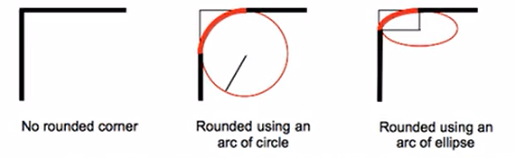
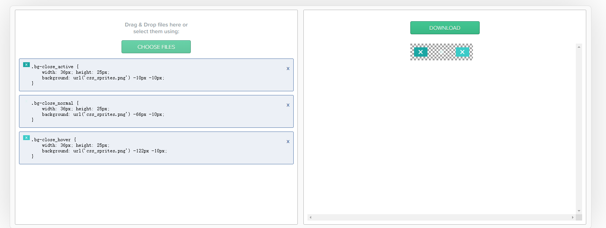

# 浏览器的默认样式

通常情况下，浏览器都会为元素设置一些默认样式，如body、p的外边距等

默认样式的存在会影响页面的布局，所以在开发的时候需要将浏览器的默认样式去除

1. reset.css 去除浏览器默认样式，可在gitee中下载
2. normalize.css 统一浏览器默认样式，可在gitee中下载

# 单位

## 长度单位

绝对单位与相对单位：绝对单位（px像素，in英寸，mm毫米），相对单位（em相对于父元素,rem相对于根元素)

1. #### 像素(px)

   屏幕(显示器)实际上是由一个一个的小点构成的。不同屏幕的像素大小是不同的，像素越小的屏幕显示的效果越清晰，所以同样的200px在不同的设备下显示效果不同

2. #### 百分比(%)

   相对于父元素属性值的百分比，设置百分比可以使子元素跟随父元素属性值的改变而改变

3. #### em

   相对于父元素的字体大小计算的

   1em = 1font-size

   em会根据字体大小的改变而改变

4. #### rem

   相对于根元素(html)的字体大小计算的

   1rem = 1[html]font-size

   rem会根据html字体大小的改变而改变

## 颜色单位

1. #### 颜色名称

   在CSS中可以直接使用颜色名来设置各种颜色，如：red yellow blue orange green...

   但是在CSS中，直接使用颜色名称是非常不方便的

2. #### RGB值

   通过原色：红，绿，蓝的不同浓度来调配出不同的颜色

   R：red；G：green；B：blue

   每一种颜色的取值范围在0-255(0%-100%)之间

   如：rgb(255,0,0)

3. #### RBGA

   在rgb基础上，增加了一个a表示不透明度

   需要四个值，前三个和rgb一样，第四个表示不透明度，取值范围是(0-1)

   如：rgba(126,126,126,.5)

4. #### 十六进制的RGB值

   语法：#红色绿色蓝色

   十六进制编码hex：#FFFFFF，每两个数字控制一种颜色，共1600 万种。缩写(#FFF 4000种)。

   颜色浓度通过00-ff表示

   如果颜色两位两位重复，可以简写，如#aabbcc --> #abc

5. #### HSL值

   H：色相(0-360)；

   S：饱和度：颜色的浓度(0%-100%)；

   L：亮度：颜色的亮度(0%-100%)

   如:hsl(0,100%,0%)

6. #### HSLA值

   同rgba较之于rgb

# 继承

为一个元素设置的样式同时也会应用到他的后代元素上，这种特性·称之为CSS的继承

优点：方便开发，利用继承可以将通用的样式统一设置到共同的祖先元素上，这样只需设置一次即可让所有的元素都具有该样式

1. 不可继承的样式：display、margin、border、padding、background、height、min-height、max- height、width、min-width、max-width、overflow、position、left、right、top、 bottom、z-index、float、clear
2. 所有元素可继承的样式：visibility、cursor
3. 内联元素可继承：letter-spacing、word-spacing、white-space、line-height、color、font、 font-family、font-size、font-style、font-variant、font-weight、text- decoration、text-transform、direction
4. 块级元素可继承：text-indent、text-align
5. 列表元素可继承：list-style、list-style-type、list-style-position、list-style-image
6. 表格元素可继承：border-collapse

**总结：布局相关的样式大都不可以继承，修饰类的样式大都可以继承**

# 布局声明

## 文档流

英文名为normal flow

网页是一个多层的结构，一层套在一层的上面，通过CSS可以分别为每一层来设置样式，作为用户来讲只能看到最顶上一层，这些层中，最底下的一层称为文档流，文档流是网页的基础，我们所创建的元素默认都是在文档流中进行排列

那么从文档流的角度出发，一个元素应该有两个状态，在文档流中和不在文档流中(脱离文档流)

元素在文档流中的特点：

1. 块级元素

   在页面中独占一行，并且自上而下垂直排列，默认宽度是父元素的内容宽度，也就是说会将父元素撑满，默认高度是被内容撑开，也就是说高度取决于子元素

2. 行内元素

   不会独占一行，只占自身的大小，行内元素在页面中从左向右排列，如果一行中放不下则元素会换到第二行继续从左向右排列，默认高度和宽度都是被子元素撑开

## 盒模型：

盒子模型也叫box-model，CSS认为HTML中所有的元素都是一个矩形的盒子，页面布局也就变成了如何将指定的盒子摆放到指定的位置。每个标签都有，可以让标签向外拓展，包括，width, heigh

- 边框 border：盒子的边框的大小，可以直接设置border:边框宽度 边框样式 边框颜色 ，没有先后顺序 
  - border-style：边框样式，实线虚线
  - border-width：边框的大小
  - border-color：边框的颜色
  - 还有一组border-xxx，xxx可以是top right bottom left 分别设置不同方向的边框
- 内边距 padding：盒子与内容的距离。
  - padding-top`, `padding-right`, `padding-bottom， padding-left。
- 外边距 margin：与其他盒子的距离
- 内容(content)：盒子容量的大小
  - 默认情况下通过设置盒子的height和width来控制盒子的容量大小
  - 也可以通过设置box-sizing来设置盒子的类型，可选值：

    1. content-box 默认值，此时设置width和height就是在设置盒子的内容大小
    2. border-box 此时设置width和height其实设置的是border+padding+content的和

### 水平布局

元素在父元素中水平方向的位置，有以下几个属性共同决定

1. margin-left 左外边距
2. border-left 左边框
3. padding-left 左内边距
4. width 宽度，默认是auto
5. padding-right 右内边距
6. border-right 右边框
7. margin-right 有外边距

一个元素在其父元素中，水平布局必须要满足以下等式

margin-left+border-left+padding-left+width+padding-right+border-right+margin-right = 其父元素内容区的宽度，如果等式不成立，称之为过度约束，浏览器会自动调整等式(这就是我们经常设置margin失效的原因)

如果这七个值中没有auto的情况，则浏览器会自动调整margin-right值以使等式成立

这七个值中有三个值可以设置为auto，分别是 width margin-let margin-right，如果某个值为auto，则浏览器会自动调整为auto的那个值以使等式成立

如果将宽度和一个外边距设置为auto，则宽度会调整到最大，设置为auto的外边距会自动为0

如果将三个值都设置为auto，则外边距都是0，宽度最大

如果将两个外边距设置为auto，宽度固定值，则会将外边距设置为相同的值，所以我们经常使用这个特点来使一个元素在其父元素中水平居中

### 垂直布局

元素在父元素中垂直方向的位置

1. 默认情况下父元素的高度被内容撑开

2. 子元素在父元素的内容区中排列，如果子元素的大小超过了父元素，则子元素会从父元素中溢出，通过overflow属性可以设置父元素如何处理溢出的子元素

   overflow的可选值(overflow-x、overflow-y)

   1. visible：默认值，子元素会从父元素中移除，在父元素外部的位置显示
   2. hidden：溢出内容将会被裁剪不显示
   3. scroll：生成垂直和水平方向的两个滚动条，通过滚动条来查看完整的内容
   4. auto：根据需要生成滚动条

3. 垂直外边距的折叠/重叠

   相邻的垂直方向外边距会发生重叠现象

   * 兄弟元素

     两者都是正值的情况下，兄弟元素将的相邻垂直外边距会取两者之间的较**大**值

     两者都是负值的情况下，兄弟元素将的相邻垂直外边距会取两者之间的较**小**值

     **特殊情况：如果相邻的外边距一正一负，则取两者的和**

   * 父子元素

     子元素的上外边距会传递给父元素

     解决方案：

     1. 父元素设置padding-top
     2. 父元素设置border-top

### 行内元素的盒子模型

1. 不支持设置宽度和高度
2. 可以设置padding，但是垂直方向的padding不会影响页面的布局
3. 可以设置border，但是垂直方向的border不会影响页面的布局
4. 可以设置margin，但是垂直方向的margin不会影响页面的布局

### 其它属性

**display**

用来定义元素显示的类型

可选值：

1. inline：将元素设置为行内元素

2. block：将元素设置为块元素

3. inline-block：将元素设置为行内块元素

   行内块元素：既可以设置宽度和高度又不会独占一行(尽量避免使用)

4. table：将元素设置为表格

5. none：元素不在页面中显示

**visibility**

用来设置元素的显示状态

可选值：

1. visible：默认值，元素在页面中正常显示
2. hidden：元素在页面中隐藏不显示，但是依然占据页面的位置

**轮廓**

outline用来设置元素的轮廓线，用法和border一样，区别于border在于outline不会影响到可见框的大小，不会影响布局

**阴影**

box-shadow用来设置元素的阴影效果，和outline一样不会影响页面布局

```css
div{
    box-shadow:10px 10px 10px rgba(0,0,0,.3);
}
```

默认情况下，阴影在元素的正下面

第一个值：水平偏移量，设置阴影的水平位置，正值向右移动，负值向左移动

第二个值：垂直偏移量，设置阴影的垂直位置，正值向下移动，负值向上移动

第三个之：阴影的模糊半径，值越大越模糊，值越小约清晰

第四个值：阴影的颜色，通常情况下会用一个rgba值来表示

**圆角**

border-radius用来设置元素的边框的圆角效果，设置圆的半径大小，值越大，圆角越大

```css
div{
    border-radius:10px 20px 30px 40px;
}
```

四个值：左上、右上、右下、左下

三个值：左上、右上左下、右下

两个值：左上右下、右上左下

一个值：左上右上右下左下共享一个值

```css
div{
    border-radius:10px / 20px
}
```

水平半径和垂直半径，这样的话会形成一个椭圆形

```css
div{
    border-radius:50%
}
```

50%会让元素变成一个圆形




## 定位

文件流指页面中标签排列方式，其中，块元素：从上到下排列（独占一行）。行内元素：从左到右排列（不独占一行）。若想打破文档流让标签可以在任意地方显示，需要进行定位。

position 可选项：

1. static：默认值，元素是静止的没有开启定位

2. 固定定位：position : **fixed**; left : 500px; top : 200px;

   定位元素才有left、top、right、bottom属性

   固定定位元素不占用起始位置

   固定定位是以网页为参照，固定在某一个位置（哪怕页面滑动：也是在这个位置上）

   固定定位永远参照于浏览器的视口进行定位，不会随网页的滚动条而滚动

   **视口和html(初始包含块)元素的区别在于视口不会随着网页滚动条的上下滚动而滚动**

3. 相对定位: position : **relative**;

   相对定位元素：相对于自己起始位置进行偏离。

   相对元素起始位置是占用的（别人用不了）

4. 绝对定位：position : **absolute**;

   如果没有定位父元素【绝对定位元素：参照页面进行偏移】

   如果有定位父元素【绝对定位元素：参照定位父元素进行偏移】

   绝对定位元素不占起始位置（别人可以占用起始位置）

5. 粘滞定位：position：**sticky**

   当元素滚动到某个相对于其包含块的位置时将其固定

规律：**子绝父相**。

### 相对定位

特点：

1. 元素开启相对定位以后如果不设置偏移量，元素不会发生任何的变化
2. 相对定位会提升元素的层级
3. 相对定位不会使元素脱离文档流
4. 相对定位不会改变元素的性质，块级元素还是块级元素，行内元素还是行内元素
5. **相对定位时参照于元素在文档流中的位置进行定位的**

偏移量(offset)

1. 当元素开启了相对定位以后，可以通过偏移量来设置元素的位置

   可选值：

   1. top：元素相对于元素在文档流中的位置的顶部偏移量
   2. bottom：元素相对于元素在文档流中的位置的底部偏移量
   3. left：元素相对于元素在文档流中的位置的左侧偏移量
   4. right：元素相对于元素在文档流中的位置的右侧偏移量

### 绝对定位

特点：

1. 开启绝对定位后，如果不设置偏移量元素的位置不会发生变化
2. 开启绝对定位后，元素会从文档流中脱离
3. 绝对定位会改变元素的性质，行内变成块，块的高度被内容撑开
4. 绝对定位会使元素提升一个层级
5. **绝对定位元素是相对于其包含块进行定位的**

包含块(block containing)

**正常情况下，包含块就是离该元素最近的祖先块元素**

**绝对定位的元素包含块就是离他最近的开启了定位的祖先元素，如果所有的祖先元素都没有开启定位则根元素就是他的包含块(html，也就是初始包含块)**

当开启了绝对定位后，水平方向的布局等式需要添加left和right两个值，此时盒模型的等式只是添加了两个值，

当发生过度约束时

1. 如果9个值中没有auto则自动调整**right**值使等式满足
2. 如果有auto，则自动调整auto的使等式满足，可设置auto的值：margin width left right
3. 因为left和right的默认值是auto，所以如果不设置left和right的值时会自动调整这两个值

垂直方向布局的等式也必须要满足，利用这一点可以让元素垂直居中

### 元素的层级

对于开启了定位的元素，可以通过z-index属性来制定元素的层级，需要一个整数作为参数，值越大元素的层级越高，元素的层级越高越优先显示，如果元素的层级一样，则优先显示靠下的元素，祖先元素的层级再高也不会盖住后代元素

## 浮动

浮动就是可以使元素向其父元素的左侧或者右侧浮动，元素设置了浮动以后，水平布局的等式便不需要强制成立了，元素设置浮动以后会完全从文档流中脱离，不再占用文档流的位置，所以元素下边的还在文档流中的元素会自动向上移动

float可选值：

1. none：默认值，元素不浮动
2. left：元素向左浮动
3. right：元素向右浮动

浮动的特点

1. 浮动元素会完全脱离文档流，不再占据文档流中的位置

2. 设置浮动以后元素会向父元素的左侧或者右侧移动

3. 浮动元素默认不会从父元素中移出

4. 浮动元素向左或向右移动时，不会超过前面的其他浮动元素

5. 如果浮动元素的上面是一个没有浮动的块元素，则浮动元素无法上移

6. 浮动元素不会超过它上边浮动的兄弟元素

7. 浮动元素不会盖住文字，会自动环绕在元素的周围，所以我们可以利用浮动来设置文字的环绕图片的效果，实际上最初float的作用就是用来环绕图片的

8. 元素设置浮动从文档流中脱离以后，元素的一些特点也会发生变化

   1. 块元素不再独占页面的一行，在没有指定宽度和高度的情况下会被内容撑开
   2. 行内元素会变成块级元素，特点和块级元素一样

   **脱离文档流之后，不需要再区分块级元素和行内元素了**

**浮动的作用**

让页面中的元素水平排列，通过浮动可以制作一些水平方向的布局

### 问题

1. 高度塌陷

   父元素不设置高度的情况下，子元素浮动会导致父元素失去高度，这种现象我们称之为高度塌陷

   高度塌陷会导致页面布局发生变化：下面的元素会自动上移，导致页面布局混乱。

   可以通过BFC和after伪类来解决这个高度塌陷问题

   BFC：即Block Formatting Context：块级格式化环境，是CSS中的一个隐含的属性，可以为一个元素开始BFC，开启BFC的元素会变成一个独立的布局区域

   特点：

   1. 开启BFC的元素不会被浮动元素所覆盖
   2. 开启BFC的元素子元素和父元素的外边距不会重叠

   3. 开启BFC的元素可以包含浮动的子元素

   如何开启BFC

   1. 设置元素的浮动

      虽然能解决高度塌陷的问题，但是他自己本身也浮动了，会导致页面布局更加混乱

   2. 将元素设置为行内块元素

      虽然能解决高度塌陷的问题，但是行内块元素本身没有宽度，导致元素宽度失效

   3. 将元素的overflow设置为一个非visible的值(hidden)

      常用的开启BFC的方式，可以解决高度塌陷的问题，相对来说副作用比较小，但是也有副作用，有时候我们就需要将overflow设置为visible

2. 元素会改变位置，而元素中的文字保持不变

   可以通过clear属性清楚浮动元素对当前元素所产生的影响，设置清除浮动以后，浏览器会自动为元素添加一个上外边距，以使其位置不受其他元素的影响

   可选值：

   1. left：清除左侧浮动元素对当前元素的影响
   2. right：清除右侧浮动元素对当前元素的影响
   3. both：清楚较大浮动元素对当前元素的影响

3. 高度塌陷最终解决方案

   ```CSS
   .outer{
       border:10px solid red;
   }
   .inner{
       height:100px;
       width:100px;
       background-color:aqua;
       float:left;
   }
   // 解决高度塌陷的问题
   .outer::after{
       content:'';
       display:block;
       clear:both;
   }
   // 解决外边框折叠的问题
   .outer::before{
       content:'';
       display:table;
   }
   ```

   给高度塌陷的元素添加clearfix类

   ```CSS
   .clearfix::before,
   .clearfix::after{
   	display:block;
       content:'';
       clear:both;
   }
   ```

# 背景 

1. Background-color：背景颜色

2. background-image：背景图设置

   1. 通过设置linear-gradient()定义线性渐变

      渐变可以同时指定多个颜色，多个颜色默认情况下平均分布，也可以手动指定渐变的分布情况，如上所示red后面的50px就表示从右往左第50个像素的地方开始向黄色过渡

      通过设置repeating-linear-gradient()定义重复线性渐变，使用方式和linear-gradient()一致，其可以将元素空白的地方也会用渐变填充

   2. 通过设置radial-gradient()定义元素的径向渐变(放射性效果)

      语法：radial-gradient(大小 at 位置，颜色 位置，颜色 位置，颜色 位置)

3. background-repeat：背景图重复

   可选值：

   1. repeat 默认值，背景会沿着X轴 Y轴双方向重复
   2. repeat-x 沿着x轴方向重复
   3. repeat-y 沿着y轴方向重复
   4. no-repeat 不重复

4. background-position：定义背景图片的位置

   1. 通过top left right bottom center 几个表示方向的词来设置背景图片位置

      **其实相当于一个九宫格来确认背景图片的位置**

      使用方位时必须要同时指定两个值，如果只写一个，默认第二个值是center

   2. 通过偏移量来指定背景图片的位置：

      水平方向的偏移量 垂直方向的偏移量

5. background-clip：定义背景的范围

   可选值：

   1. border-box 默认值，背景会出现在边框的下面
   2. padding-box 背景不会出现在边框，只出现在内容区和内边距
   3. center-box 背景只会出现在内容区

6. background-origin：定义背景图片偏移量计算的原点

   可选值：

   1. padding-box 默认值，background-position从内边距出开始计算
   2. content-box background-position从内容区开始计算
   3. border-box background-position从边框处开始计算

7. background-size定义背景图片的尺寸

   设置方式：

   1. 第一个值表示宽度 第二个值表示高度(如 background-size:100px 200px)

      如果只写一个值则第二个值默认是auto，也就是等比例缩放

   2. cover 图片比例不变，将元素铺满

   3. contain 图片比例不变，将图片在元素中完整显示

8. background-attachment定义元素的背景图片移动方式

   可选值：

   1. scroll 默认值，背景图片会跟随元素移动
   2. fixed 背景会固定在页面中，不会随元素移动

简写：

1. 如：background:#bfa url('../xxx.png') center center/contain no-repeat
2. 没有顺序要求，都是可选参数

3. **background-size必须写在background-position的后面并且使用斜杠隔开**
4. **background-origin必须在background-clip的前面**

## 雪碧图

解决图片闪烁的问题，可以将多个小图片统一保存到一个大图片中，然后通过调整background-position来显示不同区域的图片，这样图片会同时加载到网页中，就可以有效的避免出现闪烁的问题，这种技术在网页中应用十分广泛，被称为CSS-Sprite，这种图片我们称之为雪碧图。一次性将多个图片加载到页面，降低请求次数，加快访问速度，提升用户体验

使用步骤：

1. 制作雪碧图

   通过在线雪碧图制作网站 https://www.toptal.com/developers/css/sprite-generator 将图片制作成雪碧图



2. 将制作完成的雪碧图下载复制到项目中
3. 通过background-position来显示不同区域的图片

# 表格

1. border-spacing：指定单元格边框之间的距离

2. border-collapse：设置边框的合并

   **注意：如果表格中没有使用tbody而是直接使用tr，则浏览器会自动创建一个tbody，并且将tr全都放到tbody中，也就是说tr不是table的子元素，而是tbody的子元素**

3. vertical-align：设置td中的元素垂直居中方式

   **可以通过这个特性设置元素在父元素中垂直居中**

# 字体

## 字体样式

1. color：字体颜色(前景色)

2. font-size：字体大小，单位 em rem px，如12px

3. font-family：字体样式，可以同时指定多个字体，多个字体之间使用逗号隔开，字体生效时优先使用第一个，第一个无法使用时则使用第二个，以此类推

   可选值：

   1. serif：衬线字体
   2. sans-serif：非衬线字体
   3. monospace：等宽字体
   4. cursive：草书字体
   5. fantasy：虚幻字体

   以上5个值制定字体的类别，浏览器会自动使用该类别下的字体

4. line-height：设置元素中文字占有的实际高度，可以直接指定一个大小(px em)，也可以直接设置为一个整数，

   如果是一个整数的话，行高将会是字体大小的指定的倍数，行高默认值是1.333

   字体框就是字体存在的格子，设置font-size实际上就是在设置字体框的高度

   **行高会在字体框的高度下上下平均分配，可以通过设置行高等于容器的高度来使文字在容器中垂直居中**

   行高经常用来设置文字的行间距，行间距 = 行高 - 字体大小

5. font-weight：bold表示字体加粗效果，font情况下可以省略不写

   可选值：

   1. normal 默认值，不加粗
   2. bold 加粗
   3. 100-900 九个级别(基本没什么用)

5. font-style：italic表示字体倾斜效果，font情况下可以省略不写

   可选值：

   1. normal 默认值，不倾斜
   2. italic 斜体

   行高、倾斜、加粗不写的情况下，默认使用默认值

6. @font-face：将服务器中的字体直接提供给用户使用
   1. font-family：字体名称(随便写，相当于手动给改字体起了一个名称)

   2. src：服务器中字体文件的路径，多个字体之间使用逗号隔开，优先使用第一个字体

      format：告诉浏览器字体文件的格式是ttf

## 图标字体

在网页中经常需要使用一些图标，可以通过图片来引入图标，但是图片本身比较大，并且非常的不灵活(放大、缩小、改变颜色等)，所以在使用图标时，我们还可以将图标直接中设置位字体，然后通过font-face的形式来对字体引入，这样我们就可以通过使用字体的形式来使用图标。

1. font-awesome 官网下载 https://fontawesome.com/

   通过class=类名来使用图标

2. 阿里图标 官网：https://www.iconfont.cn/

# 文本

1. 通过设置text-align定义文本的水平对齐

2. 通过设置vertical-align定义文本的垂直对齐

3. 通过设置text-decoration定义文本的线条

4. 通过设置word-warp定义元素的换行

   可选值

   1. normal 默认值，表示不换行
   2. break-word 表示强制换行

5. white-space定义网页如何处理空白

   可选值：

   1. normal 正常
   2. nowrap 不换行
   3. pre 保留空白

   可通过white-space设置当文本超出规定宽度时显示省略号

   ```CSS
   p{
       width:100px;
       width-space:nowrap;
       overflow:hidden;
       text-overflow:ellipsis;
   }
   ```

6. letter-spacing定义字距，所谓字间距就是字符与字符之间的空白，取值为长度值，由浮点数字和单位标识符组成，默认为 normal，表示默认间隔

7. word-spacing定义英文单词之间的间距，对中文无效。和 letter-spacing 一样，其属性值可为不同单位的数值，允许使用负值，默认为normal

8. text-indent定义首行文本的缩进，其属性值可为不同单位的数值、em字符宽度的倍数、或相对于浏览器窗口宽度的百分比%，, 建议使用em作为设置单位。允许使用负值

# 动态

## 过渡

通过设置transition的值，可以指定一个属性发生变化时的切换方式。

1. transition-property

   指定要执行过渡的属性，多个属性之间使用逗号(,)隔开，如果所有属性都需要过渡，则使用all关键字，大部分属性都执行过渡效果，过渡时必须是从一个有效值向另外一个有效值进行过渡

2. transition-duration

   指定过渡效果的持续时间，单位是s和ms 1s=1000ms

3. transition-timing-function

   指定过渡效果的时序函数，也就是指定过渡的执行方式

   可选值：

   1. ease 默认值，慢速开始，先加速，再减速

   2. linear 匀速执行过渡(匀速运动)

   3. ease-in 加速执行过渡(加速运动)

   4. ease-out 减速执行过渡(减速运动)

   5. ease-in-out 慢速开始，后减速

   6. cubic-bezier() 指定时序函数

      https://cubic-bezier.com/ 通过该网站可以指定贝塞尔曲线

   7. steps() 分布执行过渡效果

      如：steps(2,end/start)

      第一个参数表示分两步指定，第一步执行到中间，第二部直接完成

      第二个参数可以为end(默认值)或者start，表示动画是从开始时过渡还是结束时过渡

4. transition-delay

   通设置transition-delay指定过渡效果的延迟，等待一段时间后再执行过渡

**以上四个属性，可以通过transition语法糖来实现，先写持续时间再写延迟时间**

**语法糖写法： <transition-property>  <transition-duration>  <transition-timing-function>  <transition-delay>**

## 动画

动画和transition类似，都是用来实现动态效果，不同的是过渡需要在某个属性发生变化时才会触发，动画可以自动触发动画效果

设置动画效果，必须要设置一个关键帧，其用来设置动画执行的每一个步骤

### @keyframes

通过设置@keyframes指定动画执行的关键帧

1. from{} --> to{}

   from表示动画的开始位置

   to表示动画的结束位置

2. 0% --> xx%-->...-->100%

   0%表示动画的开始位置

   100%表示动画的结束位置

### animation

1. animation-name

   设置当前动画关键帧的名字

2. animation-duration

   设置当前动画的执行时间

3. animation-delay

   设置当前动画的延迟执行时间

4. animation-timing-function

   设置当前动画的时序函数

5. animation-iteration-count

   设置当前动画执行的次数，infinite表示无限循环

6. animation-direction

   设置当前动画运行的方向

   可选值

   1. normal：默认值，动画每次开始都是从from到to的顺序去执行
   2. reverse：从to到from
   3. alternate：先从from到to，再从to到from循环执行
   4. alternate-reverse：先从to搭配from，再从from到to循环执行

7. animation-play-state

   设置动画执行的状态

   可选值

   1. running：默认值，动画执行
   2. paused：动画暂停

8. animation-fill-mode

   设置动画的填充模式

   可选值

   1. none：默认值，动画执行完毕元素回到原来的状态
   2. forwards：动画执行完毕后元素回到动画结束的状态
   3. backwards：动画延时等待时元素处于开始时的状态
   4. both：具备forwards和backwards的特点

## 变形

通过设置transform来改变元的形状或位置，**变形不会影响网页的布局**

transform-origin:变形的原点

### 平移

通过设置translate来改变元素的位置

1. translateX()：沿着X轴方向平移

2. translateY()：沿着Y轴方向平移

3. translateZ()：沿着Z轴方向平移

   调整元素在Z轴的位置，正常情况下就是调整元素和人眼之间的距离，距离越大，元素离人眼越近

   **Z轴的平移属于立体效果(近大远小)，默认情况下网页是不支持透视，如果需要看见效果，必须要设置网页的视距**

参数可以为具体的像素值也可以为百分比，百分比的话是相对于自身大小的百分比

利用平移可以实现当元素大小不确定时实现元素在父元素中的居中效果，

如小米商城图片浮出的效果 https://www.mi.com/?masid=2701.0313

**注意：元素的平移是在元素没有旋转的情况下看到的效果，如果元素发生旋转，那么元素的平移也会相应的改变方向**

### 旋转

通过旋转可以使元素沿着X、Y、Z旋转指定的角度

1. rotateX()

   元素沿着水平轴旋转，单位可以是deg，也可以是turn。deg表示度，turn表示圈

2. rotateY()

   元素沿着垂直轴旋转，单位可以是deg，也可以是turn。deg表示度，turn表示圈

3. rotateZ()

   元素沿着中心旋转，可以是deg，也可以是turn。deg表示度，turn表示圈

**注意backface-visibility可以用来设置元素的背面是否可视**

练习：时针的制作

### 缩放

通过缩放可以使元素沿着X、Y、Z轴放大或者缩小

1. scaleX()

   元素沿着X轴缩放，其实就是改变元素的宽度

2. scaleY()

   元素沿着Y轴缩放，其实就是改变元素的高度

3. scaleZ()

   元素沿着Z轴缩放，结合3d效果，其实就是在Z轴上将元素拉长或者缩小

### 拉伸(倾斜)

通过拉伸可以使元素沿着X、Y轴倾斜

1. skewX()

   元素沿着X轴倾斜

2. skewY()

   元素沿着Y轴倾斜

3. skew(参数1，参数2)

   第一个参数为X轴的倾斜参数，第二个参数为Y轴的倾斜参数