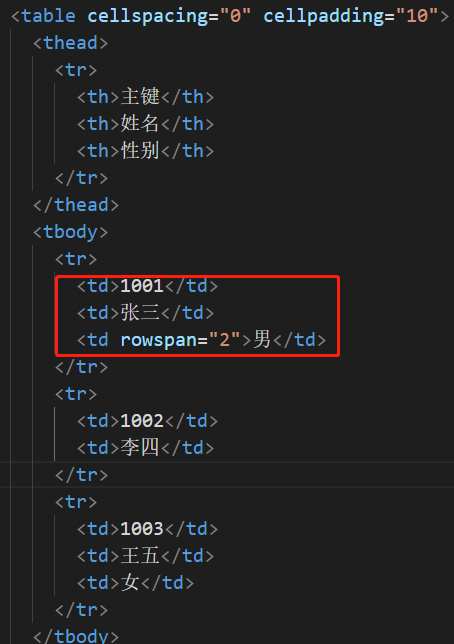
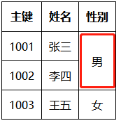

# HTML

## 定义：

Hyper Test Makeup Language 超级文本标记语言。是静态页面，由标签组成

## 结构

DOCTYPE，HTML，HEAD（META，TITLE），BODY。Style，Script。Script标签一般放置程序最下方

```html
<!DOCTYPE html>  <!--指定html的版本为html5，英文下开发-->
<html lang="en">  
	<head>
        <meta charset="UTF-8" />
        <meta name="viewport" content="width=device-width, initial-scale=1.0">
    		<meta http-equiv="X-UA-Compatible" content="ie=edge">
        <!--放入网页描述，如link,meta,title,style,script-->
        <title>My website</title>
	</head>
	<body>
		<!--放入网页内容-->
        <h1>Hello world!</h1>
        <p>
            I'm a p tag! Hear is a 
            <!--页面间跳转-->
            <a href="http://freecodecamp.one" target="_blank">link</a>
        </p>
        <!--图片添加固定链接-->
        <a href="#">
            
        </a>
        <!--内部跳转-->
        <a href="#footer">link to end</a>
        <div>
            <p>three ordered items</p>
            <ol>
                <li>one</li>
                <li>two</li>
                <li>three</li>
            </ol>
            <p>three unordered items</p>
            <ul>
                <li>mather</li>
                <li>father</li>
                <li>sister</li>
            </ul>   
        </div>
        <form action="/submit-cat-photo">
            <input type="text" placeholder="this is placeholder text" required>
            <p>
               	<lable for="indoor">
                    <input type="radio" id="indoor" name="in-out" checked>indoor</lable>
                <lable for="outdoor">
                    <input type="radio" id="outdoor" name="in-out">outdoor</lable>
            </p>
            <p>
                <label for="meat">
                    <input type="checkbox" id="meat" name="food" checked>Meat</label>
                <label for="fruit">
                    <input type="checkbox" id="fruit" name="food">Fruit</label>
                <label for="juice">
                    <input type="checkbox" id="juice" name="food">Juice</label>
            </p>
            <button type="submit">Submit</button>
        </form>
    	<footer id="footer">my app</footer>
	</body>
</html>
```

## 基础元素

### 块元素

特点：独占一行，在页面中是由上到下进行排列，元素如下：

1. 标题：head，h1-h6；h1主标题, h2副标题。
2. 段落：paragraph <P>
3. 容器：division（层）元素，是一个盛装其他元素的通用容器。
4. 导航栏：nav
5. 有序列表：ordered lists （ul-li)
6. 无序列表：unordered lists  (ol-li)
   1. li标签经常作为他们子元素一起使用
7. 定义列表：dl-dt-dd 
8. address
9. 音频：音频audio标签，只能播放下面三种音频格式，mp3、ogg、wav格式

### 行内元素

特征：不是独占一行，从左到右进行排列

1. 图片：image, src, alt 属性的文本是当图片无法加载时显示的替代文本.

2. 锚点：anchor, href跳转，包含页面间跳转（增加target=“_blank”，在新的空白页上打开），页内跳转，固定链接。

3. span：内联容器

4. 标签：label 

5. ```html
   //button onclick事件绑定，需要加括号。
   <button onclick="copyText()">Copy Text</button>
   ```

## 标签分类

### 布局标签

| 标签 | 说明     |
| ---- | -------- |
| div  | 块容器   |
| span | 内联容器 |
| nav  | 导航栏   |

### 列表标签

| 标签     | 说明     |
| -------- | -------- |
| ul-li    | 无序列表 |
| ol-li    | 有序列表 |
| dl-dt-dd | 定义列表 |

### 文本标签

* 文本容器标签

  | 标签  | 说明 |
  | ----- | ---- |
  | h1-h6 | 标题 |
  | p     | 段落 |

* 文本修饰标签

  | 标签     | 说明                                                       |
  | -------- | ---------------------------------------------------------- |
  | em,i     | 斜体                                                       |
  | b,strong | 黑体                                                       |
  | small    | 细体                                                       |
  | br       | 换行                                                       |
  | del      | 删除线                                                     |
  | sup      | 上标(包含在\<sup>\</sup> 中的内容会上浮一半字符的高度显示) |
  | sub      | 下标(会下沉一半字符的高度显示)                             |

<sup>标签如果和 <a> 标签结合起来使用，可以创建出很好的超链接脚注

### 表格标签

| 标签  | 说明         |
| ----- | ------------ |
| table | 定义一个表格 |
| thead | 表格头       |
| tbody | 表格体       |
| tr    | 行           |
| th    | 表格头的列   |
| td    | 列           |

#### table属性

| 属性        | 说明         |
| ----------- | ------------ |
| cellpadding | 单元格内间距 |
| cellspacing | 单元格外间距 |

单元格双边框问题只需设置：border-collapse: collapse即可。

当然还有表格隔行变色的设置：

```css
.tablelist tr:nth-child(odd){background: #c80}/*奇数行*/
.tablelist tr:nth-child(even){background: #ccc}/*偶数行*/
```

#### 行合并rowspan





#### 列合并colspan


### 表单标签

| 标签     | 说明     |
| -------- | -------- |
| form     | 表单容器 |
| input    | 基本输入 |
| select   | 下拉选择 |
| button   | 按钮     |
| label    | 文字     |
| textarea | 多行文本 |

#### form标签属性

向服务器提交数据的 Web 表单

| 属性   | 说明                      |
| ------ | ------------------------- |
| method | 提交方式：get或post       |
| action | 提交的地址                |
| target | 打开方式(同a标签的target) |

#### input标签详解

* type

| 值       | 说明                           |
| -------- | ------------------------------ |
| text     | 文本输入                       |
| password | 密码输入                       |
| button   | 按钮                           |
| submit   | 表单提交                       |
| radio    | 单选框(使用相同的name进行分组) |
| checkbox | 多选框                         |
| file     | 文件选择                       |
| number   | 数字                           |
| range    | 范围条                         |

* name

  提交表单中的key

* value

  提交表单key对应的值

#### select

```html
<!--单选-->
<select name="sex">
  <option value="男">男</option>
  <option value="女">女</option>
  <option value="未知">未知</option>
</select>

<!--多选-->
<select name="menu" multiple>
    <option value="护士站">护士站</option>
    <option value="医生站">医生站</option>
    <option value="科室报表">科室报表</option>
</select>
```

#### button

```html
<button>按钮</button>
<button type="submit">按钮</button>
```

#### label

通常用于输入提示或者和单选框多选框配合使用

```html
<label>姓名</label><input type="text"/>

<label for="man">
  <input type="radio" id="man"/>男
</label>
```

### 超链接标签

超链接标签：<a href="https:www.baidu.com"></a>

#### href

超链接指向

| href     | 说明                                                      |
| -------- | --------------------------------------------------------- |
| URL      | 统一资源定位符，如:https://www.baidu.com                  |
| URI      | 统一资源标识符，如tel:10086或mailto:liuhaogang123@163.com |
| 文件路径 | ./index.html                                              |

#### target

打开方式

| target     | 说明             |
| ---------- | ---------------- |
| _blank     | 重新打开一个页面 |
| _self      | 本页面跳转       |
| _parent    | 父页面打开       |
| _top       | 顶级页面打开     |
| frame name | 指定iframe中打开 |

### 图像标签

图像标签是一个自闭合的标签：

| 属性 | 说明                                                         |
| ---- | ------------------------------------------------------------ |
| src  | 可以是一个本地图片的地址(绝对地址或相对地址)；也可以是一个Base64的字符串，也可以是一个来自于网络的图片地址 |
| alt  | 图片的说明，当鼠标移到图片上时会显示的文字，当图片发生错误时会直接显示该说明 |

src的四种写法

```html
<!--相对路径-->


<!--绝对路径-->


<!--网络路径-->


<!--base64-->


```

### 多媒体标签

1. embed

   embed标签用来插入各种多媒体，如

   ```html
   <embed src="多媒体地址" />
   ```

   注意：embed是一个html5标签

2. audio

   音频标签

3. video

   视频标签

| 属性名称 | 说明     |
| -------- | -------- |
| controls | 控制按钮 |
| autoplay | 自动播放 |
| loop     | 循环播放 |

### 内联框架标签

用来嵌入其他页面的标签

src：指定引入其他页面的路径

```html
<iframe src="https://www.baidu.com" width="800" height="600"></iframe>
```

## 常用属性

1. class

   定义样式的class类名，如

   ```html
   <style>
       .box{
           border:1px solid red;
       }
       .bgblue{
           background-color:blue
       }
   </style>
   ...
   <div class="box bgblue">
   我是一个盒子
   </div>
   ```

2. style

   定义元素的样式，如

   ```html
   <div style="border:1px solid red;background-color:blue">
   我是一个盒子
   </div>
   ```

3. id

   定义元素的唯一标识

4. name

   定义元素的检索标识

5. title

   定义元素当鼠标覆盖时显示的文字

## 自定义属性

html标签中，除了标准的属性名外，还可以自定义属性名（属性值为String类型）

1. 直接使用定义属性名

   ```html
     <button desc="this is a button">Click me!</button>
     
     <script>
       var btn = document.querySelector('button')
       console.log(btn.getAttribute('desc')) // 获取属性值
       btn.setAttribute('tip', 'please click button') // 设置属性值
     </script>
   
   显示为：<button desc="this is a button" tip="please click button">Click me!</button>
   ```

2. 使用“data-自定义属性名”

   自定义属性名前面加上**data-**，获取/赋值都需要通过**dataset**，所有data-开头的数据都存在dataset中

   ```html
     <button data-desc="this is a button">Click me!</button>
     
     <script>
       var btn = document.querySelector('button')
       console.log(btn.dataset.desc) // 获取属性值
       btn.dataset.tip = 'please click button' // 设置属性值
         
   显示为：<button data-desc="this is a button" data-tip="please click button">Click me!</button>
   ```

3. 使用js添加属性

# HTML5

HTML5 成为 HTML、XHTML 以及 HTML DOM 的新标准。

HTML5 是 W3C（World Wide Web Consortium，万维网联盟） 与 WHATWG 合作的结果

新的规则：

- a.新特性应该基于 HTML、CSS、DOM 以及 JavaScript
- b.减少对外部插件的需求（比如 Flash）
- c.更优秀的错误处理
- d.更多取代脚本的标记
- e.HTML5 应该独立于设备
- f.开发进程应对公众透明

## 新增元素

新的特殊内容元素

1. main：让搜索引擎和开发者瞬间找到网页的主要内容。
2. header
3. footer
4. nav
6. article
7. section

新增input类型： calendar，email、url、number、range、Date pickers (date, month, week, time, datetime, datetime-local)、search、color

新的表单元素：datalist、keygen、output

用于媒介播放： video 和 audio 元素；

用于绘画 ：Canvas

1. canvas是HTML5中新增的一个双闭合标签【浏览器认为他是一张图片】
2. Canvas标签是由默认w（300）、h（150）
3. canvas标签w、h务必通过属性进行设置（别写样式设置）否则变形
4. canvas中标签文本、儿子标签都没有任何意义
5. Canvas最基本功能是绘制图形，需要注意画布任何操作都是通过2D上下文进行渲染
6. Canvas 通过 JavaScript 来绘制 2D 图形
7. Canvas 是逐像素进行渲染的。
8. 在 canvas 中，一旦图形被绘制完成，它就不会继续得到浏览器的关注。如果其位置发生变化，那么整个场景也需要重新绘制，包括任何或许已被图形覆盖的对象

## 表单属性

1. 新的 form 属性：

   autocomplete、novalidate

2. 新的 input 属性：

   autocomplete、autofocus、form、form overrides (formaction, formenctype, formmethod, formnovalidate, formtarget)、height 和 width、list、min, max 和 step、multiple、pattern (regexp)、placeholder、required
3. autocomplete 属性：
   （1）autocomplete 属性规定 form 或 input 域应该拥有自动完成功能

   （2）autocomplete 适用于 标签，以及以下类型的 标签：text, search, url, telephone, email, password, datepickers, range 以及 color

   （3）当用户在自动完成域中开始输入时，浏览器应该在该域中显示填写的选项：

```html
	<form action="demo_form.asp" method="get" autocomplete="on">
	First name: <input type="text" name="fname" /><br />
	Last name: <input type="text" name="lname" /><br />
	E-mail: <input type="email" name="email" autocomplete="off" /><br />
	<input type="submit" />
	</form>
```

4. autofocus 属性：

   （1）autofocus 属性规定在页面加载时，域自动地获得焦点。

   （2）autofocus 属性适用于所有 标签的类型

   （3）代码示例：

```html
	User name: <input type="text" name="user_name"  autofocus="autofocus" />
```
5. form 属性：
   （1）form 属性规定输入域所属的一个或多个表单

   （2）form 属性适用于所有 标签的类型

   （3）form 属性必须引用所属表单的 id

   （4）代码示例：

```html
	<form action="demo_form.asp" method="get" id="user_form">
	First name:<input type="text" name="fname" />
	<input type="submit" />
	</form>
	Last name: <input type="text" name="lname" form="user_form" />
```
6. 表单重写属性：
   （1）表单重写属性（form override attributes）允许您重写 form 元素的某些属性设定

   （2）表单重写属性有：

   formaction - 重写表单的 action 属性

   formenctype - 重写表单的 enctype 属性

   formmethod - 重写表单的 method 属性

   formnovalidate - 重写表单的 novalidate 属性

   formtarget - 重写表单的 target 属性

（3）表单重写属性适用于以下类型的 标签：submit 和 image

（4）代码示例：

```html
	<form action="demo_form.asp" method="get" id="user_form">
	E-mail: <input type="email" name="userid" /><br />
	<input type="submit" value="Submit" />
	<br />
	<input type="submit" formaction="demo_admin.asp" value="Submit as admin" />
	<br />
	<input type="submit" formnovalidate="true" value="Submit without validation" />
	<br />
	</form>
```
7. height 和 width 属性：
   （1）height 和 width 属性规定用于 image 类型的 input 标签的图像高度和宽度

   （2）height 和 width 属性只适用于 image 类型的 标签

   （3）代码示例：

```html
	<input type="image" src="img_submit.gif" width="99" height="99" />
```
8. list 属性：
   （1）list 属性规定输入域的 datalist。datalist 是输入域的选项列表

   （2）list 属性适用于以下类型的 标签：text, search, url, telephone, email, date pickers, number, range 以及 color。

   （3）代码示例：

```html
	Webpage: <input type="url" list="url_list" name="link" />
	<datalist id="url_list">
	<option label="W3Schools" value="http://www.w3school.com.cn" />
	<option label="Google" value="http://www.google.com" />
	<option label="Microsoft" value="http://www.microsoft.com" />
	</datalist>
```
9. min、max 和 step 属性：
   （1）min、max 和 step 属性用于为包含数字或日期的 input 类型规定限定（约束）

   （2）max 属性规定输入域所允许的最大值。

   min 属性规定输入域所允许的最小值。

   step 属性为输入域规定合法的数字间隔（如果 step=“3”，则合法的数是 -3,0,3,6 等）

   （3）min、max 和 step 属性适用于以下类型的 标签：date pickers、number 以及 range

   （4）代码实例：

```html
	Points: <input type="number" name="points" min="0" max="10" step="3" />
```
10. multiple 属性：
    （1）multiple 属性规定输入域中可选择多个值

    （2）multiple 属性适用于以下类型的 标签：email 和 file

    （3）代码实例：

```html
	Select images: <input type="file" name="img" multiple="multiple" />
```
11. novalidate 属性：
    （1）novalidate 属性规定在提交表单时不应该验证 form 或 input 域

    （2）novalidate 属性适用于 以及以下类型的 标签：text, search, url, telephone, email, password, date pickers, range 以及 color.

    （3）代码示例：

```html
	<form action="demo_form.asp" method="get" novalidate="true">
	E-mail: <input type="email" name="user_email" />
	<input type="submit" />
	</form>
```
12. pattern 属性：
    （1）pattern 属性规定用于验证 input 域的模式（pattern）

    （2）模式（pattern） 是正则表达式

    （3）pattern 属性适用于以下类型的 标签：text, search, url, telephone, email 以及 password

    （4）下面的例子显示了一个只能包含三个字母的文本域（不含数字及特殊字符）：

```html
	Country code: <input type="text" name="country_code"
	pattern="[A-z]{3}" title="Three letter country code" />
```
13. placeholder 属性：
    （1）placeholder 属性提供一种提示（hint），描述输入域所期待的值

    （2）placeholder 属性适用于以下类型的 标签：text, search, url, telephone, email 以及 password。

    （3）提示（hint）会在输入域为空时显示出现，会在输入域获得焦点时消失：

```html
	<input type="search" name="user_search"  placeholder="Search W3School" />
```
14. required 属性：
    （1）required 属性规定必须在提交之前填写输入域（不能为空）

    （2）required 属性适用于以下类型的 标签：text, search, url, telephone, email, password, date pickers, number, checkbox, radio 以及 file

    （3）代码示例：

```html
	Name: <input type="text" name="usr_name" required="required" />
```

## 拖放

1. 拖放（Drag 和 drop）是 HTML5 标准的组成部分：

   1. 拖放是一种常见的特性，即抓取对象以后拖到另一个位置
   2. 在 HTML5 中，拖放是标准的一部分，任何元素都能够拖放

2. 拖动相关设置：

   1. 设置元素为可拖放，把 draggable 属性设置为 true

   2. 规定拖动元素：

      ondragstart 属性调用了一个函数drag(event)，它规定了被拖动的数据。

      dataTransfer.setData() 方法设置被拖数据的数据类型和值。

   3. 放在何处：

      ondragover 事件规定在何处放置被拖动的数据；

   4. 进行放置 - ondrop：

      当放置被拖数据时，会发生 drop 事件；

      ondrop 属性调用了一个函数，drop(event)

   5. 注意点：

      a.调用 preventDefault() 来避免浏览器对数据的默认处理（drop 事件的默认行为是以链接形式打开）

      b.通过 dataTransfer.getData(“Text”) 方法获得被拖的数据。该方法将返回在 setData() 方法中设置为相同类型的任何数据

      c.被拖数据是被拖元素的 id (“drag1”)

      d.把被拖元素追加到放置元素（目标元素）中

## 内联 SVG

定义

（1）SVG 指可伸缩矢量图形 (Scalable Vector Graphics)

（2）SVG 用于定义用于网络的基于矢量的图形

（3）SVG 是使用 XML 格式定义图形描述 2D 图形的语言

（4）SVG 图像在放大或改变尺寸的情况下其图形质量不会有损失

（5）SVG 是万维网联盟的标

（6）SVG 基于 XML，这意味着 SVG DOM 中的每个元素都是可用的。可以为某个元素附加 JavaScript 事件处理器。

（7）在 SVG 中，每个被绘制的图形均被视为对象。如果 SVG 对象的属性发生变化，那么浏览器能够自动重现图形。

优势：

（1）SVG 图像可通过文本编辑器来创建和修改

（2）SVG 图像可被搜索、索引、脚本化或压缩

（3）SVG 是可伸缩的

（4）SVG 图像可在任何的分辨率下被高质量地打印

（5）SVG 可在图像质量不下降的情况下被放大

## Canvas 与 SVG 的比较

| Canvas：                                           | SVG：                                                   |
| -------------------------------------------------- | ------------------------------------------------------- |
| 依赖分辨率                                         | 不依赖分辨率                                            |
| 不支持事件处理器                                   | 支持事件处理器                                          |
| 弱的文本渲染能力                                   | 最适合带有大型渲染区域的应用程序（比如谷歌地图）        |
| 能够以 .png 或 .jpg 格式保存结果图像               | 复杂度高会减慢渲染速度（任何过度使用 DOM 的应用都不快） |
| 最适合图像密集型的游戏，其中的许多对象会被频繁重绘 | 不适合游戏应用                                          |

## 地理定位

HTML5 Geolocation API 用于获得用户的地理位置，

使用 getCurrentPosition() 方法来获得用户的位置：navigator.geolocation.getCurrentPosition(

如果getCurrentPosition()运行成功，则向参数showPosition中规定的函数返回一个coordinates对象，showPosition() 函数获得并显示经度和纬度

## web存储

1. HTML5 提供了两种在客户端存储数据的新方法：

   localStorage - 没有时间限制的数据存储

   sessionStorage - 针对一个 session 的数据存储

2. 之前，这些都是由 cookie 完成的。但是 cookie 不适合大量数据的存储，因为它们由每个对服务器的请求来传递，这使得 cookie 速度很慢而且效率也不高

3. 在 HTML5 中，数据不是由每个服务器请求传递的，而是只有在请求时使用数据。它使在不影响网站性能的情况下存储大量数据成为可能

4. 对于不同的网站，数据存储于不同的区域，并且一个网站只能访问其自身的数据

5. HTML5 使用 JavaScript 来存储和访问数据

## 应用程序缓存

HTML5 引入了应用程序缓存，这意味着 web 应用可进行缓存，并可在没有因特网连接时进行访问。

应用程序缓存为应用带来三个优势：

- a.离线浏览 - 用户可在应用离线时使用它们

- b.速度 - 已缓存资源加载得更快

- c.减少服务器负载 - 浏览器将只从服务器下载更新过或更改过的资源。


使用 HTML5，通过创建 cache manifest 文件，可以轻松地创建 web 应用的离线版本。

## Web Workers

web worker 是运行在后台的 JavaScript，独立于其他脚本，不会影响页面的性能。您可以继续做任何愿意做的事情：点击、选取内容等等，而此时 web worker 在后台运行

```javascript
w=new Worker("demo_workers.js");		
w.onmessage=function(event){
				document.getElementById("result").innerHTML=event.data;
    };
w.terminate();
```

由于 web worker 位于外部文件中，它们无法访问下例 JavaScript 对象：window 对象、document 对象、parent 对象

## 服务器发送事件

HTML5 服务器发送事件（server-sent event），允许网页自动获取来自服务器的更新,

以前也可能做到这一点，前提是网页不得不询问是否有可用的更新。通过服务器发送事件，更新能够自动到达。

## WebSocket

WebSocket是一种基于TCP网络通信协议，是在单个TCP连接上进行双全工通讯的协议，可实现服务器主动向客户端推送数据。

在WebSocketAPI中，浏览器和服务器只需要完成一次握手，两者之间就可以直接创建持久性的连接，并进行双向数据传输。

现在，大多数的网站为了实现这种类似于推送的技术，使用的技术都是Ajax轮询。这种传统的模式带来很明显的缺点，就是浏览器需要不断的向服务器发送请求，然而HTTP请求通常都会包含较长的头部，其中真正有效的数据很少，显然这样做很浪费宽带资源。

HTML5定义的Socket协议，能更好的节省服务器资源和带宽，并且可以实时的进行通信。


浏览器通过JavaScript向服务器发送建立WebSocket连接连接建立以后，客户端和服务器端就可以通过 TCP 连接直接交换数据。

当你获取 Web Socket 连接后，你可以通过 **send()** 方法来向服务器发送数据，并通过 **onmessage** 事件来接收服务器返回的数据。