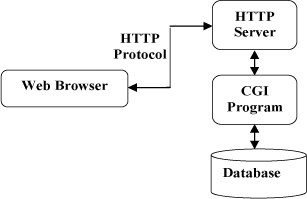

### 定义

HTTP协议（HyperText Transfer Protocol，超文本传输协议）是因特网上应用最为广泛的一种网络传输协议，所有的WWW文件都必须遵守这个标准。

HTTP是一个基于TCP/IP通信协议来传递数据（HTML 文件, 图片文件, 查询结果等）

### 工作原理

HTTP是基于客户端/服务端（C/S）的架构模型，通过一个可靠的链接URL来交换信息，是一个无状态的请求/响应协议。

一个HTTP"客户端"是一个应用程序（Web浏览器或其他任何客户端），通过连接到服务器达到向服务器发送一个或多个HTTP的请求的目的。

一个HTTP"服务器"同样也是一个应用程序（通常是一个Web服务，如Apache Web服务器或IIS服务器等），通过接收客户端的请求并向客户端发送HTTP响应数据。

HTTP使用统一资源标识符（Uniform Resource Identifiers, URI）来传输数据和建立连接。

一旦建立连接后，数据消息就通过类似Internet邮件所使用的格式[RFC5322]和多用途Internet邮件扩展（MIME）[RFC2045]来传送。

HTTP默认端口号为80，但是你也可以改为8080或者其他端口。

**HTTP三点注意事项：**

- HTTP是无连接：无连接的含义是限制每次连接只处理一个请求。服务器处理完客户的请求，并收到客户的应答后，即断开连接。采用这种方式可以节省传输时间。
- HTTP是媒体独立的：这意味着，只要客户端和服务器知道如何处理的数据内容，任何类型的数据都可以通过HTTP发送。客户端以及服务器指定使用适合的MIME-type内容类型。
- HTTP是无状态：HTTP协议是无状态协议。无状态是指协议对于事务处理没有记忆能力。缺少状态意味着如果后续处理需要前面的信息，则它必须重传，这样可能导致每次连接传送的数据量增大。另一方面，在服务器不需要先前信息时它的应答就较快。

##### CGI(Common Gateway Interface) 

是 HTTP 服务器与你的或其它机器上的程序进行“交谈”的一种工具，其程序须运行在网络服务器上。

绝大多数的 CGI 程序被用来解释处理来自表单的输入信息，并在服务器产生相应的处理，或将相应的信息反馈给浏览器。CGI 程序使网页具有交互功能

### 消息结构

HTTP请求: 客户端发送一个HTTP请求到服务器的请求消息包括以下格式：请求行（request line）、请求头部（header）、空行和请求数据四个部分组成，下图给出了请求报文的一般格式。

HTTP响应: 服务端发送一个HTTP响应到客户端的响应消息由四个部分组成，分别是：状态行、消息报头、空行和响应正文。

| 应答头           | 说明((HTTP响应头信息))                                       |
| :--------------- | :----------------------------------------------------------- |
| Allow            | 服务器支持哪些请求方法（如GET、POST等）。                    |
| Content-Encoding | 文档的编码（Encode）方法。只有在解码之后才可以得到Content-Type头指定的内容类型。利用gzip压缩文档能够显著地减少HTML文档的下载时间。Java的GZIPOutputStream可以很方便地进行gzip压缩，但只有Unix上的Netscape和Windows上的IE 4、IE 5才支持它。因此，Servlet应该通过查看Accept-Encoding头（即request.getHeader("Accept-Encoding")）检查浏览器是否支持gzip，为支持gzip的浏览器返回经gzip压缩的HTML页面，为其他浏览器返回普通页面。 |
| Content-Length   | 表示内容长度。只有当浏览器使用持久HTTP连接时才需要这个数据。如果你想要利用持久连接的优势，可以把输出文档写入 ByteArrayOutputStream，完成后查看其大小，然后把该值放入Content-Length头，最后通过byteArrayStream.writeTo(response.getOutputStream()发送内容。 |
| Date             | 当前的GMT时间。你可以用setDateHeader来设置这个头以避免转换时间格式的麻烦。 |
| Expires          | 应该在什么时候认为文档已经过期，从而不再缓存它？             |
| Last-Modified    | 文档的最后改动时间。客户可以通过If-Modified-Since请求头提供一个日期，该请求将被视为一个条件GET，只有改动时间迟于指定时间的文档才会返回，否则返回一个304（Not Modified）状态。Last-Modified也可用setDateHeader方法来设置。 |
| Location         | 表示客户应当到哪里去提取文档。Location通常不是直接设置的，而是通过HttpServletResponse的sendRedirect方法，该方法同时设置状态代码为302。 |
| Refresh          | 表示浏览器应该在多少时间之后刷新文档，以秒计。除了刷新当前文档之外，你还可以通过setHeader("Refresh", "5; URL=http://host/path")让浏览器读取指定的页面。 注意这种功能通常是通过设置HTML页面HEAD区的＜META HTTP-EQUIV="Refresh" CONTENT="5;URL=http://host/path"＞实现，这是因为，自动刷新或重定向对于那些不能使用CGI或Servlet的HTML编写者十分重要。但是，对于Servlet来说，直接设置Refresh头更加方便。  注意Refresh的意义是"N秒之后刷新本页面或访问指定页面"，而不是"每隔N秒刷新本页面或访问指定页面"。因此，连续刷新要求每次都发送一个Refresh头，而发送204状态代码则可以阻止浏览器继续刷新，不管是使用Refresh头还是＜META HTTP-EQUIV="Refresh" ...＞。  注意Refresh头不属于HTTP 1.1正式规范的一部分，而是一个扩展，但Netscape和IE都支持它。 |
| Server           | 服务器名字。Servlet一般不设置这个值，而是由Web服务器自己设置。 |
| Set-Cookie       | 设置和页面关联的Cookie。Servlet不应使用response.setHeader("Set-Cookie", ...)，而是应使用HttpServletResponse提供的专用方法addCookie。参见下文有关Cookie设置的讨论。 |
| WWW-Authenticate | 客户应该在Authorization头中提供什么类型的授权信息？在包含401（Unauthorized）状态行的应答中这个头是必需的。例如，response.setHeader("WWW-Authenticate", "BASIC realm=＼"executives＼"")。 注意Servlet一般不进行这方面的处理，而是让Web服务器的专门机制来控制受密码保护页面的访问（例如.htaccess）。 |

#### Content-Type

告诉客户端实际返回的内容的内容类型, 表示后面的文档属于什么MIME类型。

Servlet默认为text/plain，但通常需要显式地指定为text/html。

HttpServletResponse提供了一个专用的方法setContentType。

不同的文件扩展名对应不同的Content-Type(Mime-Type) .

#### MIME Type 

浏览器显示的内容都有 HTML、XML、GIF、Flash 等，浏览器是通过 MIME Type 区分它们，决定用什么内容什么形式来显示。它是该资源的媒体类型，

MIME Type 是经过互联网（IETF）组织协商，以 RFC（是一系列以编号排定的文件，几乎所有的互联网标准都有收录在其中） 的形式作为建议的标准发布在网上的，大多数的 Web 服务器和用户代理都会支持这个规范 (顺便说一句，Email 附件的类型也是通过 MIME Type 指定的)。

常见的媒体格式类型如下：

- text/html ： HTML格式
- text/plain ：纯文本格式
- text/xml ： XML格式
- image/gif ：gif图片格式
- image/jpeg ：jpg图片格式
- image/png：png图片格式

以application开头的媒体格式类型(客户端自己定义的格式)：

- application/xhtml+xml ：XHTML格式
- application/xml： XML数据格式
- application/atom+xml ：Atom XML聚合格式
- application/json： JSON数据格式
- application/pdf：pdf格式
- application/msword ： Word文档格式
- application/octet-stream ： 二进制流数据（如常见的文件下载）
- application/x-www-form-urlencoded ： <form encType="">中默认的encType，form表单数据被编码为key/value格式发送到服务器（表单默认的提交数据的格式）

另外一种常见的媒体格式是上传文件之时使用的：

- multipart/form-data ： 需要在表单中进行文件上传时，就需要使用该格式

### 请求方法

HTTP 协议中共定义了八种方法或者叫“动作”来表明对 Request-URI 指定的资源的不同操作方式.

HTTP1.0 定义了三种请求方法： GET, POST 和 HEAD 方法。

HTTP1.1 新增了六种请求方法：OPTIONS、PUT、PATCH、DELETE、TRACE 和 CONNECT 方法

-  **OPTIONS**：返回服务器针对特定资源所支持的HTTP请求方法。也可以利用向Web服务器发送'*'的请求来测试服务器的功能性。
-  **HEAD**：向服务器索要与GET请求相一致的响应，只不过响应体将不会被返回。这一方法可以在不必传输整个响应内容的情况下，就可以获取包含在响应消息头中的元信息。
-  **GET**：向特定的资源发出请求。
-  **POST**：向指定资源提交数据进行处理请求（例如提交表单或者上传文件）。数据被包含在请求体中。POST请求可能会导致新的资源的创建和/或已有资源的修改。
-  **PUT**：向指定资源位置上传其最新内容。
-  **DELETE**：请求服务器删除 Request-URI 所标识的资源。
-  **TRACE**：回显服务器收到的请求，主要用于测试或诊断。
-  **CONNECT**：HTTP/1.1 协议中预留给能够将连接改为管道方式的代理服务器。

虽然 HTTP 的请求方式有 8 种，但是我们在实际应用中常用的也就是 **get** 和 **post**，其他请求方式也都可以通过这两种方式间接的来实现。

| GET                            | POST             |
| ------------------------------ | ---------------- |
| 相对而言不安全                 | 相对而言安全一些 |
| 给服务器额外传递数据是由上限的 | 相对而言没有上限 |
| 便于分享                       | 不便于分享       |

### 状态码

包含在HTTP状态码的信息头（server header）用以响应浏览器的请求.

HTTP状态码由三个十进制数字组成，第一个十进制数字定义了状态码的类型

##### 常见的HTTP状态码：

- 200  请求成功
- 301  资源（网页等）被永久转移到其它URL,是永久重定向
- 302  是临时重定向
- 401  Unauthorized  请求要求用户的身份认证
- 403  Forbidden  服务器理解请求客户端的请求，但是拒绝执行此请求
- 404 - 请求的资源（网页等）不存在
- 500 - 内部服务器错误

##### 分类

| 分类 | 分类描述                                       |
| :--- | :--------------------------------------------- |
| 1**  | 信息，服务器收到请求，需要请求者继续执行操作   |
| 2**  | 成功，操作被成功接收并处理                     |
| 3**  | 重定向，需要进一步的操作以完成请求             |
| 4**  | 客户端错误，请求包含语法错误或无法完成请求     |
| 5**  | 服务器错误，服务器在处理请求的过程中发生了错误 |

程序员最想看到的：200-OK。

程序员不想看到的：500-Internal-Server-Error。

用户不想看到的：401-Unauthorized、403-Forbidden、408-Request-Time-out。

### 跨域

概述：当用户发起多次请求的时候，如果协议|域名|端口号不同情况下，称之为跨域。

JSONP数据格式跨域的实现原理是如下：

1. 利用script标签src属性（本身就可以跨域请求数据）
2. 利用的是将一个函数执行部分放置另外一个服务器上面

