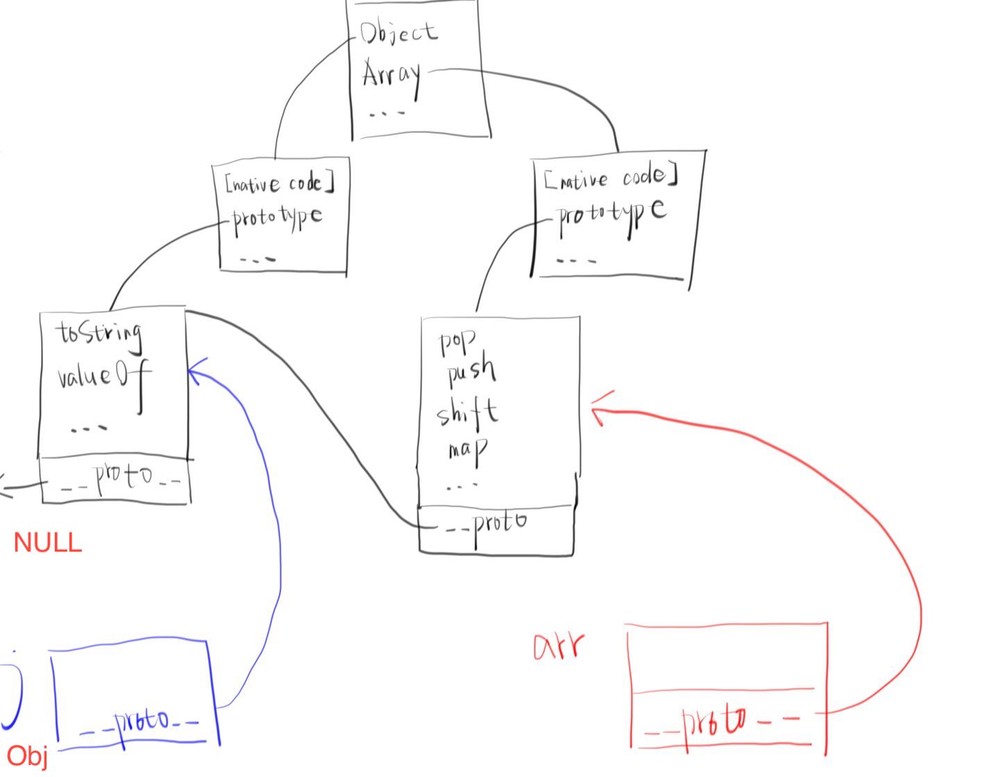

JavaScript定义：是开发web脚本语言，可以嵌套在静态页面中可以给静态页面添加一些动态效果。

### 组成

| ECMAScript | 欧洲计算机协会每年6月份定时语法规范                      |
| ---------- | -------------------------------------------------------- |
| DOM        | Document  Object Model  文档对象模型（经常用来操作标签） |
| BOM        | Browser  Object Model  浏览器对象模型（模拟浏览器）      |

#### DOM

##### 定义

HTML Document Object Model（文档对象模型）,就是系统内置引用类型对象document。

1.  HTML DOM 定义了访问和操作HTML文档的标准方法
2. HTML DOM 把 HTML 文档呈现为带有元素、属性和文本的树结构（节点树)


##### Dom节点

节点类型：HTML 文档中的每个成分都是一个节点， 是这样规定的：

1.    整个文档是一个文档节点
2.    每个 HTML 标签是一个元素节点
3.    包含在 HTML 元素中的文本是文本节点
4.    每一个 HTML 属性是一个属性节点


节点关系：节点树中的节点彼此拥有层级关系。父(parent),子(child)和同胞(sibling)等术语用于描述这些关系。顶端节点被称为根（root）。


元素节点查找：

```javascript
//直接查找节点(节点也就是一个个的标签)
document.getElementById('idname');//按照id查找，拿到的是一个标签对象
document.getElementsByClassName('classname');//按照class标签去找，得到的是一个数组里存放的标签
document.getElementsByTagName('tagname');//通过标签名去找，拿到的也是一个数组
document.getElementsByName('yuan'); //按照name属性去找,拿到的也是一个数组
document.querySelector(""); //Returns the first element that is a descendant of node that matches selectors.
//导航查找节点，通过某一个标签的位置去查找另一个标签
parentElement           // 父节点标签元素
children                // 所有子标签
firstElementChild       // 第一个子标签元素
lastElementChild        // 最后一个子标签元素
nextElementtSibling     // 下一个兄弟标签元素
previousElementSibling  // 上一个兄弟标签元素
```

元素节点操作：

1. createElement(标签名) ：创建一个指定名称的元素。
2. somenode.appendChild(newnode)：追加一个子节点（作为最后的子节点
3. somenode.insertBefore(newnode,某个节点); ：把增加的节点放到某个节点的前边
4. removeChild()：获得要删除的元素，通过父元素调用删除
5. somenode.replaceChild(newnode, 某个节点);

文本节点：

1. innerText ：获取文本节点的值，只能识别纯文本
2. innerHTML：获取文本节点的值，既可以识别纯文本，也可以识别标签
3. Value：获取表单元素的value值，：input  ，select （selectedIndex），textarea  

属性节点：

```javascript
 //或者直接用 elementNode.属性名(DHTML)操作，如id。大多情况下，通过标签.属性名字进行操作
 elementNode.setAttribute(name,value)    
 elementNode.getAttribute(属性名)   //不可以操作class
 elementNode.removeAttribute(“属性名”);
```

文档节点

1. documentElement属性：可以获取页面中HTML标签
2. head属性:可以获取到head标签
3. body属性：可以获取到body标签
4. title属性：可以操作title标签文本

其它操作

1. 操作标签行内样式：div.style.background=‘black';

2. ```javascript
   //操作class属性
   var ele = document.getElementsByClassName('c1')[0];
   console.log(ele.className); //打印类的名字
   
   ele.classList.add('hide');
   console.log(ele); //<div class="c1 hide" id="d1">
   
   ele.classList.remove('hide');//把添加的remove移除了
   ```

##### 事件

类型

```
onclick        当用户点击某个对象时调用的事件句柄。
ondblclick     当用户双击某个对象时调用的事件句柄。

onfocus        元素获得焦点。               练习：输入框
onblur         元素失去焦点。               应用场景：用于表单验证,用户离开某个输入框时,代表已经输入完了,我们可以对它进行验证.
onchange       域的内容被改变。             应用场景：通常用于表单元素,当元素内容被改变时触发.（三级联动）

onkeydown      某个键盘按键被按下。          应用场景: 当用户在最后一个输入框按下回车按键时,表单提交.
onkeypress     某个键盘按键被按下并松开。
onkeyup        某个键盘按键被松开。

onload         一张页面或一幅图像完成加载。只给 body元素加,这个属性的触发 标志着 页面内容被加载完成.
应用场景: 当有些事情我们希望页面加载完立刻执行,那么可以使用该事件属性.

onmousedown    鼠标按钮被按下。
onmousemove    鼠标被移动。
onmouseout     鼠标从某元素移开，在指针离开元素或进入该元素的子元素时均会被触发，冒泡
onmouseover    鼠标移到某元素之上。
onmouseleave   鼠标从元素离开，仅在指针离开元素时被触发，不冒泡

onselect       文本被选中。
onsubmit       确认按钮被点击,该属性也只能给form元素使用.应用场景: 在表单提交前验证用户输入是否正确.如果验证失败.在该方法中我们应该阻止表单的提交.
```

绑定事件方式

```html
<div onclick="foo(this)">div</div> //
<div class="c1">div2</div>
<script>
    //jquery下是$(self), 这种方式this参数必须填写;
    function foo(self) {
        console.log(self); //<div onclick="foo(this)" style="color: red;">
        self.style.color = 'red';
    }

	//事件的绑定方式2：标签对象.on事件 = function (){}, 这种方式不需要this参数;
     var ele=document.getElementsByClassName("c1")[0];
     ele.onclick=function () {
        console.log(this); // this 代指： 当前触发时间的标签对象；
        this.style.fontSize="30px"
    };
    
    //事件的绑定方式3：添加事件监听。
    const div1 = document.getElementById('div1');
	div1.addEventListener('mouseleave', (event) => {
 		 event.currentTarget.style.backgroundColor = 'blue';
  		 setTimeout(() => event.currentTarget.style.backgroundColor = '', 1000);
    });
</script>
```

事件传播

```html
<!DOCTYPE html>
<html lang="en">
<head>
    <meta charset="UTF-8">
    <title>Title</title>

    <style>
        .outer{
            width: 300px;
            height: 300px;
            background-color: antiquewhite;
        }
        .inner{
            width: 100px;
            height: 100px;
            background-color: rebeccapurple;
        }
    </style>
</head>
<body>
    <!--onsubmit事件，on的意思代表监听-->
    <form action="" id="form1">
        <input type="text" name="username">
        <input type="submit" value="提交">
    </form>

    <script>
        var ele=document.getElementById('form1');
        ele.onsubmit=function (event) {
            alert(123); // 先触发onsubmit事件，然后提交表单(action为空那么发送到当前页面，也可发现点击提交后页面有刷新)
            // return false; // 不往后端发送表单(比如判断输入格式不正确即可拦截)，这是第一种方式
            event.preventDefault(); // 通知浏览器不要执行与事件关联的默认动作，这是第二种方式
        };
    </script>

    <!--事件传播：如果不阻止事件传播，那么点击里面的div时会有两次弹窗-->
    <div class="outer">
        <div class="inner"></div>
    </div>

    <script>
        var ele1=document.getElementsByClassName('inner')[0];
        ele1.onclick=function (event) {
            // event对象的使用，必须用这种事件绑定方法
            alert('I am inner');
            event.stopPropagation(); // stopPropagation()阻止事件向外层div传播
        };
        var ele2=document.getElementsByClassName('outer')[0];
        ele2.onclick=function () {
            alert('I am outer');
        };
    </script>
</body>
</html>
```

冒泡机制

div1包含div2，当鼠标从div2 移动至 div1 会触发变色则是由于冒泡机制。鼠标离开 div2 的边界时会产生一个 mouseout 事件。由于 div2 本身没有绑定任何事件处理程序，因此事件冒泡至 div1，并触发 div1 的事件处理程序。

如果想阻断这种冒泡行为，可在 div2 中使用 stopPropagation() 阻止冒泡：

```javascript
const div1 = document.getElementById('div1'); 
div1.addEventListener('mouseout',(event)=>{
   event.currentTarget.style.backgroundColor ='blue';
setTimeout(()=> event.currentTarget.style.backgroundColor ='',1000);
});
const div2 = document.getElementById('div2');
div2.addEventListener('mouseout',(event) => event.stopPropagation());
```

冒泡机制可以实现事件委托——即使用一个事件处理程序处理多个元素的同一事件：

```
<div id="container" style="height: 200px; width: 100px; border: 1px solid">
  <div id="div1" style="height: 50px; width: 50px; margin: 10px auto; border: 1px dashed"></div>
  <div id="div2" style="height: 50px; width: 50px; margin: 10px auto; border: 1px dashed"></div>
  <div id="div3" style="height: 50px; width: 50px; margin: 10px auto; border: 1px dashed"></div>
</div>

const container = document.getElementById('container'); 
container.addEventListener('mouseleave',(event) => {
  const target = event.target; 
  switch(target.id){
    case 'div1':
      target.style.backgroundColor ='blue';
      break;
    case 'div2':
      target.style.backgroundColor ='green';
      break;
    case 'div3':
      target.style.backgroundColor ='red';
      break;
  }  
  setTimeout(()=> target.style.backgroundColor ='', 1000);
});
```

注意到这里使用的是 target，而非上面的 currentTarget。target 指向实际触发事件的元素，而 currentTarget 指向当前事件处理程序所属的元素。这里使用 target 就可以分别为触发事件的不同元素作出不同的响应。因为 div1、div2、div3 均是 container 的子元素，它们的事件都会通过冒泡机制传到 container 的事件处理程序。

鼠标事件中类似的组合还有 mouseenter 和 mouseover，

##### 大小和位置

可视区尺寸： 

document.documentElement.clientWidth                                                                                                                             document.documentElement.clientHeight

滚动条滚动距离： 

document.documentElement.clientScrollTop                                                                                                                          document.documentElement.clientScrollLeft   

存在兼容性问题（Chrome与其它浏览器不同），解决办法如下

var scrollTop = document.documentElement.scrollTop||document.body.scrollTop;
var scrollLeft = document.documentElement.scrollTop||document.body.scrollLeft;

内容高/宽：元素.scrollHeight/scrollWidth

当一个事件发生时鼠标到页面可视区的距离：clientX/clientY

#### BOM

Browser Object Model 是浏览器对象模型，浏览器对象模型提供了独立与内容的、可以与浏览器窗口进行互动的对象结构，BOM由多个对象构成，其中代表浏览器窗口的window对象是BOM的顶层对象，其他对象都是该对象的子对象。

##### window 对象

BOM的核心对象是window，它表示浏览器的一个实例。在浏览器中，window对象有双重角色，它既是通过javascript访问浏览器窗口的一个接口，又是ECMAScript规定的Global对象。

是 JS 的最顶层对象，其他的 BOM 对象都是 window 对象的属性，所有 JavaScript 全局对象、函数以及变量均自动成为 window 对象的成员。

1. 全局变量是 window 对象的属性。
2. 全局函数是 window 对象的方法。
3. JS 代码还没运行的时候，JS 环境里已经有一个 window 对象了
4. window 对象有一个 Object 属性，window.Object 是一个函数对象
5. window.Object 这个函数对象有一个重要属性是 prototype
6. window.Object.prototype 里面有这么几个属性 toString（函数）、valueOf（函数）

属性

1. 窗口位置：screenLeft,screenTop,screenX,screenY
2. 窗口关系和框架：self自己，top最外层框架，parent当前的父框架。
3. 窗口本身尺寸；outerWidth,outerHeight
4. 页面视图区大小（减去边框）：innerWidth,innerHeight
5. 视口的大小：document.body.clientWidth/Height,document.documentElement.clientWidth/Height

常用方法

1. 弹框类的方法
   1. alert('提示信息')
   2. confirm("确认信息") : 确认和取消。
   3. prompt("弹出输入框")  : 确认和取消，以及文本输入域
   4. open("url地址"，“打开的方式（可以是-self或-black）”，“新窗口的大小”）注：如果url为空，则默认打开一个空白页面，如果打开方式为空，则默认为新窗口方式打开页面。返回值为：返回新打开窗口的window对象
   5. close()  关闭当前的网页。 注：存在兼容性问题：FF：禁止设置关闭浏览器的代码(   Chrome：默认直接关闭  IE：询问用户)                                                                                     
   6. window.moveTo() - 移动当前窗口
   7. window.resizeTo() - 调整当前窗口的尺寸
2. 定时器，清除定时器。
   1. setTimeout(函数，时间) 只执行一次
   2. setInterval(函数，时间) 无限执行
   3. clearTimeout/clearInterval(定时器名称) 清除定时器
3. 窗口移动
   1. resizeTo()
   2. resizeBy()

##### location 对象

window.location对象：用于获得浏览器当前页面的地址 (URL)，并把浏览器重定向到新的页面。在编写时可不使用 window 这个前缀。

属性

1. herf  'url地址'  https://www.baidu.com
2. hash 返回#号后面的字符串，不包含散列，则返回空字符串。
3. host 返回服务器名称和端口号   www.baidu.com:8080
4. hostname :  www.baidu.com
5. pathname 返回目录和文件名。 /project/test.html
6. search 返回？号后面的所有值。?q=xingoo
7. port 返回URL中的指定的端口号，如URL中不包含端口号返回空字符串  8080
8. portocol 返回页面使用的协议。 http:或https:

刷新页面方法

1. 重新加载：reload() 从缓存中加载，reload(true) 从服务器加载。
2. 带有历史记录：location.assign(" https://www.baidu.com"), location=" https://www.baidu.com", location.href=" https://www.baidu.com";
3. 不带历史记录：replace();

##### navigator 对象

window.navigator 对象包含有关访问者浏览器的信息。在编写时可不使用 window 这个前缀。

属性

1. navigator.platform：操作系统类型；
2. navigator.userAgent：浏览器设定的User-Agent字符串。
3. navigator.appName：浏览器名称；
4. navigator.appVersion：浏览器版本；
5. navigator.language：浏览器设置的语言；
6. userAgent是最常用的属性，用来完成浏览器判断。

```js
if(window.navigator.userAgent.indexOf('MSIE')!=-1){
        alert('我是IE');
    }else{
        alert('我不是IE');
    }
```

##### screen 对象

window.screen 对象包含有关客户端用户屏幕的信息。

screen.availWidth 属性返回访问者屏幕的宽度，以像素计，减去界面特性，比如窗口任务栏。

screen.availHeight 属性返回访问者屏幕的高度，以像素计，减去界面特性，比如窗口任务栏。

##### history 对象

window.history 对象包含浏览器的历史。为了保护用户隐私，对 JavaScript 访问该对象的方法做出了限制。

方法

1. history.back() - 加载历史列表中的前一个 URL。返回上一页。

2. history.forward() - 加载历史列表中的下一个 URL。返回下一页。
3. go(“参数”) -1表示上一页，1表示下一页。

```javascript
# 页面跳转的方法有：
window.location.href = '你所要跳转到的页面';
window.open('你所要跳转到的页面’);
window.history.back(-1); //:返回上一页
window.history.go(-1/1); //:返回上一页或下一页
history.go("baidu.com")；
```

### 书写格式

JavaScript属于脚本语言，JS语法一定嵌套在静态页面中，才可以运行；

1. JS语法必须放置在双闭合标签script里面
2. 双闭合标签script可以放置静态页面中任意地方（一般放置静态页面底部）
3. 程序当中当然可以有多个script标签
4. JS当中字符串，外层需要加上双引号或单引号
5. 每行代码最后面加上一个分号：代表的是这行语句结束

### 数据类型

##### 包含基本数据类型（5） 

| 数据类型          | 数值            |
| ----------------- | --------------- |
| String：字符串    | “我爱你祖国”    |
| Number：数字类型  | 100，3.14，-666 |
| Boolean：布尔类型 | true、false     |
| Undefined：未定义 | undefined       |
| Null：空对象类型  | null            |

##### 引用类型【复杂数据类型】（1）

| 数据类型         | 数值                       |
| ---------------- | -------------------------- |
| Object: 引用类型 | 函数、数组、正则、DOM、BOM |

typeof 是JS当中一个关键字，可以检查数据类型

```js
console.log(typeof undefined);
```

### 变量

变量variable，用关键字var声明，未赋值的默认初始undefined。

1. 局部变量：函数形参、在函数体中声明变量，只能在函数体中使用
2. 全局变量：可以在JS行为层中任意地方使用。

作用域：是书写代码范围：

1. 全局作用域：你可以理解为两个双闭合标签script之间
2. 函数作用域：函数体

### 运算符

包括算术运算符，比较运算符、逻辑运算符、赋值运算符

##### 算术运算符

除了数字以外，其他类型数据需要隐式转换为数字，

1. 隐式转换由系统内置函数Number自动完成。
2. NaN是数字类型一个特殊值：这个数字进行数学运算的时候都是计算不出结果（NaN）
3. 未定义类型数据，undefined=>NaN
4. 空对象类型，null=>0
5. 布尔值，true=>1    false=>0
6. 字符串，加号遇见字符串称之为连字符：将数据从左到右拼接为字符串。

##### 比较运算符

除了数字以外，其他类型数据需要隐式转换为数字参与。（字符串特殊）

1. 两个等号（==, !=）：相等比较运算符   (只看数值是否一样)
2. 三个等号（===, !==）：全等比较 （即看数值又看类型比较）
3. 如果是字符串和字符串进行表：通过的是ASCII码数值进行比较。

##### 逻辑运算符

或||，与&&，非！。除了布尔值以外数据，需要隐式转换为布尔值。

| 值           | 布尔值 |
| ------------ | ------ |
| 0            | False  |
| NaN          | False  |
| 非0、NaN数字 | true   |
| 空字符串     | False  |
| 非空字符串   | True   |
| undefined    | False  |
| null         | False  |

### 语句

条件语句 if else、循环语句for、while、do.while，break，continue，return。

```javascript
//for循环，变量i为全局变量，放在<script>内，函数外。
    for (var i = 0; i < 10; i++) {
        console.log(i);
        document.write("<h1>我爱你祖国</h1>");
    }
    //JS循环语句变量可以在循环体外边使用
    console.log(i);
//while  i=0隐式转为false；
    var i = 11;
    var sum = 0;
    while (i--) {
        sum += i;
    }
```

### 对象

只要是引用类型数据即为对象, 只有对象才可以通过点语法动态添加属性和方法.

#### 狭义对象

概述：在JS当中狭义对象用一个大花括号表示{}；

狭义对象可以拥有很多属性和方法.

```javascript
<script>
   //狭义对象:使用大花括号表示
   var obj = {  
		name:"小明",
    age:18,
    sex:"男",
    eat:function(){
         console.log("我可以吃八斤米饭");
    }
   };
   //修改属性值
   obj.name = "二哈";
   //动态添加属性、方法
   obj.color = "白加黑";
```

####   广义对象

概述：是引用类型数据，且除了自定义属性、方法以外, 系统提供内置属性和方法的对象.

```javascript
<script>
  //广义对象-----函数
  function People (a,b,c){

  }
  //name:系统提供内置属性，可以获取函数名字
  console.log(People.name);
  //length：系统提供内置属性，可以获取函数形参个数
  console.log(People.length);
  //动态添加自定义属性
  People.xingming = "我是小明";
  People.age = 18;
  console.log(People.xingming);

  //广义对象------数组
  var arr = ["吃饭",'睡觉','打豆豆'];
  console.log(arr.length);
  console.log(arr.reverse());
  //动态添加属性和方法
  arr.xingming ="小红";
  arr.age = 18;
  console.log(arr.xingming);
</script>
```

### 函数

函数使用也是分为两部分：声明+调用。用关键字function进行声明，参数为形参。调用时的参数为实参。

JS中如果有多个重名的函数，永远是后者覆盖前者。

return关键字只能在函数体中使用，返回函数计算结果，return关键字后面语句不再执行。

#### 内置功能函数

1. 警告框-alert
2. 提示框-prompt
3. 控制台打印数据 console.log
4. 类型转换为数字 Number

#### 函数上下文

函数上下文即为this，它只能在函数体中使用.

this 就是你 call 一个函数时，传入的第一个参数,  所以函数上下文数值取决函数该如何调用执行.

函数作为事件处理函数执行，上下文是当前这个触发事件的元素

#### 函数调用

函数调用只有一种形式：func.call(context, p1, p2) , 其它都是语法糖，可以等价地变为 call 形式

- 函数名+小括号 :  函数上下文即为BOM【内置window对象】

  ```javascript
    function fun (){
        //这个this即为函数上下文
        console.log(this);
    }
    //如果是函数名+小括号调用函数上下文为window【所谓BOM对象】
    fun();  
    // 等价于func.call(undefined),可以简写为 func.call(), 
    // 因为浏览器里有一条规则, window 对象就是默认的 context（严格模式下默认 context 是 undefined）
   
    //如果你希望这里的 this 不是 window，很简单：
  	func.call(obj) // 那么里面的 this 就是 obj 对象了
  ```

- 函数作为狭义对象方法执行 :  函数的上下文最后打点对象

  ```javascript
     //狭义对象
     var obj = {
         name:"贾成豪",
         eat:function(){
             console.log(this.name+"我可以吃八级米饭");
         }
     }
  	//调用对象方法
  	obj.eat();
  	// 等价于obj.eat.call(obj)
  
    //打印出的 this 是 window
    var bar = obj.eat;
    bar();  //转换为 bar.call(), 由于没有传 context, 所以 this 就是 undefined, 最后浏览器给你一个默认的 this —— window 对象
  ```

- 函数作为事件处理函数执行 : 函数的上下文即为触发事件的当前标签.

  ```javascript
    //绑定单击事件
    div.onclick = function(){
       //函数体中上下文
       this.style.background = "red";
    }
  ```

- 定时器回调函数执行 : 函数上下文为BOM【内置window对象】.

  ```javascript
  <script>
    //定时器回调函数每隔一段事件执行一次
    //第一个参数：函数（称之为回调函数）
    //第二个参数：是一个数字（代表的是定时器间隔）单位MS
    setInterval(function(){
        console.log(this);
    },1500);
  </script>
  ```

- 函数作为数组元素枚举出来执行 : 函数的上下文为当前数组

  ```javascript
    var arr = [1,2,3,4,5,function(){
         console.log("我是数组里面函数----我执行了");
         this.reverse();
    },6,7,8,9,10];
    //枚举出函数执行
    arr[5]();  //转换为 arr.5.call(arr)
  ```

### 构造函数

也叫函数对象, 用于创建一个狭义对象.  构造函数就是所谓‘类’，通过四步走出来的狭义对象，称之为‘实例’：

#### 特征:

1. 构造函数的首个英文字母一般是大写的
2. 使用关键字new调用.
3. 构造函数可以返回一个狭义对象.

#### prototype原型

1. 任意构造函数天生都有一个prototype属性，指向一个空的狭义对象(一块内存)，这个内存里面有共用属性.
2. 实例天生拥有一个\__proto\__属性，指向上面的狭义对象, 使用它的共用属性,

```javascript
    function Dog(name,sex,age){
      //构造函数独有四步走
      //第一步：在函数体中神秘创建了一个空的狭义对象
      //第二步：函数的上下文指向当前的空的下一对象
      //第三步：通过点语法动态给狭义对象添加属性、方法
       this.name = name;
       this.sex  = sex;
       this.age = age;
      //第四步：虽然没有关键字new，但是系统会将当前这个狭义对象返回
      for(var i = 0 ; i < 10 ;i++){};
      if(true){};
    }
		//给类动态添加方法
    Dog.prototype.yaoren = function(){
        console.log("我可以咬人");
    }
    //调用函数
    var erha =  new Dog("二哈","公",3);
    var taidi  =  new Dog("泰迪","母",6);
   //因为这是两个不同对象，因为在堆空间当中内存地址不同
   console.log(erha,taidi);
	 //调用动态添加的方法
	 erha.yaoren()
	 taidi.__proto__.yaoren();
```



#### 原型链

1. 原型链 : 函数对象「读」属性的「搜索过程」, 是连着由 __proto__ 组成的链子一直走的.

   window.Object.prototype.\_\_proto\_\_为null .

   ```javascript
   var obj = {};
   obj.toString();
   // obj 变量指向一个空对象，这个空对象有个 __proto__ 属性指向 window.Object.prototype。
   // 调用 obj.toString() 的时候，obj 本身没有 toString，就去 obj.__proro__ 上面去找 toString。
   // 所以 obj.toString() 等价于 window.Object.prototype.toString.call(obj)
   
   var arr = []
   arr.push(1) // [1
   arr.valueOf() 
   // 让 arr 指向一个空的数组对象，然后 arr.__proto__ 指向 window.Array.prototype。
   // 1. arr.push(1) 等价于 window.Array.prototype.push.call(arr, 1)
   // 2. arr 没有 valueOf，于是去 arr.__proto__ 上找, arr.__proto__ 只有 pop、push, length，于是去 arr.__proto__.__proto__ 上找
   //    Array的父类是Object, 所以arr.__proto__.__proto__指向window.Object.prototype.
   //    arr.valueOf() 等价于 window.Object.prototype.valueOf.call(arr)
   ```

2. 共享原型链:  两个对象具有某些相同行为

   ```javascript
       var obj1 = { name: 'obj1' }
       var obj2 = { name: 'obj2' }
       // obj1.toString 和 obj2.toString 其实是同一个东西, window.Object.prototype.toString()
       console.log(obj1.toString() === obj2.toString()); //true
   
       obj2.__proto__.toString = function () {
           return '新的方法';
       };
   		// 改写 obj2.__proto__.toString，那么 obj1.toString 也会变
       console.log(obj1.toString());
       console.log(obj2.toString());
   ```

3. 差异化 : 直接赋值.

   ```javascript
   		obj.toString = function(){ return '新的 toString 方法' }
   ```

### 数组

1. array数组，引用类型数据，
2. 可以存储很多有序数据，可以是任意类型，
3. 用中括号表示。

```javascript
var arr=[]; //声明
arr[3]=12;  //增加
```

属性：length

#### 方法：

1. pop 数组尾处移除元素，返回的是移除掉的那项元素

2. push 在数组尾处添加元素，返回的数值是数组新增完元素总个数；

3. shift，unshift：在数组头部添加、移除元素。

4. reverse：顺序倒置。

5. concat：将多个数组合并为一个数组

6. join： 使用一个字符将数组拼接为字符串

7. slice：(起始索引值，结束索引值)，截取数组，

   截取的时候，包含起始位置，但是不包含结束位置、

   起始位置可以 为负向索引。

   对于原始数组没有任何影响

8. splice：(起始位置，长度)，删除元素，并向数组添加新元素。

   替换：arr.splice(2,2,"123","345")); 返回删除的元素。
   插入：arr.splice(2,0,"678")); 返回空

9. indexOf是数组方法，可以获取数组当中某一个元素索引值

   注意1：获取到的是从左到右第一个符合条件索引值

   注意2：如果获取的是数组里面没有元素，返回索引值是-1

#### 伪数组

1. 如果一个数组的 __*proto*__ 直接或间接指向 Array.prototye（用到了数组的共用属性），那么就是真数组
2. 如果一个数组的 __*proto*__ 没有直接或间接指向 Array.prototye，那么就是伪数组

```javascript
var realArr = {0: 'a', 1:'b', length: 2}
realArr.__proto__ = Array.prototype
// 这就是真数组（并不完全是）
// 基本等价于 realArr = ['a', 'b']
realArr.push !== undefined // true

var fakeArr = {0: 'a', 1:'b', length: 2}
// 这就是伪数组
realArr.push === undefined // true
```

### 正则表达式

在JavaScrip中，正则创建的方式 有：

```javascript
# 方式1：
re = /正则的代码.../模式

# 方式 2：
re = new RegExp("正则的代码","模式");
```

常用的模式有：

1. g （全文查找出现的所有 pattern） 
2. i （忽略大小写） 

正则对象常用的方法：

1. test() 判断字符串的内容是否符合正则所定义的规则
2. exec() 查找指定的字符串是否存在符合规则的子串

示例

```javascript
var str = "HEllo123";
var reg = /^[a-z0-9]+$/i; 
document.write("符合规则吗？"+reg.test(str));
/* 结果为：true 
注意： javascript如果没有加上边界匹配器，那么只要全文中存在符合规则的字符串，那么就返回true.
如果要精确判断整个字符串，需要加上边界匹配器 开头^ 与 结尾$ 。*/

var str = "jin wang yao tuo tang da jia gao xing ma";
//要找出三个字母组成的单词
var reg = /\b[a-z]{3}\b/gi; 
var line = "";
while((line = reg.exec(str))){
document.write(line+",");
} 
/* 如果没有加上模式g，那么每次都是从字符串的开始位置寻找
结果为 ：jin,yao,tuo,jia,gao,
\b代表字与字中间那个看不见的东西,如 here is a word 那么,这句中有好几个\b, 每个单词的前后都有一个\b. 。
exec方法会不断重开头第一个单词查找，第一个不匹配，又会重新开头查找，这样会进入死循环，只有当正则模式中加入g模式后，才会进行一次重头到尾的查找。所以exec方法常常与g模式一起使用。
*/
```
