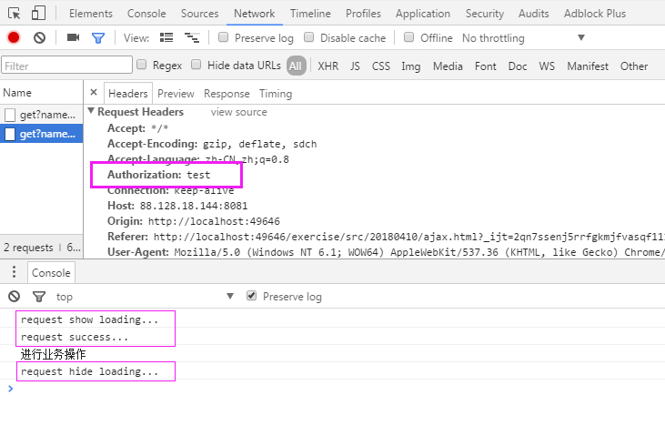
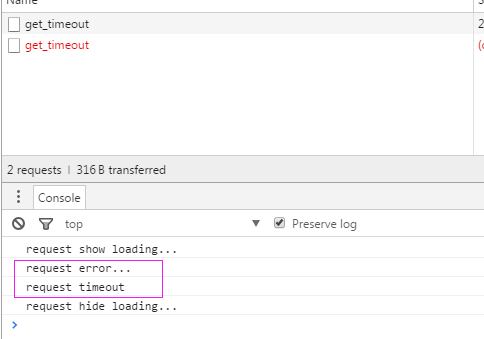
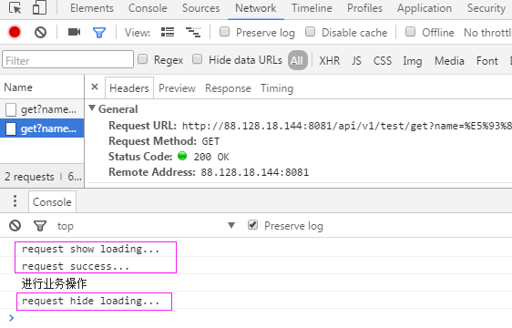
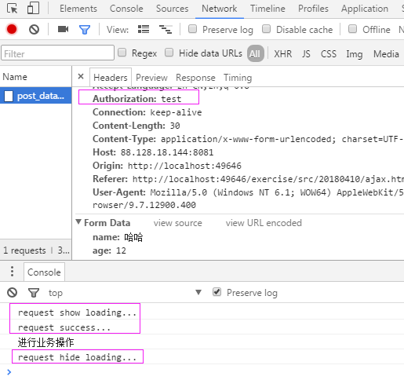
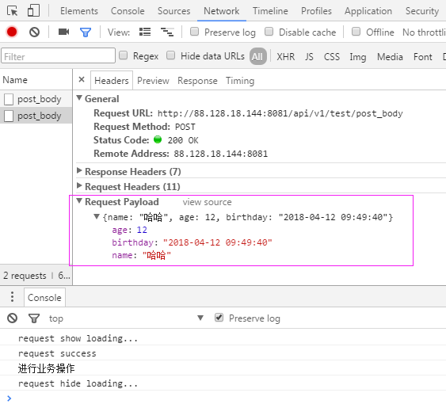
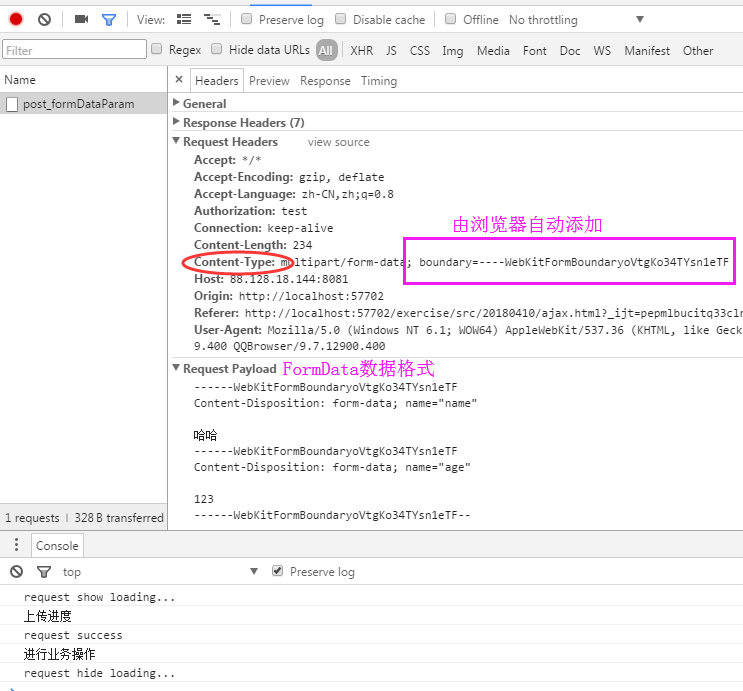
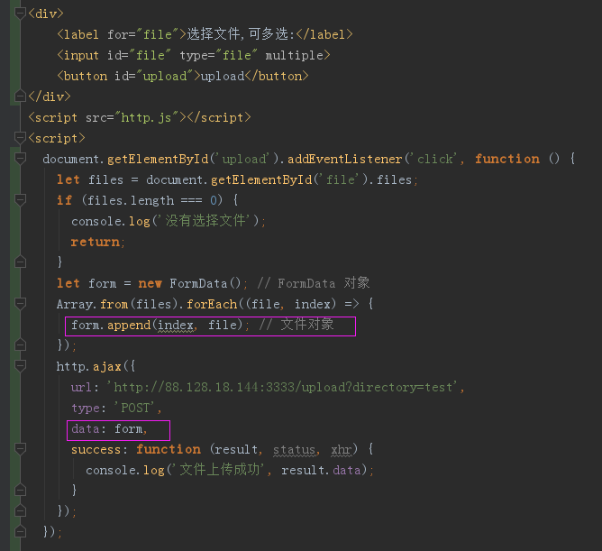
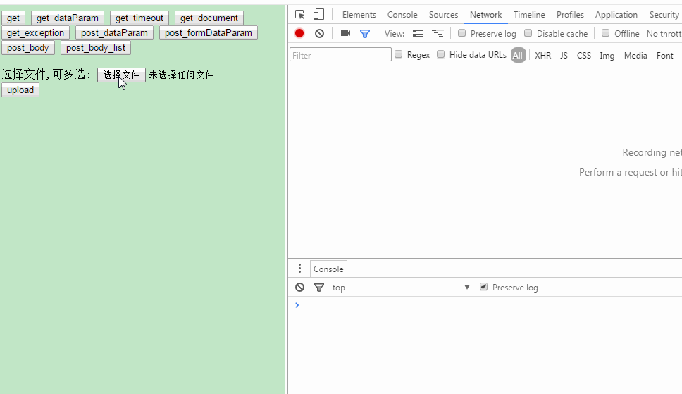
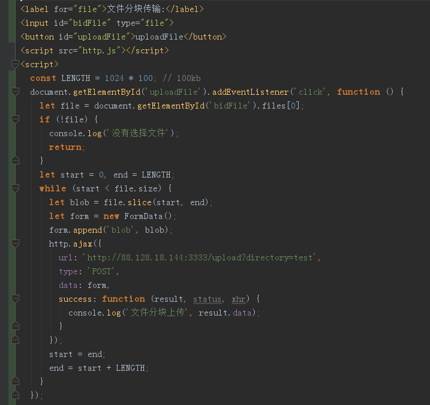
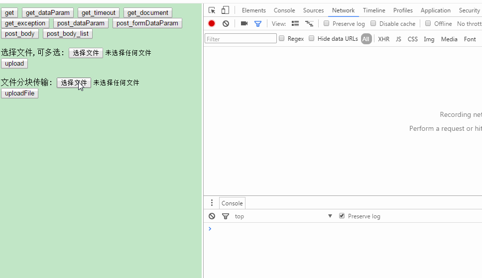

# 前言

- 做web开发,我们都知道浏览器通过`XMLHttpRequest`对象进行http通信
- 在实际开发中我们使用的是各种框架封装了的`XMLHttpRequest`对象,对具体实现往往一知半解.所以为了换框架好上手,请求有异常好调试,有必要深入学习一下`XMLHttpRequest`
- 本文从基础`XMLHttpRequest`开始,一步步把它封装为更实用的框架级别
- 参考：[jQuery2.2.4源码 — ](https://links.jianshu.com/go?to=https%3A%2F%2Fcdn.bootcss.com%2Fjquery%2F2.2.4%2Fjquery.js) 中搜索 ajax: function

# 实例

- 一个最简单的http请求

```javascript
let xhr = new XMLHttpRequest();
xhr.open('GET', '/url', true);
xhr.send();
```

- 一个稍微完整的http请求

```javascript
 let xhr = new XMLHttpRequest();
// 请求成功回调函数
xhr.onload = e => {
    console.log('request success');
};
// 请求结束
xhr.onloadend = e => {
    console.log('request loadend');
};
// 请求出错
xhr.onerror = e => {
    console.log('request error');
};
// 请求超时
xhr.ontimeout = e => {
    console.log('request timeout');
};
// 请求回调函数.XMLHttpRequest标准又分为Level 1和Level 2,这是Level 1和的回调处理方式
// xhr.onreadystatechange = () => {
//  if (xhr.readyState !== 4) {
//  return;
//  }
//  const status = xhr.status;
//  if ((status >= 200 && status < 300) || status === 304) {
//  console.log('request success');
//  } else {
//  console.log('request error');
//  }
//  };

xhr.timeout = 0; // 设置超时时间,0表示永不超时
// 初始化请求
xhr.open('GET/POST/DELETE/...', '/url', true || false);
// 设置期望的返回数据类型 'json' 'text' 'document' ...
xhr.responseType = '';
// 设置请求头
xhr.setRequestHeader('', '');
// 发送请求
xhr.send(null || new FormData || 'a=1&b=2' || 'json字符串');
```

- 很多东西一看就懂,但当真正去用的时候就会发现很多问题
- 为了深入学习,本着使XMLHttpRequest更易用的原则,模仿jQuery ajax封装`XMLHttpRequest`

# 封装XMLHttpRequest

```javascript
const http = {
  /**
   * js封装ajax请求
   * >>使用new XMLHttpRequest 创建请求对象,所以不考虑低端IE浏览器(IE6及以下不支持XMLHttpRequest)
   * >>使用es6语法,如果需要在正式环境使用,则可以用babel转换为es5语法 https://babeljs.cn/docs/setup/#installation
   *  @param settings 请求参数模仿jQuery ajax
   *  调用该方法,data参数需要和请求头Content-Type对应
   *  Content-Type                        data                                     描述
   *  application/x-www-form-urlencoded   'name=哈哈&age=12'或{name:'哈哈',age:12}  查询字符串,用&分割
   *  application/json                     name=哈哈&age=12'                        json字符串
   *  multipart/form-data                  new FormData()                           FormData对象,当为FormData类型,不要手动设置Content-Type
   *  注意:请求参数如果包含日期类型.是否能请求成功需要后台接口配合
   */
  ajax: (settings = {}) => {
    // 初始化请求参数
    let _s = Object.assign({
      url: '', // string
      type: 'GET', // string 'GET' 'POST' 'DELETE'
      dataType: 'json', // string 期望的返回数据类型:'json' 'text' 'document' ...
      async: true, //  boolean true:异步请求 false:同步请求 required
      data: null, // any 请求参数,data需要和请求头Content-Type对应
      headers: {}, // object 请求头
      timeout: 1000, // string 超时时间:0表示不设置超时
      beforeSend: (xhr) => {
      },
      success: (result, status, xhr) => {
      },
      error: (xhr, status, error) => {
      },
      complete: (xhr, status) => {
      }
    }, settings);
    // 参数验证
    if (!_s.url || !_s.type || !_s.dataType || _s.async === undefined) {
      alert('参数有误');
      return;
    }
    // 创建XMLHttpRequest请求对象
    let xhr = new XMLHttpRequest();
    // 请求开始回调函数
    xhr.addEventListener('loadstart', e => {
      _s.beforeSend(xhr);
    });
    // 请求成功回调函数
    xhr.addEventListener('load', e => {
      const status = xhr.status;
      if ((status >= 200 && status < 300) || status === 304) {
        let result;
        if (xhr.responseType === 'text') {
          result = xhr.responseText;
        } else if (xhr.responseType === 'document') {
          result = xhr.responseXML;
        } else {
          result = xhr.response;
        }
        // 注意:状态码200表示请求发送/接受成功,不表示业务处理成功
        _s.success(result, status, xhr);
      } else {
        _s.error(xhr, status, e);
      }
    });
    // 请求结束
    xhr.addEventListener('loadend', e => {
      _s.complete(xhr, xhr.status);
    });
    // 请求出错
    xhr.addEventListener('error', e => {
      _s.error(xhr, xhr.status, e);
    });
    // 请求超时
    xhr.addEventListener('timeout', e => {
      _s.error(xhr, 408, e);
    });
    let useUrlParam = false;
    let sType = _s.type.toUpperCase();
    // 如果是"简单"请求,则把data参数组装在url上
    if (sType === 'GET' || sType === 'DELETE') {
      useUrlParam = true;
      _s.url += http.getUrlParam(_s.url, _s.data);
    }
    // 初始化请求
    xhr.open(_s.type, _s.url, _s.async);
    // 设置期望的返回数据类型
    xhr.responseType = _s.dataType;
    // 设置请求头
    for (const key of Object.keys(_s.headers)) {
      xhr.setRequestHeader(key, _s.headers[key]);
    }
    // 设置超时时间
    if (_s.async && _s.timeout) {
      xhr.timeout = _s.timeout;
    }
    // 发送请求.如果是简单请求,请求参数应为null.否则,请求参数类型需要和请求头Content-Type对应
    xhr.send(useUrlParam ? null : http.getQueryData(_s.data));
  },
  // 把参数data转为url查询参数
  getUrlParam: (url, data) => {
    if (!data) {
      return '';
    }
    let paramsStr = data instanceof Object ? http.getQueryString(data) : data;
    return (url.indexOf('?') !== -1) ? paramsStr : '?' + paramsStr;
  },
  // 获取ajax请求参数
  getQueryData: (data) => {
    if (!data) {
      return null;
    }
    if (typeof data === 'string') {
      return data;
    }
    if (data instanceof FormData) {
      return data;
    }
    return http.getQueryString(data);
  },
  // 把对象转为查询字符串
  getQueryString: (data) => {
    let paramsArr = [];
    if (data instanceof Object) {
      Object.keys(data).forEach(key => {
        let val = data[key];
        // todo 参数Date类型需要根据后台api酌情处理
        if (val instanceof Date) {
          // val = dateFormat(val, 'yyyy-MM-dd hh:mm:ss');
        }
        paramsArr.push(encodeURIComponent(key) + '=' + encodeURIComponent(val));
      });
    }
    return paramsArr.join('&');
  }
}
```

- 可以把这段代码复制到你的ide上查看

- 调用http.ajax:发送一个get请求

```javascript
http.ajax({
  url: url + '?name=哈哈&age=12',
  success: function (result, status, xhr) {
    console.log('request success...');
  },
  error: (xhr, status, error) => {
    console.log('request error...');
  }
});
```

- 调用http.ajax:发送一个post请求

```javascript
http.ajax({
  url: url,
  type: 'POST',
  data: {name: '哈哈', age: 12}, //或 data: 'name=哈哈&age=12',
  headers: {
    'Content-Type': 'application/x-www-form-urlencoded; charset=UTF-8'
  },
  beforeSend: (xhr) => {
    console.log('request show loading...');
  },
  success: function (result, status, xhr) {
    console.log('request success...');
  },
  error: (xhr, status, error) => {
    console.log('request error...');
  },
  complete: (xhr, status) => {
    console.log('request hide loading...');
  }
});
```

- 此时的`http.ajax`方法已经完全可以处理请求了,但是每个请求都要单独处理异常情况吗?如果需要请求前显示`loading`请求结束关闭`loading`,每个请求都要添加`beforeSend`和`complete`参数吗?答案显而易见,于是继续封装

# 封装http.ajax

- 给http对象添加了`request`方法,该方法添加了业务逻辑后然后调用`http.ajax`,详情阅读代码及注释

```javascript
const http = {
  /**
   * 根据实际业务情况装饰 ajax 方法
   * 如:统一异常处理,添加http请求头,请求展示loading等
   * @param settings
   */
  request: (settings = {}) => {
    // 统一异常处理函数
    let errorHandle = (xhr, status) => {
      console.log('request error...');
      if (status === 401) {
        console.log('request 没有权限...');
      }
      if (status === 408) {
        console.log('request timeout');
      }
    };
    // 使用before拦截参数的 beforeSend 回调函数
    settings.beforeSend = (settings.beforeSend || function () {
    }).before(xhr => {
      console.log('request show loading...');
    });
    // 保存参数success回调函数
    let successFn = settings.success;
    // 覆盖参数success回调函数
    settings.success = (result, status, xhr) => {
      // todo 根据后台api判断是否请求成功
      if (result && result instanceof Object && result.code !== 1) {
        errorHandle(xhr, status);
      } else {
        console.log('request success');
        successFn && successFn(result, status, xhr);
      }
    };
    // 拦截参数的 error
    settings.error = (settings.error || function () {
    }).before((result, status, xhr) => {
      errorHandle(xhr, status);
    });
    // 拦截参数的 complete
    settings.complete = (settings.complete || function () {
    }).after((xhr, status) => {
      console.log('request hide loading...');
    });
    // 请求添加权限头,然后调用http.ajax方法
    (http.ajax.before(http.addAuthorizationHeader))(settings);
  },
  // 添加权限请求头
  addAuthorizationHeader: (settings) => {
    settings.headers = settings.headers || {};
    const headerKey = 'Authorization'; // todo 权限头名称
    // 判断是否已经存在权限header
    let hasAuthorization = Object.keys(settings.headers).some(key => {
      return key === headerKey;
    });
    if (!hasAuthorization) {
      settings.headers[headerKey] = 'test'; // todo 从缓存中获取headerKey的值
    }
  }
};

Function.prototype.before = function (beforeFn) { // eslint-disable-line
  let _self = this;
  return function () {
    beforeFn.apply(this, arguments);
    _self.apply(this, arguments);
  };
};

Function.prototype.after = function (afterFn) { // eslint-disable-line
  let _self = this;
  return function () {
    _self.apply(this, arguments);
    afterFn.apply(this, arguments);
  };
};
```

- 调用http.request:发送一个get请求

```javascript
http.request({
  url: url + '?name=哈哈&age=12',
  success: function (result, status, xhr) {
    console.log('进行业务操作');
  }
});
```

如下图可以看到调用http.request方法自动添加了请求权限头,输出了业务日志



- 如果请求发生异常,如下图可以看到输出了异常日志

```javascript
http.request({
  url: url,
  timeout: 1000,
  success: function (result, status, xhr) {
    console.log('进行业务操作');
  }
});
```



- 此时的http.request已经可以统一处理业务逻辑了.发送一个post方法如下,可以看到还是需要设置headers,经常使用jQuery的都知道,jQuert还有更简化的get,post等方法,所以我们继续封装

```javascript
http.request({
  url: url,
  type: 'POST',
  data: {name: '哈哈', age: 12}, // data: 'name=哈哈&age=12',
  headers: {
    'Content-Type': 'application/x-www-form-urlencoded; charset=UTF-8'
  },
  success: function (result, status, xhr) {
    console.log('进行业务操作');
  }
});
```

# 封装http.request

- 给http对象添加了get,post等方法,这些方法主要设置了默认参数然后调用http.request,详情阅读代码及注释

```javascript
const http = {
  get: (url, data, successCallback, dataType = 'json') => {
    http.request({
      url: url,
      type: 'GET',
      dataType: dataType,
      data: data,
      success: successCallback
    });
  },
  delete: (url, data, successCallback, dataType = 'json') => {
    http.request({
      url: url,
      type: 'DELETE',
      dataType: dataType,
      data: data,
      success: successCallback
    });
  },
  // 调用此方法,参数data应为查询字符串或普通对象
  post: (url, data, successCallback, dataType = 'json') => {
    http.request({
      url: url,
      type: 'POST',
      dataType: dataType,
      data: data,
      headers: {
        'Content-Type': 'application/x-www-form-urlencoded; charset=UTF-8'
      },
      success: successCallback
    });
  },
  // 调用此方法,参数data应为json字符串
  postBody: (url, data, successCallback, dataType = 'json') => {
    http.request({
      url: url,
      type: 'POST',
      dataType: dataType,
      data: data,
      headers: {
        'Content-Type': 'application/json; charset=UTF-8'
      },
      success: successCallback
    });
  }
};
```

- 调用http.get发送get请求

```javascript
http.get(url + '?name=哈哈&age=12', null, (result, status, xhr) => {
  console.log('进行业务操作');
});
```



- 调用http.post发送post请求

```javascript
http.post(url, {name: '哈哈', age: 12}, (result, status, xhr) => {
  console.log('进行业务操作');
})
```



- 调用http.postBody发送post请求,参数是json字符串.后台接口以对象方式接受参数

```javascript
http.postBody(url, JSON.stringify({
  name: '哈哈',
  age: 12,
  birthday: dateFormat(new Date(), 'yyyy-MM-dd hh:mm:ss')
}), (result, status, xhr) => {
  console.log('进行业务操作');
});
```



- 至此,发送一个http请求已经很简单了.

# 实例—传[FormData](https://links.jianshu.com/go?to=https%3A%2F%2Fdeveloper.mozilla.org%2Fzh-CN%2Fdocs%2FWeb%2FAPI%2FFormData%2FUsing_FormData_Objects)类型参数

- 参数不要设置contentType请求头,浏览器会自动设置contentType为'multipart/form-data'

```javascript
let formData = new FormData();
      formData.append('name', '哈哈');
      formData.append('age', '123');
      http.request({
        url: url + id,
        type: 'POST',
        data: formData,
        success: function (result, status, xhr) {
          console.log('进行业务操作');
        }
      });
```



# 实例—上传文件

- 把文件对象放到FormData参数中

  

  

- 如果需要监控上传进度,需要ajax方法,添加`onprogress`事件

```javascript
 xhr.upload.addEventListener('progress', e => {
    console.log('上传进度');
  });
```

# 实例—文件分块传输



- 可以看到一张图片分了三个请求发送,至于后台到底能不能接受到这张图片,当然需要后台处理

  

# 最后

- 完整[http.js](https://links.jianshu.com/go?to=https%3A%2F%2Fgithub.com%2Fyanxiaojun617%2Fexercise%2Fblob%2Fmaster%2Fsrc%2F20180410ajax%2Fhttp.js)代码已上传github
- 使用XMLHttpRequest Level 1标准的onreadystatechange方法注册回调看[这个ajax.js](https://links.jianshu.com/go?to=https%3A%2F%2Fgithub.com%2Fyanxiaojun617%2Fexercise%2Fblob%2Fmaster%2Fsrc%2F20180410ajax%2Fajax.js)

# 其他

## 关于Fetch API

- XMLHttpRequest不好用,所以各个框架都要将其封装.规范制定者也知道不好用,所以就出了个[Fetch](https://links.jianshu.com/go?to=https%3A%2F%2Fdeveloper.mozilla.org%2Fzh-CN%2Fdocs%2FWeb%2FAPI%2FFetch_API) API来代替XMLHttpRequest
- 由于Fetch API目前的[浏览器兼容性](https://links.jianshu.com/go?to=https%3A%2F%2Fcaniuse.com%2F%23search%3Dfetch)不行,所以现在还不被考虑使用,但是它真的很好用
- 发送一个get请求代码如下(*是不是似曾相识的感觉,fetch方法返回Promise*)

```javascript
fetch(url + '?name=哈哈&age=12').then(res=>res.json()).then(data=>{
  console.log(data);
});
```

## 关于http2.0

- http2.0主要是相对我们正在使用的http1.1性能方面的提升,语法方面继续使用1.1的内容,只是更改了系统之间传输数据的方式,这些细节实现由浏览器和服务器实现.所以叫http1.2更合适.
- 你的网站想用http2？首先你的网站要全面支持https,然后在服务器端(tomcat或nginx等)配置启用http2
- [点这里了解更多http2](https://links.jianshu.com/go?to=https%3A%2F%2Fwww.zhihu.com%2Fquestion%2F34074946)
- 如何判断某网站是否使用了http2？在某网站控制台执行如下代码

```javascript
(function(){
    // 保证这个方法只在支持loadTimes的chrome浏览器下执行
    if(window.chrome && typeof chrome.loadTimes === 'function') {
        var loadTimes = window.chrome.loadTimes();
        var spdy = loadTimes.wasFetchedViaSpdy;
        var info = loadTimes.npnNegotiatedProtocol || loadTimes.connectionInfo;
        // 就以 「h2」作为判断标识
        if(spdy && /^h2/i.test(info)) {
            return console.info('本站点使用了HTTP/2');
        }
    }
    console.warn('本站点没有使用HTTP/2');
})();
```

- 京东,天猫,Google都用了http2,百度,淘宝没有用

