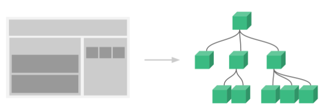

### 前言

前端领域当中有三大框架，Angular(google)，Rect(facebook)，Vue，都是开发单页面应用框架。

Vue框架官网地址：https://cn.vuejs.org/ 

VUE是一套用于构建用户界面的渐进式（JavaScript）框架，源码都封装到了一个尾缀为JS这样一样的文件里面。与其它大型框架不同的是，Vue 被设计为可以自底向上逐层应用。Vue 的核心库只关注视图层，不仅易于上手，还便于与第三方库或既有项目整合

### 基础使用

声明式渲染：Vue.js 的核心是一个允许采用简洁的模板语法来声明式地将数据渲染进 DOM 的系统

响应式；一个 Vue 应用会将其挂载到一个 DOM 元素上 (对于这个例子是 `#app`) 然后对其进行完全控制。那个 HTML 是我们的入口，但其余都会发生在新创建的 Vue 实例内部。数据和 DOM 已经被建立了关联，所有东西都是**响应式的**

1. VUE实例：每个 Vue 应用都是通过用 `Vue` 函数创建一个新的 **Vue 实例**开始的：
2. 当一个 Vue 实例被创建时，它将 `data` 对象中的所有的 property 加入到 Vue 的**响应式系统**中。当这些 property 的值发生改变时，视图将会产生“响应”，即匹配更新为新的值
3. 值得注意的是只有当实例被创建时就已经存在于 `data` 中的 property 才是**响应式**的。也就是说如果你添加一个新的 property，比如：vm.b = 'hi'，那么对 `b` 的改动将不会触发任何视图的更新
4. 使用 `Object.freeze()`，这会阻止修改现有的 property，也意味着响应系统无法再*追踪*变化.
5. Vue 实例还暴露了一些有用的实例 property 与方法。它们都有前缀 `$`，以便与用户定义的 property 区分开来。

```javascript
var obj = { foo: 1 }
//这里的 `foo` 不会更新！
Object.freeze(obj)

var vm = new Vue({
  el: '#example',
  data: obj
})

vm.$data === data // => true
vm.$el === document.getElementById('example') // => true

// $watch 是一个实例方法
vm.$watch('a', function (newValue, oldValue) {
  // 这个回调将在 `vm.a` 改变后调用
})
```

### 生命周期

每个 Vue 实例在被创建时都要经过一系列的初始化过程——例如，需要设置数据监听、编译模板、将实例挂载到 DOM 并在数据变化时更新 DOM 等。同时在这个过程中也会运行一些叫做**生命周期钩子**的函数.

生命周期钩子的 `this` 上下文指向调用它的 Vue 实例.

不要在选项 property 或回调上使用[箭头函数](https://developer.mozilla.org/zh-CN/docs/Web/JavaScript/Reference/Functions/Arrow_functions)，比如 `created: () => console.log(this.a)` 或 `vm.$watch('a', newValue => this.myMethod())`。因为箭头函数并没有 `this`，`this` 会作为变量一直向上级词法作用域查找，直至找到为止，经常导致 `Uncaught TypeError: Cannot read property of undefined` 或 `Uncaught TypeError: this.myMethod is not a function` 之类的错误。


### 模板语法

#### 命名

HTML 中的 attribute 名是大小写不敏感的，所以浏览器会把所有大写字符解释为小写字符。

这意味着当你使用 DOM 中的模板时，camelCase (驼峰命名法) 的名称需要使用其等价的 kebab-case (短横线分隔命名) 命名：

如：prop 名，组件名

#### 插值

数据绑定最常见的形式就是使用“Mustache”语法 (双大括号) 的文本插值

适用于: 文本，HTML， Attribute(Class和Style的绑定)，JavaScript 表达式

v-html,  v-text,  v-bind:.

绑定 HTML Class模板: 

```vue
<!--绑定 HTML Class模板-->
<div> class="static" v-bind:class="{active: isActive, 'text-danger':hasError}" </div>
data: {
  isActive: true,
  hasError: false
}
<!--绑定的数据对象不必内联定义在模板里-->
<div v-bind:class="classObject"></div>
data: {
  classObject: {
    active: true,
    'text-danger': false
  }
}
<!--绑定一个返回对象的计算属性-->
data: {
  isActive: true,
  error: null
},
computed: {
  classObject: function () {
    return {
      active: this.isActive && !this.error,
      'text-danger': this.error && this.error.type === 'fatal'
    }
  }
}
<!--数组语法-->
<div v-bind:class="[activeClass, errorClass]"></div>
data: {
  activeClass: 'active',
  errorClass: 'text-danger'
}
```

绑定内联样式

```vue
<div v-bind:style="{ color: activeColor, fontSize: fontSize + 'px' }"></div>
<!--直接绑定到一个样式对象-->
<div v-bind:style="styleObject"></div>
<!--数组语法-->
<div v-bind:style="[baseStyles, overridingStyles]"></div>
<!--多重值,只会渲染数组中最后一个被浏览器支持的值-->
<div :style="{ display: ['-webkit-box', '-ms-flexbox', 'flex'] }"></div>
```

#### 指令

职责是，当表达式的值改变时，将其产生的连带影响，响应式地作用于 DOM

1. 根据条件展示: v-show, 

    有更高的初始渲染开销, 需要非常频繁地切换

   有 `v-show` 的元素始终会被渲染并保留在 DOM 中。`v-show` 只是简单地切换元素的 CSS property `display`.

2. 条件渲染:v-if,  

   有更高的切换开销, 运行时条件很少改变

   Vue 会尽可能高效地渲染元素，默认复用已有元素.

   用 `key` 管理可复用的元素, 让元素从头开始渲染. 

3. 列表渲染:v-for,  

   对象的属性, 数组的元素. 

   提供额外的二个的参数name键名,index索引.

4. Key是 Vue 识别节点的一个通用机制, 用来维护元素的状态.
   1. 默认使用“就地更新”的策略。如果数据项的顺序被改变，Vue 将不会移动 DOM 元素来匹配数据项的顺序，而是就地更新每个元素，并且确保它们在每个索引位置正确渲染.
   2. 这个默认的模式是高效的，但是**只适用于不依赖子组件状态或临时 DOM 状态 (例如：表单输入值) 的列表渲染输出**。
   3. 为了给 Vue 一个提示，以便它能跟踪每个节点的身份，从而重用和重新排序现有元素，你需要为每项提供一个唯一 `key` attribute.
   4. 建议尽可能在使用 `v-for` 时提供 `key` attribute，除非遍历输出的 DOM 内容非常简单，或者是刻意依赖默认行为以获取性能上的提升。

5. 事件处理: v-on(@),  

   监听 DOM 事件,并在触发时运行一些 JavaScript 代码.

   调用的方法名, 或内联 JavaScript 语句中调用方法.

   在内联语句处理器中, 传入特殊变量 `$event`,访问原始的 DOM 原生事件对象.

6. 事件修饰符

   替代调用 `event.preventDefault()` 或 `event.stopPropagation()` 等.

   方法只有纯粹的数据逻辑，而不是去处理 DOM 事件细节. Vue.js 为 `v-on` 提供了**事件修饰符**

   ```vue
   <!-- 阻止单击事件继续传播 -->
   <a v-on:click.stop="doThis"></a>
   
   <!-- 提交事件不再重载页面 -->
   <form v-on:submit.prevent="onSubmit"></form>
   
   <!-- 添加事件监听器时使用事件捕获模式 -->
   <!-- 即内部元素触发的事件先在此处理，然后才交由内部元素进行处理 -->
   <div v-on:click.capture="doThis">...</div>
   
   <!-- 只当在 event.target 是当前元素自身时触发处理函数 -->
   <!-- 即事件不是从内部元素触发的 -->
   <div v-on:click.self="doThat">...</div>
   
   <!-- 点击事件将只会触发一次 -->
   <a v-on:click.once="doThis"></a>
   
   <!-- 滚动事件的默认行为 (即滚动行为) 将会立即触发 -->
   <!-- 而不会等待 `onScroll` 完成 ,对应 addEventListener 中的 passive 选项-->
   <!-- 这其中包含 `event.preventDefault()` 的情况 -->
   <div v-on:scroll.passive="onScroll">...</div>
   
   <!-- 按键修饰符, 只有在 `key` 是 `Enter` 时调用 `vm.submit()` -->
   <input v-on:keyup.enter="submit">
   ```

   用 `v-on:click.prevent.self` 会阻止**所有的点击**，

   而 `v-on:click.self.prevent` 只会阻止对元素自身的点击。

   `.passive` 修饰符尤其能够提升移动端的性能

7. 表单输入绑定：v-model，

   由数据劫持结合发布者－订阅者模式实现

   ```vue
   <input v-model="searchText">
   <!--等价于-->
   <input v-bind:value="searchText" v-on:input="searchText = $event.target.value"
   
   <!-- 在“change”时而非“input”时更新 -->
   <input v-model.lazy="msg">
   
   <!-- 自动将用户的输入值转为数值类型 -->
   <input v-model.number="age" type="number">
   
   <!-- 自动过滤用户输入的首尾空白字符 -->
   <input v-model.trim="msg">
   ```

### 计算属性

computed: 对于任何复杂逻辑，你都应当使用**计算属性**.

**它是基于它们的响应式依赖进行缓存的**。只在相关响应式依赖发生改变时它们才会重新求值。这就意味着只要 `message` 还没有发生改变，多次访问 `reversedMessage` 计算属性会立即返回之前的计算结果，而不必再次执行函数.

计算属性默认只有 getter，不过在需要时你也可以提供一个 setter：

```javascript
computed: {
  fullName: {
    // getter
    get: function () {
      return this.firstName + ' ' + this.lastName
    },
    // setter
    set: function (newValue) {
      var names = newValue.split(' ')
      this.firstName = names[0]
      this.lastName = names[names.length - 1]
    }
  }
}
//现在再运行 vm.fullName = 'John Doe' 时，setter 会被调用，vm.firstName 和 vm.lastName 也会相应地被更新
```

### 侦听器

Vue 提供了一种更通用的方式来观察和响应 Vue 实例上的数据变动：**侦听属性**, 当需要在数据变化时执行异步或开销较大的操作时，这个方式是最有用的. 

使用 `watch` 选项允许我们执行异步操作 (访问一个 API)，限制我们执行该操作的频率，并在我们得到最终结果前，设置中间状态。这些都是计算属性无法做到的

但其它情况下, 通常更好的做法是使用计算属性而不是命令式的 `watch` 回调.

### 组件



1. **一个组件的 `data` 选项必须是一个函数**，因此每个实例可以维护一份被返回对象的独立的拷贝

2. 为了能在模板中使用，这些组件必须先注册以便 Vue 能够识别。

   这里有两种组件的注册类型：**全局注册**和**局部注册**。

   `Vue.component` 是全局注册，对象内部conponents{} 是局部注册。

3. 组件传值有3种。

   1. 父组件通过 props 向子组件传递数据

      所有的 prop 都使得其父子 prop 之间形成了一个**单向下行绑定**：父级 prop 的更新会向下流动到子组件中，每次父级组件发生变更时，子组件中所有的 prop 都将会刷新为最新的值，但是反过来则不行。这样会防止从子组件意外变更父级组件的状态，从而导致你的应用的数据流向难以理解

      两种常见的试图变更一个 prop 的情形：

      1. **这个子组件接下来希望将其作为一个本地的 prop 数据来使用。**在这种情况下，最好定义一个本地的 data property 并将这个 prop 用作其初始值。
      2. **这个 prop 以一种原始的值传入且需要进行转换。**在这种情况下，最好使用这个 prop 的值来定义一个计算属性。
      3. 原因：JavaScript 中对象和数组是通过引用传入的，所以对于一个数组或对象类型的 prop 来说，在子组件中改变变更这个对象或数组本身**将会**影响到父组件的状态。

      类型检查： prop 会在一个组件实例创建**之前**进行验证，所以实例的 property (如 `data`、`computed` 等) 在 `default` 或 `validator` 函数中是不可用的

      ```vue
      Vue.component('my-component', {
        props: {
          // 基础的类型检查 (`null` 和 `undefined` 会通过任何类型验证)
          propA: Number,
          // 多个可能的类型
          propB: [String, Number],
          // 必填的字符串
          propC: {
            type: String,
            required: true
          },
          // 带有默认值的数字
          propD: {
            type: Number,
            default: 100
          },
          // 带有默认值的对象
          propE: {
            type: Object,
            // 对象或数组默认值必须从一个工厂函数获取
            default: function () {
              return { message: 'hello' }
            }
          },
          // 自定义验证函数
          propF: {
            validator: function (value) {
              // 这个值必须匹配下列字符串中的一个
              return ['success', 'warning', 'danger'].indexOf(value) !== -1
            }
          }
        }
      })
      ```

   2. 子组件可以通过调用内建的 **`$emit`** 方法并传入事件名称来触发一个事件, 

      还可以使用事件抛出一个值, 父级组件监听这个事件的时候，可以通过 `$event` 访问到被抛出的这个值. 

      或者作为第一个参数传入事件处理函数的方法.

   3. 兄弟组件之间

4. 组件中非 Prop 的 Attribute

5. 每个组件必须只有一个根元素

6. 组件上使用 v-model

   ```vue
   <custom-input v-model="searchText"></custom-input>
   <!--等价于-->
   <custom-input v-bind:value="searchText" v-on:input="searchText = $event"></custom-input>
   
   Vue.component("custom-input",{
   	props:['value'],
   	template:
       '<input\
         v-bind:value="value"\
         v-on:input="$emit('input', $event.target.value)"\
       >'
   })
   ```

7. 通过插槽分发内容：slot元素。

8. 动态组件：`is` attribute 

9. 解析DOM模板：有些 HTML 元素，诸如 `<ul>`、`<ol>`、`<table>` 和 `<select>`，对于哪些元素可以出现在其内部是有严格限制的，

   ```vue
   <table>
     <blog-post-row></blog-post-row>
   </table>
   <!--这个自定义组件 <blog-post-row> 会被作为无效的内容提升到外部，并导致最终渲染结果出错,需改为-->
   <table>
     <tr :is="blog-post-row"></tr>
   </table>
   ```

   需要注意的是**如果我们从以下来源使用模板的话，这条限制是\*不存在\*的**：

   - 字符串 (例如：`template: '...'`)
   - 单文件组件(.vue)
   - 脚本文件<script type='text/x-temlate'>

10. 


原理：https://blog.csdn.net/weixin_37861326/article/details/80854763

实现：

1. 调色板
2. 微博发布框
3. 百度预搜索效果
4. AJAX技术实现
5. 

https://www.baidu.com/sugrec?pre=1&p=3&ie=utf-8&json=1&prod=pc&from=pc_web&sugsid=34302,33966,34335,34369,31660,34331,34004,34073,34281,34094,26350,34245,34090&wd=wangjicheng&req=2&bs=html%20span%20p&pbs=html%20span%20p&csor=11&pwd=wangjichen&cb=jQuery1102009684849123971118_1628056613932&_=1628056614015

https://zhuanlan.zhihu.com/p/27678951

https://blog.csdn.net/get_set/article/details/79455258
