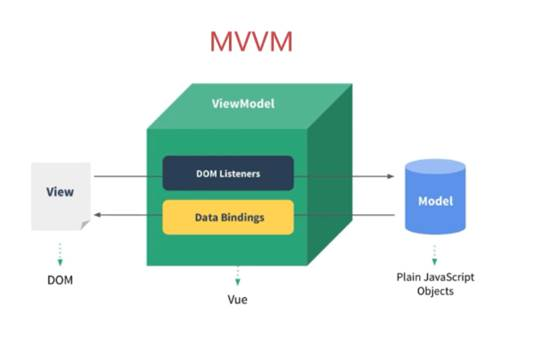

### 前言

前端领域当中有三大框架，Angular(google)，Rect(facebook)，Vue，都是开发单页面应用框架。

Vue框架官网地址：https://cn.vuejs.org/ 

VUE是一套用于构建用户界面的渐进式（JavaScript）框架，

1. 源码都封装到了一个尾缀为JS这样一样的文件里面。
2. 与其它大型框架不同的是，Vue 被设计为可以自底向上逐层应用。
3. Vue 的核心库只关注视图层，不仅易于上手，还便于与第三方库或既有项目整合

渐进式的理解：

1. Vue的核心功能：强调的是状态到界面的映射，是一个视图模板引擎。
2. 声明式渲染（视图模板引擎）：是一个允许采用简洁的模板语法来声明式地将数据渲染进 DOM 的系统。
3. 下图所示，这里包含了Vue的所有部件，在声明式渲染（视图模板引擎）的基础上，我们可以通过添加组件系统、客户端路由、大规模状态管理来构建一个完整的框架。更重要的是，这些功能相互独立，你可以在核心功能的基础上任意选用其他的部件，不一定要全部整合在一起。
4. 所以，所说的“渐进式”，其实就是Vue的使用方式，同时也体现了Vue的设计的理念．


当与现代化的工具链以及各种支持类库结合使用时，Vue 也完全能够为复杂的单页应用提供驱动

实际上vue框架就是一个MVVM框架,它是初创公司的首选框架，它是轻量级的，有很多根据Vue拓展的独立的功能或库



### 基础使用

响应式；一个 Vue 应用会将其挂载到一个 DOM 元素上 (对于这个例子是 `#app`) 然后对其进行完全控制。那个 HTML 是我们的入口，但其余都会发生在新创建的 Vue 实例内部。数据和 DOM 已经被建立了关联，所有东西都是**响应式的**

1. VUE实例：每个 Vue 应用都是通过用 `Vue` 函数创建一个新的 **Vue 实例**开始的：
2. 当一个 Vue 实例被创建时，它将 `data` 对象中的所有的 property 加入到 Vue 的**响应式系统**中。当这些 property 的值发生改变时，视图将会产生“响应”，即匹配更新为新的值
3. 值得注意的是只有当实例被创建时就已经存在于 `data` 中的 property 才是**响应式**的。也就是说如果你添加一个新的 property，比如：vm.b = 'hi'，那么对 `b` 的改动将不会触发任何视图的更新
4. 使用 `Object.freeze()`，这会阻止修改现有的 property，也意味着响应系统无法再*追踪*变化.
5. Vue 实例还暴露了一些有用的实例 property 与方法。它们都有前缀 `$`，以便与用户定义的 property 区分开来。

```javascript
var obj = { foo: 1 }
//这里的 `foo` 不会更新！
Object.freeze(obj)

var vm = new Vue({
  el: '#example',
  data: obj
})

vm.$data === data // => true
vm.$el === document.getElementById('example') // => true

// $watch 是一个实例方法
vm.$watch('a', function (newValue, oldValue) {
  // 这个回调将在 `vm.a` 改变后调用
})
```

### 模板语法

#### 命名

HTML 中的 attribute 名是大小写不敏感的，所以浏览器会把所有大写字符解释为小写字符。

这意味着当你使用 DOM 中的模板时，camelCase (驼峰命名法) 的名称需要使用其等价的 kebab-case (短横线分隔命名) 命名：

如：prop 名，组件名

#### 插值

数据绑定最常见的形式就是使用“Mustache”语法 (双大括号) 的文本插值，内部也可以存放表达式，表达式支持简单，比如简单判断，比如三元表达式，不可以使用if等等复杂判断

#### 指令

指令的英文：directive，vue指令的作用是通过带有v-的特殊属性，实现对dom的响应式加载

职责是，当表达式的值改变时，将其产生的连带影响，响应式地作用于 DOM

1. 根据条件展示: v-show, 

   有更高的初始渲染开销, 需要非常频繁地切换

   有 `v-show` 的元素始终会被渲染并保留在 DOM 中。`v-show` 只是简单地切换元素的 CSS property `display`.对元素的显示和隐藏进行逻辑判断，并没有实现元素的下树

2. 条件渲染:v-if,  

   有更高的切换开销, 运行时条件很少改变

   Vue 会尽可能高效地渲染元素，默认复用已有元素.

   用 `key` 管理可复用的元素, 让元素从头开始渲染. 

   显示根本原理：一个是通过对值的隐式转换，一个就是通过对表达式的判断得出的布尔值得来的

   v-show和v-if的使用场景区分：如果页面切换的特别频繁使用v-show，如果页面的涉及范围特别大并且不是特别频繁的切换使用v-if，因为主要区分是涉及到页面的加载性能。

3. 列表渲染:v-for,  

   作用是遍历数组（对象）的每一个值. 

   提供额外的二个的参数name键名,index索引.

   数组的元素: \<li v-for="(item,index) in arr" :key="index">{{index}}-{{item}}</li>

   对象的属性: \<li v-for="(item,key,index) in obj" :key="index">{{index}}-{{key}}:{{item}}</li>

   index指的是每一项被遍历的值的下标索引值

   key是用来给每一项值加元素标识(对象属性名)，作用是为了区分元素，为了实现最小量的更新

   Key是 Vue 识别节点的一个通用机制, 用来维护元素的状态.
   1. 默认使用“就地更新”的策略。如果数据项的顺序被改变，Vue 将不会移动 DOM 元素来匹配数据项的顺序，而是就地更新每个元素，并且确保它们在每个索引位置正确渲染.
   2. 这个默认的模式是高效的，但是**只适用于不依赖子组件状态或临时 DOM 状态 (例如：表单输入值) 的列表渲染输出**。
   3. 为了给 Vue 一个提示，以便它能跟踪每个节点的身份，从而重用和重新排序现有元素，你需要为每项提供一个唯一 `key` attribute.
   4. 建议尽可能在使用 `v-for` 时提供 `key` attribute，除非遍历输出的 DOM 内容非常简单，或者是刻意依赖默认行为以获取性能上的提升。

4. 渲染文本：v-html,  v-text,

   渲染方法：双大括号插值：{{}}，v-text， v-html

   双大括号和v-text渲染结果类似，都是会以文本类型进行渲染。

   区别：

   双大括号在渲染结果之前，会有编译之前的文本显示，v-text是没有这种现象的

   双大括号更灵活，中间是可以添加内容的，v-text是只能渲染data中的数据，中间不允许插入内容

   v-html的渲染方式，会识别html模板。不允许在标签元素(如p)中间随意插值

5. v-cloak

   作用是在vue实例渲染后关联结果。

   双大括号插值语法在遇到网络延迟的时候会显示编译之前的文本。

   使用v-cloak结合CSS解决双大括号渲染：[v-cloak]css选择器选择的是html结构中有v-cloak的属性，有这个属性的元素设置display为none，又由于v-cloak这个属性在vue的实例加载完之后关联结束，所以修改这个元素的隐藏状态，元素就会显示，这样造成的结果就是要么空白，要么显示编译后的文本。

6. v-once

   作用是只会渲染对应元素一次，数据更新不会引起视图的更新

   目的是为了优化页面的性能

7. v-pre

   属性的作用是跳过该元素编译过程，直接显示元素内部的文本，特点就是跳过大量的没有指令的节点。

   浏览器显示的就是没有编译之前的h2元素中的文本内容，v-pre属性的有点就是优化页面的加载性能

8. 事件处理: v-on(@),  

   作用是给元素添加事件监听，可以简写为@，监听 DOM 事件,并在触发时运行一些 JavaScript 代码.

   替代原生的JavaScript的事件方法，一律去除on，如onmouseleave

   调用的方法名, 或内联 JavaScript 语句中调用方法.

   必须写在vue的methods中，不允许在外部罗列方法名称，

   原生的JavaScript的事件方法是不能和vue混用的，

   同名方法会有覆盖情况，后写方法会覆盖先写的方法

   在内联语句处理器中, 传入特殊变量 `$event`,访问原始的 DOM 原生事件对象.

   如果方法中没有传入值，默认输入会有该方法的事件参数

9. v-bind

   属性的作用是将普通的w3c属性变为动态属性，让属性具有动态能力

   适用于: 文本，HTML， Attribute(Class和Style的绑定)，JavaScript 表达式

   style属性和class属性有特殊性，如果需要使用动态传值，必须传入一个object对象.

   绑定 HTML Class模板: 

   ```vue
   <!--绑定 HTML Class模板-->
   <div> class="static" v-bind:class="{active: isActive, 'text-danger':hasError}" </div>
   data: {
     isActive: true,
     hasError: false
   }
   <!--绑定的数据对象不必内联定义在模板里-->
   <div v-bind:class="classObject"></div>
   data: {
     classObject: {
       active: true,
       'text-danger': false
     }
   }
   <!--绑定一个返回对象的计算属性-->
   data: {
     isActive: true,
     error: null
   },
   computed: {
     classObject: function () {
       return {
         active: this.isActive && !this.error,
         'text-danger': this.error && this.error.type === 'fatal'
       }
     }
   }
   <!--数组语法-->
   <div v-bind:class="[activeClass, errorClass]"></div>
   data: {
     activeClass: 'active',
     errorClass: 'text-danger'
   }
   ```

   绑定内联样式

   ```vue
   <div v-bind:style="{ color: activeColor, fontSize: fontSize + 'px' }"></div>
   <!--直接绑定到一个样式对象-->
   <div v-bind:style="styleObject"></div>
   <!--数组语法-->
   <div v-bind:style="[baseStyles, overridingStyles]"></div>
   <!--多重值,只会渲染数组中最后一个被浏览器支持的值-->
   <div :style="{ display: ['-webkit-box', '-ms-flexbox', 'flex'] }"></div>
   ```

10. 表单输入绑定：v-model，

   由数据劫持结合发布者－订阅者模式实现

   v使用在表单元素中的，作用是实现表单和数据的双向绑定

   ```vue
   <input v-model="searchText">
   <!--等价于-->
   <input v-bind:value="searchText" v-on:input="searchText = $event.target.value"
   
   <!-- 表单修饰符都是用来修饰v-model属性的,分别是.lazy，.number，.trim-->
   <!-- 在“change”时而非“input”时更新,将输入框的数据绑定v-model从实时监听的状态变为change状态 -->
   <input v-model.lazy="msg">
   
   <!-- 自动将用户的输入值转为数值类型 -->
   <input v-model.number="age" type="number">
   
   <!-- 自动过滤用户输入的首尾空白字符 -->
   <input v-model.trim="msg">
   ```

#### 修饰符

替代调用 `event.preventDefault()` 或 `event.stopPropagation()` 等.

方法只有纯粹的数据逻辑，而不是去处理 DOM 事件细节. Vue.js 为 `v-on` 提供了**事件修饰符**

```vue
<!-- 阻止单击事件继续传播(冒泡),类似原生JavaScript的event.stopPropagation()方法-->
<a v-on:click.stop="doThis"></a>

<!-- 作用是阻止标签元素的默认事件 原生：event.preventDefault()-->
<!-- 提交事件不再重载页面 -->
<form v-on:submit.prevent="onSubmit"></form
<!-- 不会执行a标签的默认的跳转事件 -->
<a href="http://www.baidu.com" @click.prevent="alertDialog">点击跳转到百度</a>

<!-- 添加事件监听器时使用事件捕获模式 -->
<!-- 即内部元素触发的事件先在此处理，然后才交由内部元素进行处理 -->
<!-- vue的事件监听，默认都是获取冒泡阶段的，所以使用capture去监听捕获阶段的事件,结果为:外层-中间-内层-->
<div class="outer" @click.capture="outer">
    <div class="center" @click.capture="center">
        <div class="inner" @click="inner"></div>
    </div>
</div>

<!-- 只当在 event.target 是当前元素自身时触发处理函数，即事件不是从内部元素触发的, -->
<!-- 作用是只有点击元素本身的时候才能触发事件，不接受冒泡上来的事件，同时也不能阻止事件的冒泡 -->
<div v-on:click.self="doThat">...</div>

<!-- 点击事件将只会触发一次 -->
<a v-on:click.once="doThis"></a>

<!-- 滚动事件的默认行为 (即滚动行为) 将会立即触发 -->
<!-- 而不会等待 `onScroll` 完成 ,对应 addEventListener 中的 passive 选项-->
<!-- 这其中包含 `event.preventDefault()` 的情况 -->
<div v-on:scroll.passive="onScroll">...</div>

<!-- 按键修饰符, 只有在 `key` 是 `Enter`（空格） 时调用 `vm.submit()` -->
<input v-on:keyup.enter="submit">
<input type="text" @keyup.32='add'>
    
<!-- 鼠标按键修饰符修饰的是鼠标的左、滚轮、右键 -->
<!-- 结合prevent修饰符实现右键的事件监听，prevent必须在right后 -->
<button  @click.right.prevent='add'>按我加1 </button>
    
<!-- 系统修饰符,通过一些指定的按键配合鼠标点击或者键盘事件进行事件监听,如ctrl,alt,shfit,meta徽标键,Command苹果键-->
<!-- 此时按住键盘ctrl键然后鼠标点击才能实现add加1 -->
<button  @click.ctrl='add'>按我加1 </button>
```

1. 用 `v-on:click.prevent.self` 会阻止**所有的点击**，

2. 而 `v-on:click.self.prevent` 只会阻止对元素自身的点击。

3. `.passive` 修饰符尤其能够提升移动端的性能

常用的keyCode别名

| keyCode值 | 别名    | 键盘按键            |
| --------- | ------- | ------------------- |
| 13        | .enter  | 回车                |
| 32        | .space  | 空格                |
| 37        | .left   | 键盘左键            |
| 38        | .up     | 键盘上键            |
| 39        | .right  | 键盘右键            |
| 40        | .down   | 键盘下键            |
| 9         | .tab    | 键盘tab             |
| 46或者8   | .delete | delete或者backspace |


