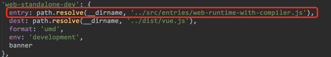
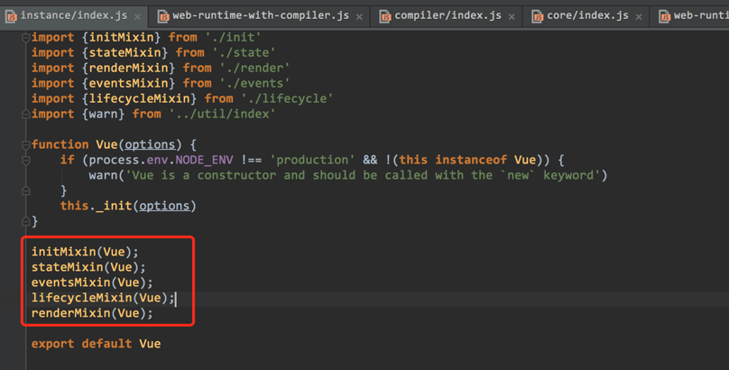
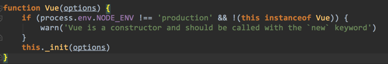
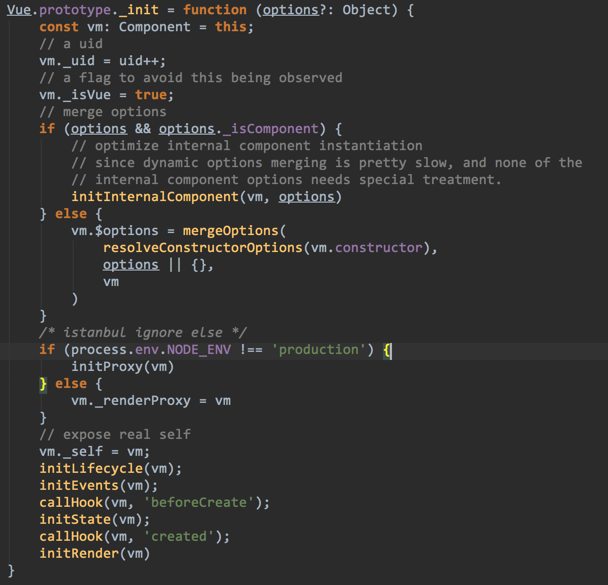
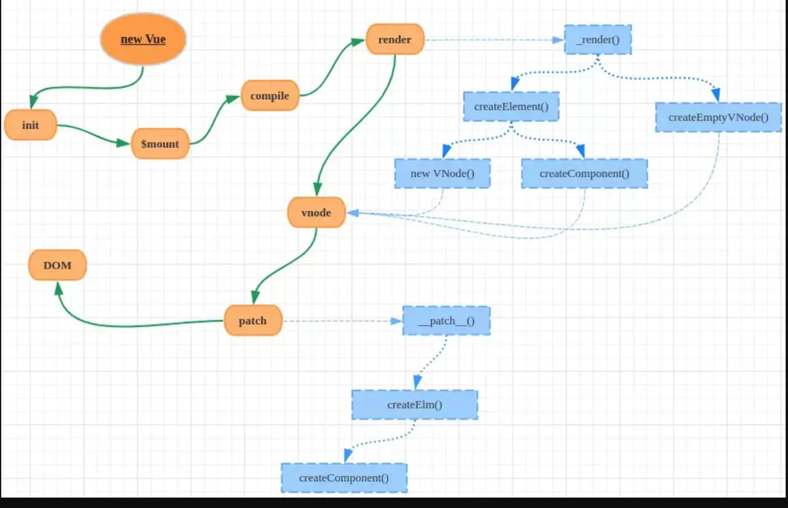
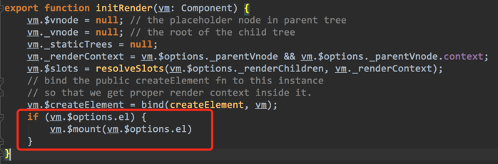
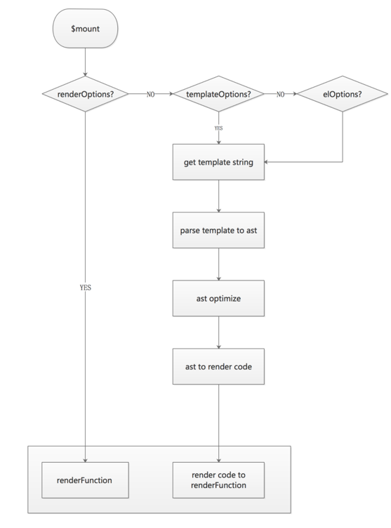
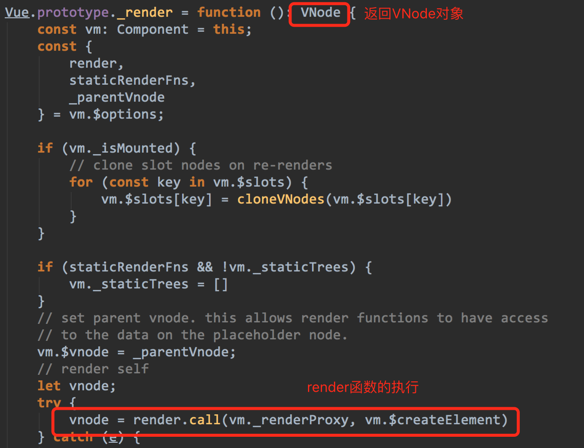
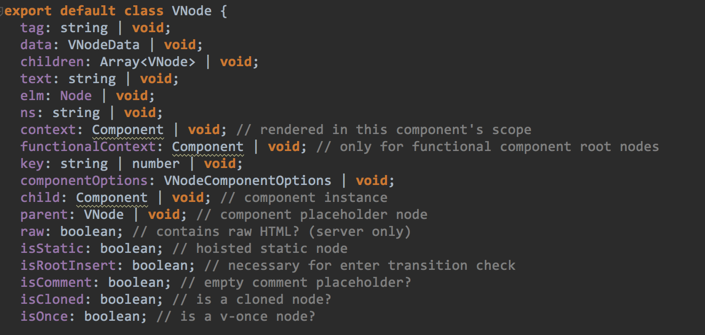

源码请参考：https://github.com/vuejs/vue/tree/dev/src/platforms/web

# 初始化

我们在使用Vue.js的时候，最基本的一个使用，就是在HTML引入Vue.js的库文件，并写如下一段代码：

```js
1.var app = new Vue({
2.  el: '#app',
3.  data: {
4.    message: 'Hello Vue!'
5.  }
6.})
```

new Vue，本质就是生成一个Vue的对象，我们来了解一下这个生成Vue对象的过程是怎样的：

首先，Vue的入口是/src/entries/web-runtime-with-compiler.js，这是由config.js配置文件决定的。



这个入口文件中import了很多文件，其中有一条主要的脉络：

```
/src/entries/web-runtime-with-compiler.js` 
引用了`/src/entries/web-runtime.js` 
引用了`/src/core/index.js` 
引用了`/src/core/instance/index.js
```

其中`/src/core/instance/index.js`是最核心的初始化代码，其中：



红框部分，就是整个Vue的类的核心方法。其含义给读者解读一下：

```js
1.//初始化的入口，各种初始化工作
2.initMixin(Vue) 
3.//数据绑定的核心方法，包括常用的$watch方法
4.stateMixin(Vue)
5.//事件的核心方法，包括常用的$on，$off，$emit方法
6.eventsMixin(Vue)
7.//生命周期的核心方法
8.lifecycleMixin(Vue)
9.//渲染的核心方法，用来生成render函数以及VNode
10.renderMixin(Vue)
```

其中new Vue就是执行下面的这个函数：



`_init`方法就是initMixin中的`_init`方法。



至此，程序沿着这个`_init`方法继续走下去。

# 渲染逻辑

## 核心流程

1. new Vue，执行初始化
2. 挂载`$mount`方法，通过自定义Render方法、template、el等生成Render函数
3. 实例进行挂载，根据根节点render的调用，递归生成虚拟dom树
4. 通过patch方法，对比新旧VNode对象，通过DOM Diff算法，添加、修改、删除真正的DOM元素，渲染真实dom。
5. 通过Watcher监听数据的变化
6. 当数据发生变化时，组件和子组件引用data作为props重新调用Render函数，Render函数执行生成VNode对象，再返回步骤4

代码调用过程：



## Render函数

Vue.js是如何渲染页面的。在上图中我们看到有一个`initRender`的方法：

在该方法中会执行红框部分的内容：



而`$mount`方法就是整个渲染过程的起始点。具体定义是在`/src/entries/web-runtime-with-compiler.js`中，根据代码整理成流程图：



由上图可以看到,在渲染过程中，提供三种渲染模式：自定义Render函数、template、el均可以渲染页面，也就是对应我们使用Vue时，三种写法：

1. 自定义Render函数

```js
1.Vue.component('anchored-heading', {
2.    render: function (createElement) {
3.        return createElement(
4.            'h' + this.level,   // tag name 标签名称
5.            this.$slots.default // 子组件中的阵列
6.        )
7.    },
8.    props: {
9.        level: {
10.            type: Number,
11.            required: true
12.        }
13.    }
14.})
```

2. template写法

```js
1.var vm = new Vue({
2.    data: {
3.        // 以一个空值声明 `msg`
4.        msg: ''
5.    },
6.    template: '<div>{{msg}}</div>'
7.})
```

3. el写法（这个就是入门时最基本的写法）

```js
1.var app = new Vue({
2.    el: '#app',
3.    data: {
4.        message: 'Hello Vue!'
5.    }
6.})
```

**这三种渲染模式最终都是要得到Render函数**。只不过用户自定义的Render函数省去了程序分析的过程，等同于处理过的Render函数，而普通的template或者el只是字符串，需要解析成AST，再将AST转化为Render函数。

我们在使用过程中具体要使用哪种调用方式，要根据具体的需求来。

- 如果是比较简单的逻辑，使用template和el比较好，因为这两种都属于声明式渲染，对用户理解比较容易，但灵活性比较差，因为最终生成的Render函数是由程序通过AST解析优化得到的；
- 而使用自定义Render函数相当于人已经将逻辑翻译给程序，能够胜任复杂的逻辑，灵活性高，但对于用户的理解相对差点。

## VNode对象

无论怎么渲染，最终会得到Render函数，而Render函数的作用是什么呢？

在`/src/core/instance/lifecycle.js`中有这么一段代码：

```js
1.vm._watcher = new Watcher(vm, () => {
2.    vm._update(vm._render(), hydrating)
3.}, noop);
```

意思就是，通过Watcher的绑定，每当数据发生变化时，执行`_update`的方法，此时会先执行`vm._render()`，在这个`vm._render()`中，我们的Render函数会执行，而得到VNode对象。



在Vue.js 2.0中javascript模拟DOM模型树（Virtual DOM）就是VNode，Render函数执行后都会返回VNode对象，为下一步操作做准备。在`/src/core/vdom/vnode.js`中，我们可以看到VNode的具体数据结构：



虚拟节点里面有一个属性**`elm`**, 这个属性指向真实的DOM节点。因为VNode指向了真实的DOM节点，那么虚拟节点经过对比后，生成的DOM节点就可以直接进行替换。

**这么做的好处**：一个组件对象，如果内部的`data`发生变化，触发了render函数，重新生成了VNode节点。那么就可以直接找到所对应的节点，然后直接替换。那么这个过程只会在本组件内发生，不会影响其他的组件。于是组件与组件是隔离的。

示例：

```js
// main.js
const root = new Vue({
  data: {
    state: true
  },
  mounted() {
    setTimeout(() => {
      console.log(this)
      this.state = false
    }, 1000)
  },
  render: function(h) {
    const { state } = this // state 变化重新触发render
    let root = h(App)
    console.log('root:', root)
    return root
  }
}).$mount('#app')

// App.vue
<script>
export default {
  render: (h) => {
    let app = h('h1', ['hello world'])
    console.log('app:', app)
    return app
  }
}
</script>
```

当`main.js`中重新触发render函数的时候，render方法里面有引用App.vue这个子组件。但是并没有触发App.vue组件的的render函数。

VNode的数据结构中还有VNodeData、VNodeDirective、VNodeComponentOptions，这些数据结构都是对DOM节点的一些描述。

（PS：Vue.js使用了flow，标识了参数的静态类型，对理解代码很有帮助^_^）

## patch方法

Render函数执行生成了VNode，而VNode只是Virtual DOM，我们还需要通过**DOM Diff**之后，来生成真正的DOM节点。在Vue.js 2.0中，是通过`/src/core/vdom/patch.js`中的`patch(oldVnode, vnode ,hydrating)`方法来完成的。

该方法有三个参数oldVnode表示旧VNode，vnode表示新VNode，hydrating表示是否直接使用服务端渲染的DOM元素.

其主要逻辑为当VNode为真实元素或旧的VNode和新的VNode完全相同时，直接调用createElm方法生成真实的DOM树，当VNode新旧存在差异时，则调用patchVnode方法，通过比较新旧VNode节点，根据不同的状态对DOM做合理的添加、删除、修改DOM，再调用createElm生成真实的DOM树。

## 数据变化后的渲染

**Render的触发：**

响应式原理（数据劫持）是VUE的一大特色，给组件的data的属性进行的赋值的时候(set)，此属性如果在组件内部初次渲染过程被引用(`data的属性被访问，也就是数据劫持的get`), 包括生命周期方法或者render方法。于是会触发组件的update(beforeUpdate -> render -> updated)。

> 注: 为了防止data被多次set从而触发多次update, Vue把update存放到异步队列中。这样就能保证多次data的set只会触发一次update。

**当props会触发组件的重新渲染：**

把父组件的data通过props传递给子组件的时候，子组件在初次渲染的时候生命周期或者render方法，有调用data相关的props的属性, 这样子组件也被添加到父组件的data的相关属性依赖中，这样父组件的data在set的时候，就相当于触发自身和子组件的update。

```javascript
// main.js
import Vue from 'vue'
import App from './App'

const root = new Vue({
  data: {
    state: false
  },
  mounted() {
    setTimeout(() => {
      this.state = true
    }, 1000)
  },
  render: function(h) {
    const { state } = this // state 变化重新触发render
    let root = h(App, { props: { status: state } })
    console.log('root:', root)
    return root
  }
}).$mount('#app')
window.root = root

// App.vue
<script>
export default {
  props: {
    status: Boolean
  },
  render: function (h){
    const { status } = this
    let app = h('h1', ['hello world'])
    console.log('app:', app)
    return app
  }
}
</script>
```

在`main.js`中 **state** 状态发生了变化，由`false` => `true`, 触发了**自身**与**子组件**的render方法。

