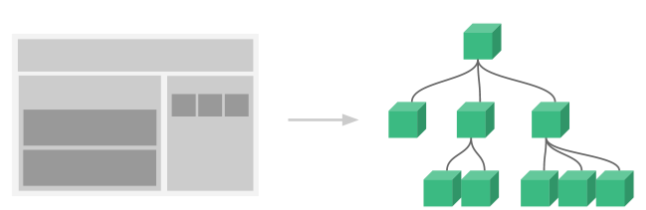

# 生命周期

每个 Vue 实例在被创建时都要经过一系列的初始化过程——例如，需要设置数据监听、编译模板、将实例挂载到 DOM 并在数据变化时更新 DOM 等。同时在这个过程中也会运行一些叫做**生命周期钩子**的函数.

生命周期钩子的 `this` 上下文指向调用它的 Vue 实例.

不要在选项 property 或回调上使用[箭头函数](https://developer.mozilla.org/zh-CN/docs/Web/JavaScript/Reference/Functions/Arrow_functions)，比如 `created: () => console.log(this.a)` 或 `vm.$watch('a', newValue => this.myMethod())`。因为箭头函数并没有 `this`，`this` 会作为变量一直向上级词法作用域查找，直至找到为止，经常导致 `Uncaught TypeError: Cannot read property of undefined` 或 `Uncaught TypeError: this.myMethod is not a function` 之类的错误。


updated函数会在数据变化时被触发，但却不能准确的判断是那个属性值被改变，所以在实际情况中用**computed**或**watch**函数来监听属性的变化，并做一些其他的操作

## 计算属性

computed: 对于任何复杂逻辑，你都应当使用**计算属性**。

计算属性将被混入到 Vue 实例中。所有 getter 和 setter 的 this 上下文自动地绑定为 Vue 实例。

**它是基于它们的响应式依赖进行缓存的**。只在相关响应式依赖发生改变时它们才会重新求值。这就意味着只要 `message` 还没有发生改变，多次访问 `reversedMessage` 计算属性会立即返回之前的计算结果，而不必再次执行函数.

计算属性默认只有 getter，不过在需要时你也可以提供一个 setter：

```javascript
computed: {
  fullName: {
    // getter
    get: function () {
      return this.firstName + ' ' + this.lastName
    },
    // setter
    set: function (newValue) {
      var names = newValue.split(' ')
      this.firstName = names[0]
      this.lastName = names[names.length - 1]
    }
  }
}
//现在再运行 vm.fullName = 'John Doe' 时，setter 会被调用，vm.firstName 和 vm.lastName 也会相应地被更新
```

## 侦听器

Vue 提供了一种更通用的方式来观察和响应 Vue 实例上的数据变动：**侦听属性**, 当需要在数据变化时执行异步或开销较大的操作时，这个方式是最有用的. 

是一种更通用的方式来观察和响应 Vue 实例上的数据变动。一个对象，键是需要观察的表达式，值是对应回调函数。值也可以是方法名，或者包含选项的对象。Vue 实例将会在实例化时调用 $watch()，遍历 watch 对象的每一个属性。

使用 `watch` 选项允许我们执行异步操作 (访问一个 API)，限制我们执行该操作的频率，并在我们得到最终结果前，设置中间状态。这些都是计算属性无法做到的.

但其它情况下, 通常更好的做法是使用计算属性而不是命令式的 `watch` 回调.

watch函数名要与监听属性一致.

```html
<div id="watch-example">
  <p>
    Ask a yes/no question:
    <input v-model="question" />
  </p>
  <p>{{ answer }}</p>
</div>

<!-- 因为 AJAX 库和通用工具的生态已经相当丰富，Vue 核心代码没有重复 -->
<!-- 提供这些功能以保持精简。这也可以让你自由选择自己更熟悉的工具。 -->
<script src="https://cdn.jsdelivr.net/npm/axios@0.12.0/dist/axios.min.js"></script>
<script>
  const watchExampleVM = Vue.createApp({
    data() {
      return {
        question: '',
        answer: 'Questions usually contain a question mark. ;-)'
      }
    },
    watch: {
      // 每当 question 发生变化时，该函数将会执行
      question(newQuestion, oldQuestion) {
        if (newQuestion.indexOf('?') > -1) {
          this.getAnswer()
        }
      }
    },
    methods: {
      getAnswer() {
        this.answer = 'Thinking...'
        axios
          .get('https://yesno.wtf/api')
          .then(response => {
            this.answer = response.data.answer
          })
          .catch(error => {
            this.answer = 'Error! Could not reach the API. ' + error
          })
      }
    }
  }).mount('#watch-example')
</script>
```

## 区别

**computed**是在HTML DOM加载后马上执行的，如赋值；

**methods**则必须要有一定的触发条件才能执行，如点击事件；

**watch**它用于观察Vue实例上的数据变动。

执行顺序为：默认加载的时候先computed再watch，不执行methods；等触发某一事件后，则是：先methods再watch。

# 组件



1. **一个组件的 `data` 选项必须是一个函数**，返回的是一个对象，因此每个实例可以维护一份被返回对象的独立的拷贝，防止数据之间冲突。

   这个是JavaScript的原理，如果直接返回数据地址，会造成多个引用，引用同一个对象的问题。而函数中return新对象，会让每个实例都生成独立的新对象。

2. 最外层必须有默认暴露export default{}, 所有的vue的对象清单都必须在export default里面去罗列

3. 使用组件三步走

   \1)  创建vue文件

   \2)  在要渲染的地方引入该组件

   \3)  注册该组件

4. 为了能在模板中使用，这些组件必须先注册以便 Vue 能够识别。

   这里有两种组件的注册类型：**全局注册**和**局部注册**。

   `Vue.component` 是全局注册，对象内部conponents{} 是局部注册。

## 组件传值

1. 父组件通过 props 向子组件传递数据

   **单向数据流**：所有的 prop 都使得其父子 prop 之间形成了一个**单向下行绑定**：父级 prop 的更新会向下流动到子组件中，每次父级组件发生变更时，子组件中所有的 prop 都将会刷新为最新的值，但是反过来则不行。这样会防止从子组件意外变更父级组件的状态，从而导致你的应用的数据流向难以理解

   两种常见的试图变更一个 prop 的情形：

   1. **这个子组件接下来希望将其作为一个本地的 prop 数据来使用。**在这种情况下，最好定义一个本地的 data property 并将这个 prop 用作其初始值。
   2. **这个 prop 以一种原始的值传入且需要进行转换。**在这种情况下，最好使用这个 prop 的值来定义一个计算属性。
   3. 原因：JavaScript 中对象和数组是通过引用传入的，所以对于一个数组或对象类型的 prop 来说，在子组件中改变变更这个对象或数组本身**将会**影响到父组件的状态。

   类型检查： prop 会在一个组件实例创建**之前**进行验证，所以实例的 property (如 `data`、`computed` 等) 在 `default` 或 `validator` 函数中是不可用的

   ```js
   Vue.component('my-component', {
     props: {
       // 基础的类型检查 (`null` 和 `undefined` 会通过任何类型验证)
       propA: Number,
       // 多个可能的类型
       propB: [String, Number],
       // 必填的字符串
       propC: {
         type: String,
         required: true
       },
       // 带有默认值的数字
       propD: {
         type: Number,
         default: 100
       },
       // 带有默认值的对象
       propE: {
         type: Object,
         // 对象或数组默认值必须从一个工厂函数获取
         default: function () {
           return { message: 'hello' }
         }
       },
       // 自定义验证函数
       propF: {
         validator: function (value) {
           // 这个值必须匹配下列字符串中的一个
           return ['success', 'warning', 'danger'].indexOf(value) !== -1
         }
       }
     }
   })
   ```

2. 注意由于vue的属性对大小写不敏感，所以如果需要写驼峰命名，需要使用-隔开，比如msb-value代表的就是msbValue

3. 子组件可以通过调用内建的 `$emit`方法并传入事件名称来触发一个事件, 

   还可以使用事件抛出一个值, 父级组件监听这个事件的时候，可以通过 `$event` 访问到被抛出的这个值. 

   或者作为第一个参数传入事件处理函数的方法.

   

4. 兄弟组件之间，通过中央管道：就是将Vue实例作为原型对象的属性值，然后所有Vue组件都可以使用它（根组件和子组件）来进行事件的监听和触发，实现组件间通信。

   ```js
   Vue.prototype.$custom = new Vue
   this.$custom.$on('eventName',($event)=>{ console.log($event) })
   this.$custom.$emit('eventName',this.info)
   ```
   
5. 属性Attribute的继承。

   1. 组件中非 Prop 的 Attribute：是指传向一个组件，但是该组件并没有相应 prop 定义的 attribute，这些 attribute 会被添加到这个组件的根元素上。
   2. Attribute的替换和合并：大多数attribute，从外部提供给组件的值回替换掉组件内部设置好的值。但class和style的attribute会合并。
   3. 禁用attribute继承：可以在组件的选项中设置 `inheritAttrs: false`。

## 接口数据

> **在父组件的created中发请求获取数据，通过prop传递给子组件。子组件在created或者mounted中拿父组件传递过来的数据**  这样处理是有问题的。
>
> 在父组件调用接口传递数据给子组件时，接口响应显然是异步的。这会导致无论你在父组件哪个钩子发请求，在子组件哪个钩子接收数据。都是取不到的。当子组件的mounted都执行完之后，此时可能父组件的请求才返回数据。会导致，从父组件传递给子组件的数据是undefined。

1. 解决方案1：在父组件传递接口的数据给子组件时，一定要在子组件标签上加上v-if="传递的接口数据"

   ```html
   <div class="test">
       <children v-if="data1" :data="data1" ></children>
   </div>
   ```

   缺点：当有数据的时候在去渲染子组件。这样就会形成天然的阻塞。在父组件的created中的请求返回数据后，才会执行子组件的created，mounted。最后执行父组件的mounted。

2. 解决方案2：在子组件中 watch 监听，父组件获取到值，这个值就会变化，自然是可以监听到的

   ```javascript
   watch:{
       data:{
         deep:true,
         handler:function(newVal,oldVal) {
           this.$nextTick(() => {
             this.data = newVal
             this.data = newVal.url ? newVal.url : ''
           })
         }
       },
   }
   ```

   从父组件点击调用接口并显示子组件，子组件拿到数据并监听在watch中调用方法并显示

## 插槽

通过插槽分发内容：slot元素。

插槽可以包含字符串，任何模板代码，包括 HTML，当组件渲染的时候，`<slot></slot>` 将会被替换为“Add todo”和模板代码。

```html
<todo-button>
  <!-- 添加一个 Font Awesome 图标 -->
  <i class="fas fa-plus"></i>
  Add todo
</todo-button>

<!-- todo-button 组件模板 -->
<button class="btn-primary">
  <slot></slot>
</button>
```

**渲染作用域**

在一个插槽中使用数据时，

1. 该插槽可以访问与模板其余部分相同的实例 property (即相同的“作用域”)
2. 插槽**不能**访问 `<todo-button>` 的作用域。例如，尝试访问 `action` 将不起作用

```html
<todo-button action="delete">
  Delete a {{ item.name }}
  
  <!--action将会是 undefined，因为这个内容是传递到 <todo-button>，而不是在 <todo-button> 中定义的。-->
  Clicking here will {{ action }} an item
</todo-button>
```


请记住这条规则：

> 父级模板里的所有内容都是在父级作用域中编译的；子模板里的所有内容都是在子作用域中编译的。

## 其它

1. 每个组件必须只有一个根元素，单个根元素

2. 组件上使用 v-model

   ```vue
   <custom-input v-model="searchText"></custom-input>
   <!--等价于-->
   <custom-input v-bind:value="searchText" v-on:input="searchText = $event"></custom-input>
   
   Vue.component("custom-input",{
   	props:['value'],
   	template:
       '<input\
         v-bind:value="value"\
         v-on:input="$emit('input', $event.target.value)"\
       >'
   })
   ```

4. 动态组件：`is` attribute 

5. 解析DOM模板：有些 HTML 元素，诸如 `<ul>`、`<ol>`、`<table>` 和 `<select>`，对于哪些元素可以出现在其内部是有严格限制的，

   ```vue
   <table>
     <blog-post-row></blog-post-row>
   </table>
   <!--这个自定义组件 <blog-post-row> 会被作为无效的内容提升到外部，并导致最终渲染结果出错,需改为-->
   <table>
     <tr :is="blog-post-row"></tr>
   </table>
   ```

   需要注意的是**如果我们从以下来源使用模板的话，这条限制是\*不存在\*的**：

   - 字符串 (例如：`template: '...'`)
   - 单文件组件(.vue)
   - 脚本文件<script type='text/x-temlate'>

# 执行顺序

## vue加载时的文件

1. 找到webpack的打包配置文件build/webpack.base.conf.js（定义了vue的程序入口文件）
2. 执行index.html文件
3. 执行main.js文件
4. main.js挂载了app.vue文件，用app.vue的templete替换index.html中的div(id=app)
5. main.js中注入了路由文件，将对应的组件渲染到router-view中
6. router-view中加载Layout文件
7. Layout 加载Navbar, Sidebar, AppMain

## 页面首次加载

Vue 实例观察的数据对象data，Vue 实例使用的根 DOM 元素el

1. beforeCreate //在实例初始化之后、创建之前执行，data和el均未初始化，值为undefined
2. created //实例创建后执行，data已初始化，el还未初始化。
3. beforeMounted //在挂载开始之前调用，data和el均已经初始化，但此时el并没有渲染进数据，el的值为“虚拟”的元素节点
4. filters //挂载前加载过滤器
5. computed //计算属性
6. directives-bind //只调用一次，在指令第一次绑定到元素时调用
7. directives-inserted //被绑定元素插入父节点时调用
8. activated //keek-alive组件被激活时调用，则在keep-alive包裹的嵌套的子组件中触发
9. deactivated // keek-alive组件被激活时调用
10. mounted //挂载完成后调用，el已经渲染完成并挂载到实例上
11. {{}} //mustache表达式渲染页面

## 修改页面input时

1. watch //首先先监听到了改变事件
2. filters //过滤器没有添加在该input元素上，但是也被调用了
3. beforeUpdate //数据更新时调用，发生在虚拟dom打补丁前
4. directived-update //指令所在的组件的vNode更新时调用，但可能发生在其子vNode更新前
5. directives-componentUpdated //指令所在的组件的vNode及其子组件的vNode全部更新后调用updated，组件dom已经更新

## 组件销毁

1. beforeDestroy //实例销毁之前调用
2. directives-unbind //指令与元素解绑时调用，只调用一次
3. deactivated //keep-alive组件停用时调用
4. destroyed //实例销毁之后调用

## 父子组件

1. 加载渲染过程

   父beforeCreate->父created->父beforeMount->子beforeCreate->子created->子beforeMount->子mounted->父mounted

2. 更新过程

   父beforeUpdate->子beforeUpdate->子updated->父updated

3. 销毁过程

   父beforeDestroy->子beforeDestroy->子destroyed->父destroyed

4. 常用钩子简易版

   父create->子created->子mounted->父mounted