# 介绍

Vue CLI 是一个基于 Vue.js 进行快速开发的完整系统，提供：

- 通过 `@vue/cli` 实现的交互式的项目脚手架。
- 通过 `@vue/cli` + `@vue/cli-service-global` 实现的零配置原型开发。
- 一个运行时依赖 (@vue/cli-service)，该依赖：
  - 可升级；
  - 基于 webpack 构建（CLI 服务是构建于 [webpack](http://webpack.js.org/) 和 [webpack-dev-server](https://github.com/webpack/webpack-dev-server) 之上的），并带有合理的默认配置；
  - 可以通过项目内的配置文件进行配置；
  - 可以通过插件进行扩展。
- 一个丰富的官方插件集合，集成了前端生态中最好的工具。
- 一套完全图形化的创建和管理 Vue.js 项目的用户界面。

**VUE CLI 包含webpack，不需要再安装**

脚手架官方网站：https://cli.vuejs.org/zh/guide/installation.html

# Vue-cli 2.x

直接使用vue的官方vue-cli构建工具最好用，一个命令就可以直接生成项目的结构和目录。 而且官方需要依赖的包也可以自动配置好，只需要npm instal一下，然后就可以开发测试了。

## 安装

```shell
# 安装vue-cli。安装的都是旧版，最高到2.9.6  安装之前首先确保你已经安装好了nodejs 而且打开命令行
$ npm install -g vue-cli

# 卸载旧版本
$ npm uninstall vue-cli -g

# 校验一下是否安装成功
$ vue -V (vue --version)
```

## 初始化项目

通过以下命令的方式可以创建一个项目文件夹，并初始化对应的文件。

```shell
$ vue init <template-name> <project-name>
```

其中template-name可以取以下值，每个值对应不同的项目构建的模板。

- [webpack](https://github.com/vuejs-templates/webpack)--全功能的Webpack + vueify，包括热加载，静态检测，单元测试
- [webpack](https://github.com/vuejs-templates/webpack-simple)-simple--一个简易的Webpack + vueify，以便于快速开始。
- [browserify](https://github.com/vuejs-templates/browserify)--全功能的Browserify + vueify，包括热加载，静态检测，单元测试
- [browserify](https://github.com/vuejs-templates/browserify-simple)-simple--一个简易的Browserify + vueify，以便于快速开始。

安装和开发控制台的命令：

```shell
# 如果已经安装，请省略
$ npm install -g vue-cli

# 初始化一个webpack全功能包的vue项目，请您把my-project换成你自己的项目名。
$ vue init webpack my-project

# 用命令行进入当前项目目录
$ cd my-project

# npm安装所有的依赖的包
$ npm install

# 运行测试的首页
$ npm run dev
```

## 综合实例开发记录

1. 通过vue-cli构建工具初始化项目目录安装过程如下请参考：

   ```shell
   $ vue init webpack ttl                   # => 安装webpack模板的项目 ttl（项目名可以随便取）
   
   ? Project name mydemovue                        # => 项目名称
   ? Project description A Vue.js project          # => 项目描述
   ? Author KingWJC <15110038963@163.com>          # => 作者
   ? Vue build standalone                          # => 是否支持单文件组件
   ? Install vue-router? Yes                       # => vue-router组件
   ? Use ESLint to lint your code? Yes             # => 是否支持ESLint代码校验
   ? Pick an ESLint preset Standard                # => 校验的标准是什么？
   ? Set up unit tests No                          # => 是否使用单元测试
   ? Setup e2e tests with Nightwatch? Yes          # => 是否使用e2e测试
   ? Should we run `npm install` for you after the project has been created? (recommended) yarn
   ```

   通过上面一系列的命令后，我们就会创建一个webpack配置好的项目包。目录结构如下：

   ```shell
   ttl 
   |--build/             #=> 自动构建存放的文件地方
   |--config/            #=> 当前开发、测试等配置的文件，需要懂点nodejs了啊。
   |--src/               #=> 源码目录
   	asstet：静态资源文件夹，和public不同的是assets文件夹会被webpack打包，所以要使用相对路径
   	components：Vue功能组件的存放位置，内部存放的是公用的组件
   	views：公共文件，主要以各个独立页面为主
   	APP.vue：整个vue的根组件，所有的vue组件都是从这个组件中拓展的，App根组件最后通过编译后将内容渲染到.html文件中
   	main.js：vue的入口文件，vue文件初始化位置
   |--static/            #=> 静态资源存放的目录
   |--test/              #=> 测试相关目录
   |--.babelrc           #=> babel的配置文件，主要用于转换es6等最新的js语法。
   |--.editorconfig      #=> 编辑器配置 
   |--.eslintignore      #=> eslint的忽略校验的配置文件
   |--.eslintrc.js       #=> eslint的配置校验js是否规范的配置文件
   |--.gitignore         #=> 设置git忽略的管理的文件
   |--.postcssrc.js      #=> 处理CSS前缀问题(为了兼容所有浏览器，有的CSS属性需要对不同的浏览器加上前缀)
   |--README.md          #=> readme说明文件
   |--index.html         #=> 项目的主入口的模板
   |--package.json       #=> npm的配置文件
   ```
   
   1. 初始化依赖包
   
   ```shell
   $ cd ttl              #=> 进入上面创建好的项目目录
   $ npm install         #=> 安装所有的依赖包。  安装过程可能非常长，网络也可能有问题，请耐心等待。
   
   # 安装完成后，可以直接运行测试,如果自动打开浏览器，并跳转到http://localhost:8080/ 说明一切都ok了。
   $ npm run dev
   ```

## 文件的编译过程

问题：vue-cli的起步命令是npm run dev，那么这个命令干了一些什么，为什么可以执行相关的编译程序

package.json文件中，scripts是npm执行目录，也就是在scripts这个对象中的key就是npm run的命令值。

vue-cli提供了三个命令

- dev：这个是我们开发使用的命令，执行编译和热更新（ctrl+s的时候浏览器会实时更新）
- build：工作中如果我们本地调试完后需要部署代码前，进行打包的命令
- lint：命令的作用是检验文件代码的合格性（对eslint的校验）

参考：

https://www.aicoder.com/vue/preview/all.html#801

https://github.com/malun666

# Vue-cli 4.x

## 安装

```shell
# 上安装命令，可以指定版本
$ npm install -g @vue/cli@4.5.13
```

## 初始化项目

vue create my-project

选择手动创建一个项目
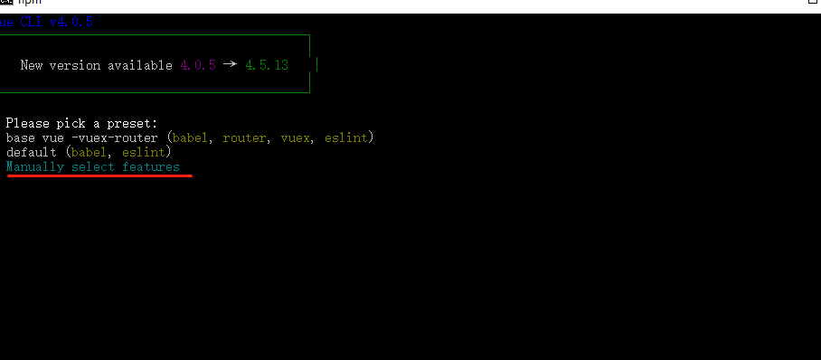
这里使用我常规创建选项
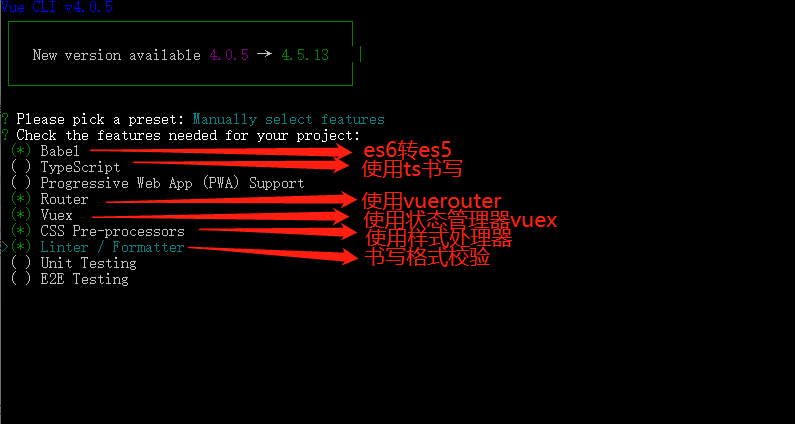

路由要使用 history 模式吗
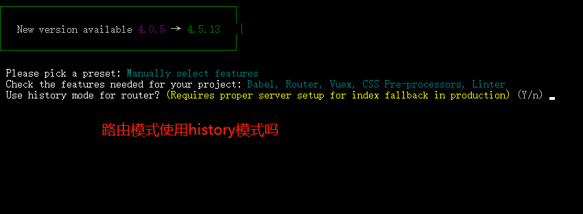
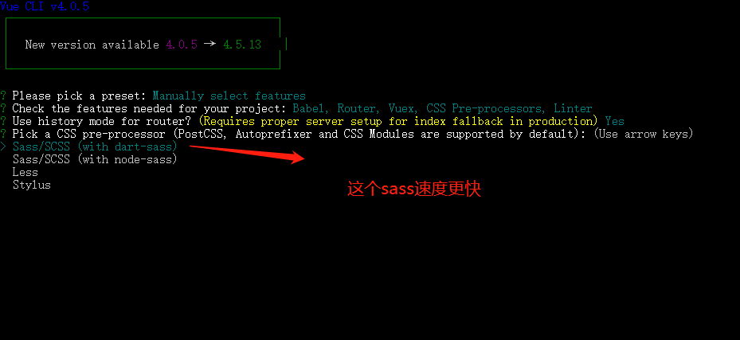

报错处理这里推荐使用标准模式

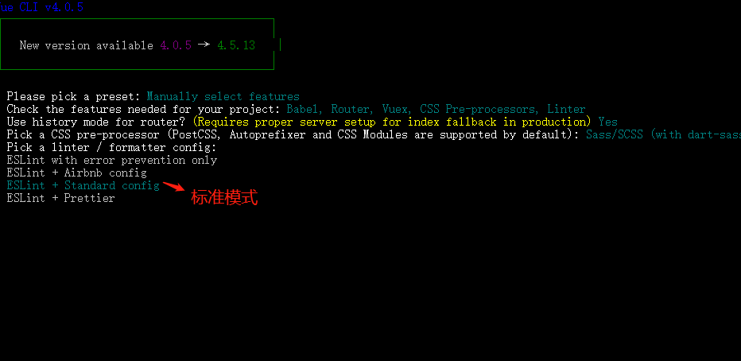
报错处理机制，这里推荐吧自动修复选中
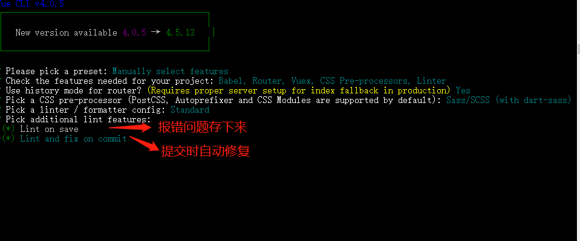
错误推荐就使用生产单独文件
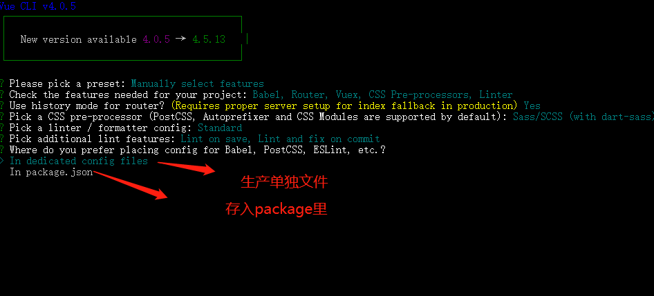
这里会询问是否要记住此次配置，你下次要再创建项目就会有这次配置的模板，你根据需要选，默认是N
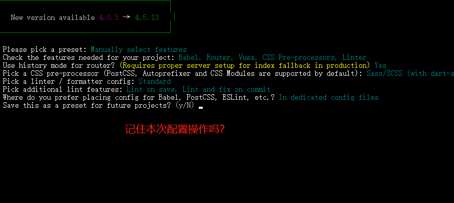

开始创建项目了

# 项目构建模式

在使用 vue-cli 脚手架构建项目时，有一个构建选项 **Vue build**：有`Runtime + Compiler` 和 `Runtime-only` 两种模式，如图所示


public 下面都有的 index.html 模板文件： <div id="app"></div>

## Runtime + Compiler

运行程序+编译器：推荐给大多数用户

```
// 项目下main.js内容
new Vue({
  el: '#app',
  components: { App },
  template: '<App/>'
})
```

运行过程是：

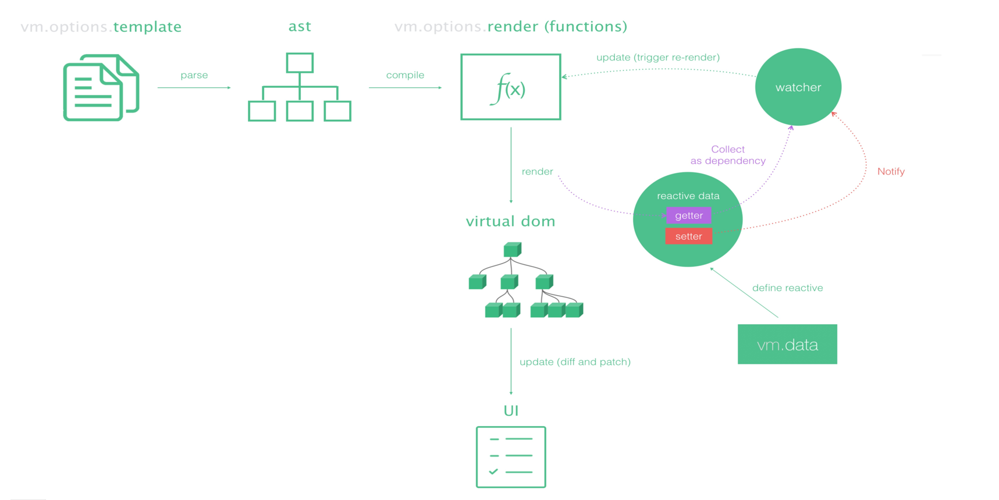

1. template--->ast---->render--->vdom--->UI

   注：ast--->Abstract Syntax Tree 抽象语法树； vdom--->Virtual DOM 虚拟dom

2. 不是在打包是对模板进行编译的，是在客户端(浏览器)运行时进行编译的，所以要使用编译器的完整版本 vue.esm.js

   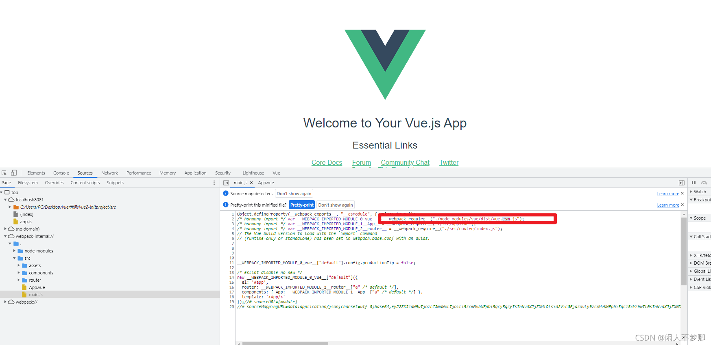

## Runtime-only

仅运行程序: 比上面那种模式轻大约 6KB，但是 template (或任何特定于vue的html)只允许在.vue文件中使用——其他地方用需要 render 函数。

```js
// 项目下main.js内容
new Vue({
  router,
  render: h => h(App)
}).$mount('#app')
```

运行过程时：

1. render--->vdom---->UI

2. 相较于runtimecompiler，runtimeonly直接从render到UI，省略了template--->ast步骤，这样使之代码量更少，运行更快。

3. runtime-only 模式中不是没有写 template ，只是把 template 放在了.vue 的文件中了，并有一个叫 **vue-template-compiler** 的开发依赖时将.vue文件中的 template 解析成 render 函数。 因为是开发依赖，不在最后生产中，所以最后生产出来的运行的代码没有template

4. 会在webpack打包时将模板编译成js，也即是进行了预编译，在打好的包里面是已经编译好的，在浏览器可以直接运行 **vue.runtime.esm.js**

   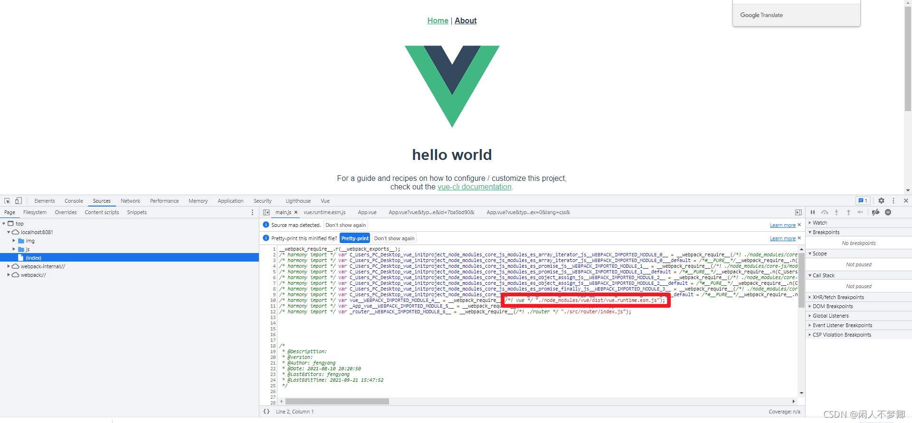

## Render函数

**render函数用来创建html模板的，有一个参数，即createElement，它本省又是一个函数，有三个参数。**

**结合代码**

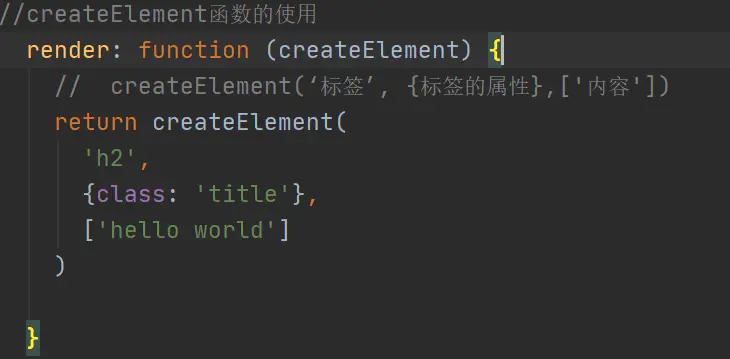

1. h('h2')：创建一个h2的标签
2. h('h2',{class:''red'})：创建一个h2的标签，并且给其添加一个red的class属性
3. h('h2',{class:''red'},['我是h2'])：第三个参数是内容
4. h(app)：可以直接传入一个组件对象