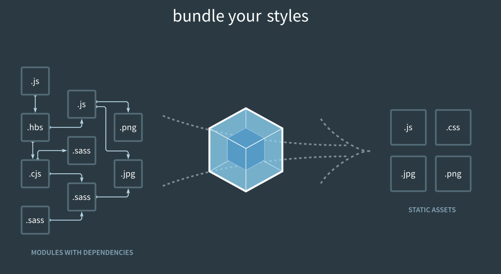

# WebPack



## 介绍

Webpack是一个前端资源构建工具，一个静态模块打包工具(module bundler)

前端所有的资源文件(js/json/css/img/less/...)都会被当作模块来处理，根据模块的依赖关系进行静态分析，打包生成对应的静态资源

官网：https://www.webpackjs.com/concepts/

**五个核心概念**

1. Entry：入口，指示Webpack以哪个文件为入口起点开始打包，分析构建内部依赖关系
2. Output：输出，指示Webpack打包后的资源bundles输出到哪里去，以及如何命名
3. Loader：翻译，处理Webpack处理不了的非JavaScript和json文件
4. Plugins：插件，可以用于执行范围更广的任务，插件的范围包括从打包优化到压缩，一直到重新定义环境中的变量等
5. Mode：指示Webpack以相应配置的模式工作，其实就是一个开发环境(development)和一个生产环境(production)

功能：

1.  可以将许多松散耦合的模块按照依赖和规则打包成符合生产环境部署的前端资源。
2.  可以将按需加载的模块进行代码分离，等到实际需要时再异步加载。
3.  通过 loader转换， 任何形式的资源都可以当做模块， 比如Commons JS、AMD、ES 6、CSS、JSON、Coffee Script、LESS

**作用**

1. 处理各种静态资源的依赖关系
2. 将less、sass等css预处理代码转换成css代码
3. 将es6、es7、ts等转换成所有浏览器都能够识别的js代码
4. 丑化、简化代码
5. **减少了页面的请求。**

## 使用

1. npm init：初始化一个包文件

2. npm install webpack -g

   npm install webpack-cli -g  全局安装webpack-cli

   npm i webpack-cli -D：局部安装webpack

3. **测试安装成功：**`webpack -v，webpack-cli -v` 

4. 新建文件夹src：用于存放代码

5. 新建文件夹build：用于存方打包后生成文件

6. 在src下新建一个index.js文档，在其中写点儿代码

7. 运行指令：

   开发环境：webpack ./src/index.js -o ./build/ --mode=development

   生产环境：webpack ./src/index.js -o ./build/ --mode=production

思考：运行上面的命令之后webpack做了什么事情？

webpack以src下的index.js文件为入口文件开始打包，打包后输出到 ./build下，并创建了一个main.js的文件，打包时候会生成一个唯一的hash值，在之前的webpack版本中会将hash值输出，这个hash值在以后会有用处

生产环境和开发环境的区别：生产环境比开发环境多了一个压缩js代码的功能

```js
// utiles.js：
function add(a,b){
    console.log(a+b);
}
export {add} ;

//index.js：
import {add} from './utiles/utiles.js'
add(6,9);

终端输入：webpack
webpack会自动寻找src目录，然后寻找index.js入口文件，然后进行打包，最终生成一个dist目录为打包后内容main.js。

// index.html引入：
 <script src="../dist/main.js"></script>
```

梳理总结：
1.安装node
2.创建项目
3.终端进入项目，使用node的命令npm xxx 安装webpack
4.创建模块，就是在src/js下面写js代码，这些模块可能相互引用
5.创建主模块，即main.js
6.在css文件夹中写一下css
7.在主模块中导入css
8.创建webpack.config.js文件，写上出口和入口
9.出口需要时一个绝对路径，所以需要导入node模块path
10.初始化node模块："npm init"
11.此时生成package.json文件，在script标签映射指令，然后使用"npm install"导入文件依赖的所以包或者模块
12.安装css和style的loader
13.最后执行npm run xxx,此时会提示安装CLI，安装完成就可以了
14.把生成的js文件引入到index.html就可以使用了

## 配置

在webpack.confing.js只能使用commonJs规范，不能使用ES6模块化规范

```js
// 因为webpack是基于node运行的，其实这里使用的是nodejs的包，需要使用npm init命令来导入
const path = require('path');

module.exports = {

  entry: "./src/main.js",

  output: {
    // 使用这个函数获取绝对路径，__dirname就是当前文件的绝对路径，dist就是这个路径下的文件夹
	// (其实是把当前文件的绝对路径和这个dist做了拼接组成了一个新的绝对路径)
    path: path.resolve(__dirname, "dist"),
    // 这是打包后生成的文件名，是放在上面这个路径下的
    filename: "bundle.js",
  }
}
```

## 引入vue

1. 首先使用指令`npm install vue (可以直到版本)`
2. 在需要使用vue的文件夹导入，比如`import Vue from "vue";`
3. vue-loader 加载vue文件
4. vue-tempalte-compiler 编译vue文件
5. 使用命令：npm install vue-loader vue-tempalte-compiler --save-dev 
6. 然后再webpack.config.js的module里配置vue-loader

注意：编译器和加载器需要一起安装，vue-loader13以上需要安装插件才能使用

```js
const { VueLoaderPlugin } = require('vue-loader')

module.exports = {
  entry: "./src/main.js",

  output: {
    path: path.join(__dirname, "dist"),
    filename: "bundle.js"
  },
    
  module: {
//因为vue其实是有两种版本的，一种是runtime only版本，一种是runtime compiler版本
//only版本不能编译template，compiler可以编译，这个例子中把div当成了template，而且
//默认使用的也是only版本，需要配置这个，换一下版本才能正常编译
//若使用vue，则只需要配置vue-loader.
    resolve: {
        alias: {
          'vue$': 'vue/dist/vue.esm.js'
        }
  	},
    rules: [
      { test: /\.vue$/, use: 'vue-loader' }
    ]
  },

  plugins: [
    new VueLoaderPlugin(),
  ],
}
```

```js
// runtime compiler版本的示例，这个例子中把div当成了template，但only不能编译模板
<body>
  <div id="app">
    <h1>{{message}}</h1>
  </div>
</body>
-----------------------------------
import Vue from "vue";

const app = new Vue({
  el: "#app",
  data: {
    message: " this is message"
  }
});
```

```js
// 加载vue-loader的示例，runtime only版本
cpn.vue代码

<template>
    <div>
    <h1>{{message}}</h1>
  </div>
</template>

<script>
export default {
  data () {
    return {
      message: " this is message"
    }
  }
}
</script>

<style>
//这里写样式
</style>
-----------------------------------------------------------
main.js代码

import Vue from "vue";
import App from "./vue/cpn.vue"//从引入js文件到引入vue文件

const app = new Vue({
  el: "#app",
  template: "<App/>",
  components: {
    App: App
  }
});
```

# 模块化的演进

## Script标签

```
<script src = ``"module1.js"``></script>``<script src = ``"module2.js"``></script>``<script src = ``"module3.js"``></script>
```

这是最原始的JavaScript文件加载方式，如果把每一个文件看做是一个模块，那么他们的接口通常是暴露在全局作用域下，也就是定义在window对象中，不同模块的调用都是一个作用域。

**这种原始的加载方式暴露了一些显而易见的弊端：**

- 全局作用域下容易造成变量冲突
- 文件只能按照`<script>`的书写顺序进行加载
- 开发人员必须主观解决模块和代码库的依赖关系
- 在大型项目中各种资源难以管理，长期积累的问题导致代码库混乱不堪

## **CommonsJS**

服务器端的NodeJS遵循CommonsJS规范，该规范核心思想是允许模块通过require方法来同步加载所需依赖的其它模块，然后通过exports或module.exports来导出需要暴露的接口。

```js
require(``"module"``);
require(``"../module.js"``);
export.doStuff = ``function``(){};
module.exports = someValue; 1234
```

**优点：**

- 服务器端模块便于重用
- NPM中已经有超过45万个可以使用的模块包
- 简单易用

**缺点：**

- 同步的模块加载方式不适合在浏览器环境中，同步意味着阻塞加载，浏览器资源是异步加载的
- 不能非阻塞的并行加载多个模块

**实现：**

- 服务端的NodeJS
- Browserify，浏览器端的CommonsJS实现，可以使用NPM的模块，但是编译打包后的文件体积较大
- modules-webmake，类似Browserify，但不如Browserify灵活
- wreq，Browserify的前身

## AMD

Asynchronous Module Definition规范其实主要一个主要接口define(id?,dependencies?,factory);它要在声明模块的时候指定所有的依 赖dependencies，并且还要当做形参传到factory中，对于依赖的模块提前执行。

```
define(``"module"``,[``"dep1"``,``"dep2"``],functian(d1,d2){``  ``return` `someExportedValue;``});``require（[``"module"``,``"../file.js"``],``function``(module，file){});``1234
```

**优点**

- 适合在浏览器环境中异步加载模块
- 可以并行加载多个模块

**缺点**

- 提高了开发成本，代码的阅读和书写比较困难，模块定义方式的语义不畅
- 不符合通用的模块化思维方式，是一种妥协的实现

**实现**

- RequireJS
- curl

## CMD

Commons Module Definition规范和AMD很相似，尽保持简单，并与CommonsJS和NodeJS的Modules规范保持了很大的兼容性。

```
define(``function``(require,exports,module){``  ``var` `$=require(``"jquery"``);``  ``var` `Spinning = require(``"./spinning"``);``  ``exports.doSomething = ...;``  ``module.exports=...;``});
```

**优点：**

- 依赖就近，延迟执行
- 可以很容易在NodeJS中运行

**缺点**

- 依赖SPM打包，模块的加载逻辑偏重

**实现**

- Sea.js
- coolie

## ES6模块

EcmaScript 6标准增加了JavaScript语言层面的模块体系定义。ES 6模块的设计思想， 是尽量静态化， 使编译时就能确定模块的依赖关系， 以及输入和输出的变量。Commons JS和AMD模块，都只能在运行时确定这些东西。

```js
import "jquery"
export function doStuff(){}

export { name, age };
import { name, age } from './info'
```

**优点**

- 容易进行静态分析
- 面向未来的Ecma Script标准

**缺点**

- 原生浏览器端还没有实现该标准
- 全新的命令，新版的Node JS才支持

**实现**

- Babel

**大家期望的模块**  

系统可以兼容多种模块风格， 尽量可以利用已有的代码， 不仅仅只是JavaScript模块化， 还有CSS、图片、字体等资源也需要模块化。

