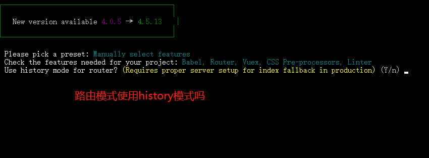

脚手架官方网站：https://cli.vuejs.org/zh/guide/installation.html

## Vue-cli 2.x

直接使用vue的官方vue-cli构建工具最好用，一个命令就可以直接生成项目的结构和目录。 而且官方需要依赖的包也可以自动配置好，只需要npm instal一下，然后就可以开发测试了。

### 安装

```shell
# 安装vue-cli。安装的都是旧版，最高到2.9.6  安装之前首先确保你已经安装好了nodejs 而且打开命令行
$ npm install -g vue-cli

# 卸载旧版本
$ npm uninstall vue-cli -g

# 校验一下是否安装成功
$ vue -V (vue --version)
```

### 初始化项目

通过以下命令的方式可以创建一个项目文件夹，并初始化对应的文件。

```shell
$ vue init <template-name> <project-name>
```

其中template-name可以取以下值，每个值对应不同的项目构建的模板。

- [webpack](https://github.com/vuejs-templates/webpack)--全功能的Webpack + vueify，包括热加载，静态检测，单元测试
- [webpack](https://github.com/vuejs-templates/webpack-simple)-simple--一个简易的Webpack + vueify，以便于快速开始。
- [browserify](https://github.com/vuejs-templates/browserify)--全功能的Browserify + vueify，包括热加载，静态检测，单元测试
- [browserify](https://github.com/vuejs-templates/browserify-simple)-simple--一个简易的Browserify + vueify，以便于快速开始。

安装和开发控制台的命令：

```shell
# 如果已经安装，请省略
$ npm install -g vue-cli

# 初始化一个webpack全功能包的vue项目，请您把my-project换成你自己的项目名。
$ vue init webpack my-project

# 用命令行进入当前项目目录
$ cd my-project

# npm安装所有的依赖的包
$ npm install

# 运行测试的首页
$ npm run dev
```

### 综合实例开发记录

1. 通过vue-cli构建工具初始化项目目录安装过程如下请参考：

   ```shell
   $ vue init webpack ttl                   # => 安装webpack模板的项目 ttl（项目名可以随便取）
   
   ? Project name mydemovue                        # => 项目名称
   ? Project description A Vue.js project          # => 项目描述
   ? Author KingWJC <15110038963@163.com>          # => 作者
   ? Vue build standalone                          # => 是否支持单文件组件
   ? Install vue-router? Yes                       # => vue-router组件
   ? Use ESLint to lint your code? Yes             # => 是否支持ESLint代码校验
   ? Pick an ESLint preset Standard                # => 校验的标准是什么？
   ? Set up unit tests No                          # => 是否使用单元测试
   ? Setup e2e tests with Nightwatch? Yes          # => 是否使用e2e测试
   ? Should we run `npm install` for you after the project has been created? (recommended) yarn
   ```

   通过上面一系列的命令后，我们就会创建一个webpack配置好的项目包。目录结构如下：

   ```shell
   ttl 
   |--build/             #=> 自动构建存放的文件地方
   |--config/            #=> 当前开发、测试等配置的文件，需要懂点nodejs了啊。
   |--src/               #=> 源码目录
   	asstet：静态资源文件夹，和public不同的是assets文件夹会被webpack打包，所以要使用相对路径
   	components：Vue功能组件的存放位置，内部存放的是公用的组件
   	views：公共文件，主要以各个独立页面为主
   	APP.vue：整个vue的根组件，所有的vue组件都是从这个组件中拓展的，App根组件最后通过编译后将内容渲染到.html文件中
   	main.js：vue的入口文件，vue文件初始化位置
   |--static/            #=> 静态资源存放的目录
   |--test/              #=> 测试相关目录
   |--.babelrc           #=> babel的配置文件，主要用于转换es6等最新的js语法。
   |--.editorconfig      #=> 编辑器配置 
   |--.eslintignore      #=> eslint的忽略校验的配置文件
   |--.eslintrc.js       #=> eslint的配置校验js是否规范的配置文件
   |--.gitignore         #=> 设置git忽略的管理的文件
   |--.postcssrc.js      #=> 处理CSS前缀问题(为了兼容所有浏览器，有的CSS属性需要对不同的浏览器加上前缀)
   |--README.md          #=> readme说明文件
   |--index.html         #=> 项目的主入口的模板
   |--package.json       #=> npm的配置文件
   ```
   
   1. 初始化依赖包
   
   ```shell
   $ cd ttl              #=> 进入上面创建好的项目目录
   $ npm install         #=> 安装所有的依赖包。  安装过程可能非常长，网络也可能有问题，请耐心等待。
   
   # 安装完成后，可以直接运行测试,如果自动打开浏览器，并跳转到http://localhost:8080/ 说明一切都ok了。
   $ npm run dev
   ```

### 文件的编译过程

问题：vue-cli的起步命令是npm run dev，那么这个命令干了一些什么，为什么可以执行相关的编译程序

package.json文件中，scripts是npm执行目录，也就是在scripts这个对象中的key就是npm run的命令值。

vue-cli提供了三个命令

- dev：这个是我们开发使用的命令，执行编译和热更新（ctrl+s的时候浏览器会实时更新）
- build：工作中如果我们本地调试完后需要部署代码前，进行打包的命令
- lint：命令的作用是检验文件代码的合格性（对eslint的校验）

参考：

https://www.aicoder.com/vue/preview/all.html#801

https://github.com/malun666

## Vue-cli 4.x

### 安装

```shell
# 上安装命令，可以指定版本
$ npm install -g @vue/cli@4.5.13
```

### 初始化项目

vue create my-project

选择手动创建一个项目

这里使用我常规创建选项


路由要使用 history 模式吗



报错处理这里推荐使用标准模式


报错处理机制，这里推荐吧自动修复选中

错误推荐就使用生产单独文件

这里会询问是否要记住此次配置，你下次要再创建项目就会有这次配置的模板，你根据需要选，默认是N


开始创建项目了

